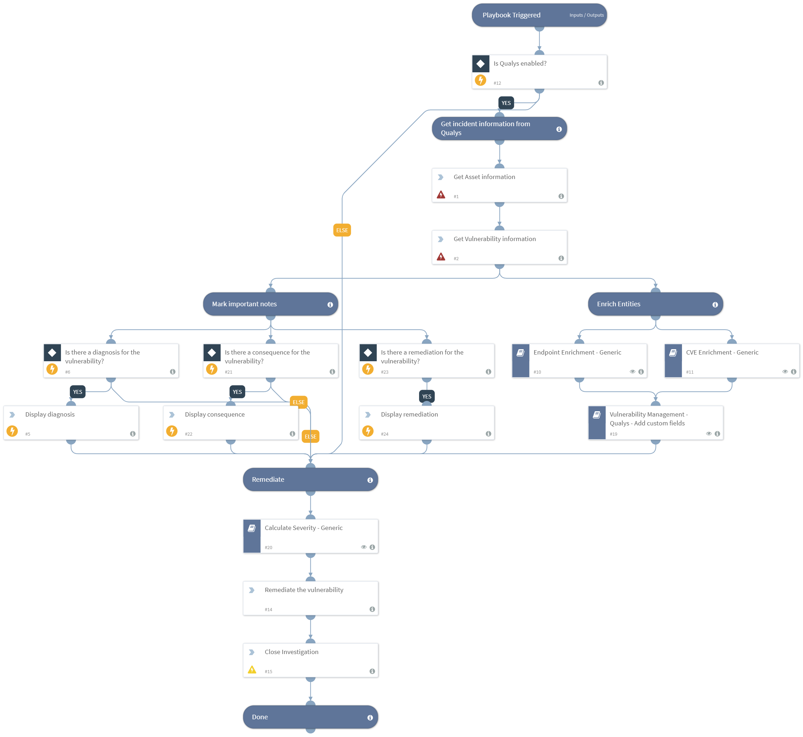

Deprecated. Manages vulnerability remediation using Qualys data, and optionally enrich data with 3rd-party tools.

Before you run this playbook, run the `Vulnerability Management - Qualys (Job)` playbook.

## Dependencies
This playbook uses the following sub-playbooks, integrations, and scripts.

### Sub-playbooks
* Vulnerability Management - Qualys - Add custom fields
* Endpoint Enrichment - Generic
* CVE Enrichment - Generic
* Calculate Severity - Generic

### Integrations
* Qualys

### Scripts
* DisplayHTML
* CloseInvestigation

### Commands
* qualys-host-list
* qualys-vulnerability-list

## Playbook Inputs
---
There are no inputs for this playbook.

## Playbook Outputs
---
There are no outputs for this playbook.

## Playbook Image
---

