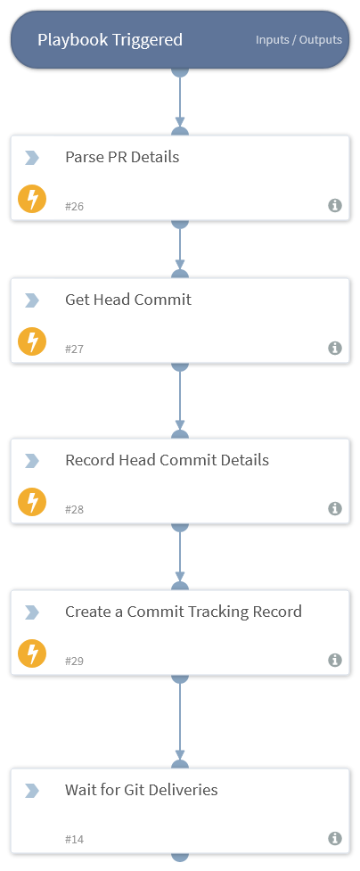

DevSecOps content pack contains multiple integrations and playbooks to help shifting security as left as the planning stage of a continues integration pipeline and make DevSecOps orchestration to be within reach.

While CI/CD orchestration tools such as Jenkins, CircleCI and others were primarily built by and to developers, SOAR is better positioned to bridge this orchestration gap between DevOps and SecOps for the following reasons:

* CI/CD orchestration pipelines are arguably easy to read and troubleshoot by developers , SOAR provides the same orchestration workflow in two different formats that are readable by both Developers and Security Analysts.

* SOAR provides way more to a DevSecOps Eco-System than CI/CD Orchestrator does:
    * Collaboration between teams members in the Eco-System.
    * Cases management.
    * Central reporting and long list of out of box integrations with security tools.

With SOAR integrations, playbooks, fields, XSOAR can be turned into a DevSecOps Orchestrator that taps in a DevSecOps Eco-System and solve for a spectrum of use cases in different stages of CI/CD piplines.

From threat-modeling in the **Planning** stage to IaC security in **Dev**, static code analysis in **Build**, post deployment scans in **Deploy** and **Monitoring**/Responding to incidents once the code is running in production.

This content pack will be updated with more integrations with different software factory tools:

- IDE's 
- Code Repo Providers
- CI/CD Orchestrators
- Code Compilers/Builders/Packagers
- Workload Orchestration Platforms
- Configuration Automation Tools
- Threat Modelers
- SAST/DAST/IAST Tools
- Vulnerability Scanners
- Networks Security Tools
- Asset Management Tools
- Log Management Tools
- Ticketing Systems

This version of the pack has two new integrations :
* Github long running integration to process Git webhook deliveries
* LGTM ( A SAST cloud service built on CodeQL) integration with the following commands:
    * lgtm-get-project-by-url to get the SAST project details 
    * lgtm-get-project-config to get Extraction and Analysis config by LGTM Project ID
    * lgtm-get-analysis-status to get get PR/Commit Analysis Results by analysis ID
    * lgtm-get-alerts-details to get Alerts Details by Analysis ID if any alerts triggered
    * lgtm-run-commit-analysis to run on-demand SAST analysis on one Commit
    * lgtm-run-project-query to on-demand SAST analysis on a Github Repo

Two new incident types along with new custom fields:
* New Git PR incident

* New App Task incident

Four playbooks are created to achieve "Discover and Eradicate APP & IaC Code Vuln’s and Policy Violations" use case:
* A PR triage Playbook that parse and record the PR details once the PR webhook delivery is received by the new Github LR integration.

* A Github App Task analysis Playbook that parses the received Github App Task delivery, create vulnerability indicators if any vuln found and then link the App Task incident&indicators to the PR incident

* The App Task analysis Playbook has two subplaybooks:
    * LGTM Task Analysis Playbook, the parses the LGTM task deliveries and create SAST vuln indicators if any
 
    * Prisma Cloud Task Analysis Playbook, the parses the Prisma task deliveries and create IAST vuln indicators if any
 
