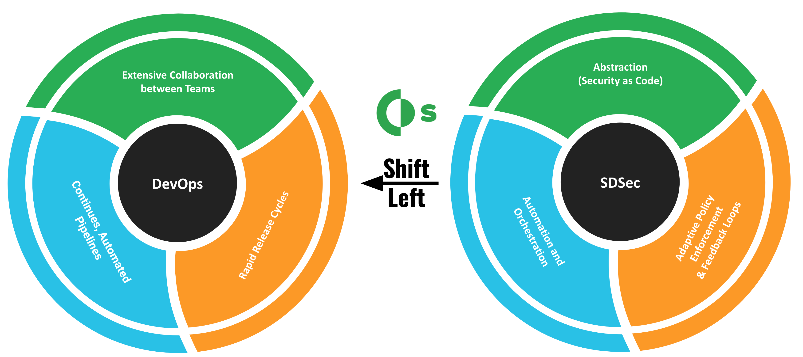
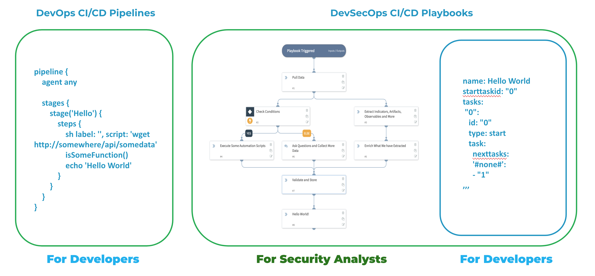
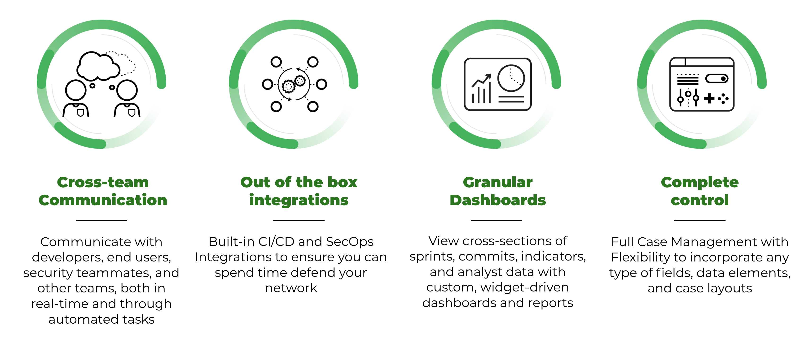
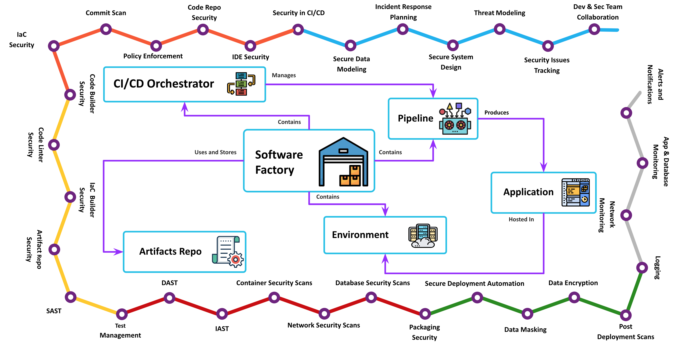
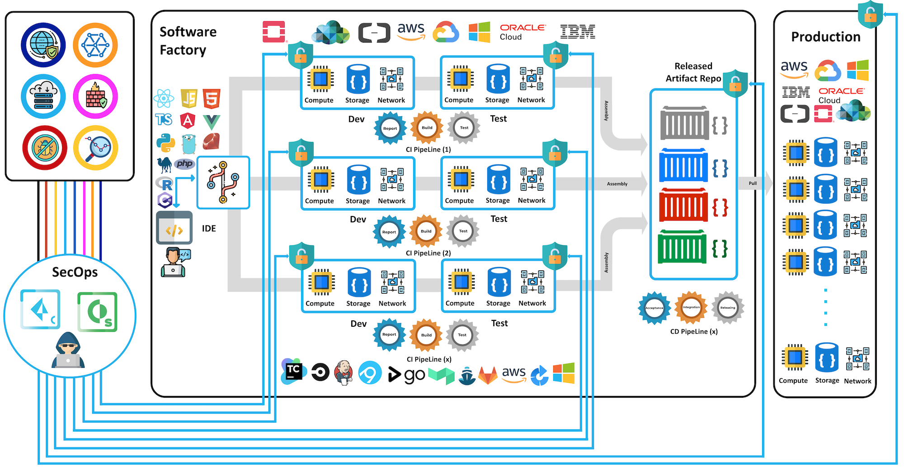

DevSecOps content pack contains multiple integrations and playbooks to help shifting security as left as the planning stage of a continues integration pipeline and make DevSecOps orchestration to be within reach.

While CI/CD orchestration tools such as Jenkins, CircleCI and others were primarily built by and to developers, SOAR is better positioned to bridge this orchestration gap between DevOps and SecOps for the following reasons:

* CI/CD orchestration pipelines are arguably easy to read and troubleshoot by developers , SOAR provides the same orchestration workflow in two different formats that are readable by both Developers and Security Analysts.

* SOAR provides way more to a DevSecOps Eco-System than CI/CD Orchestrator does:
    * Collaboration between teams members in the Eco-System.
    * Cases management.
    * Central reporting and long list of out of box integrations with security tools.

With SOAR integrations, playbooks, fields, XSOAR can be turned into a DevSecOps Orchestrator that taps in a DevSecOps Eco-System and solve for a spectrum of use cases in different stages of CI/CD piplines.

From threat-modeling in the **Planning** stage to IaC security in **Dev**, static code analysis in **Build**, post deployment scans in **Deploy** and **Monitoring**/Responding to incidents once the code is running in production.

This content pack will be updated with more integrations with different software factory tools:

- IDE's 
- Code Repo Providers
- CI/CD Orchestrators
- Code Compilers/Builders/Packagers
- Workload Orchestration Platforms
- Configuration Automation Tools
- Threat Modelers
- SAST/DAST/IAST Tools
- Vulnerability Scanners
- Networks Security Tools
- Asset Management Tools
- Log Management Tools
- Ticketing Systems

This version of the pack has four integrations :
* LGTM, a SAST cloud service built on CodeQL
* GitLab, a source code management platform
* Docker Engine, an open source containerization platform
* MinIO, a high-performance object storage suite

A new incident type along with new fields:
* DevSecOps New Git PR

A new playbook:
* A PR triage Playbook that parse and record the PR details once fetched by the Github integration.
