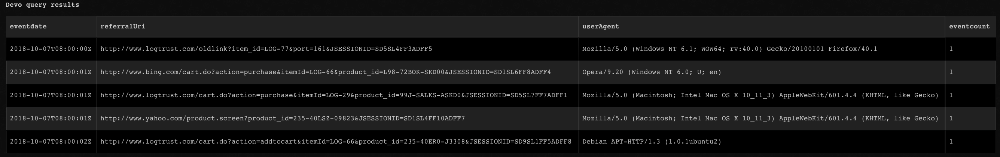
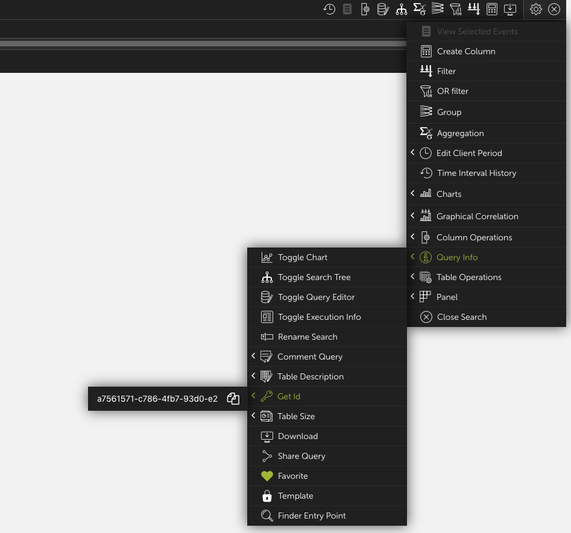

<!-- HTML_DOC -->
<h2>Devo (Deprecated)</h2>
This integration is now deprecated. Please use the <b>Devo v2</b> integration instead.

<h2>Overview</h2>

Use the Devo integration to query data in Devo.

This integration was integrated and tested with API v2 version of Devo.

 

<h2>Configure Devo on Cortex XSOAR</h2>

To use the Devo integration, a user with the administrator role is required.

You can access the API key and API secret in the Devo UI under <strong>Administration</strong> &gt; <strong>Credentials</strong>.

<ol>
<li>Navigate to <strong>Settings</strong> &gt; <strong>Integrations</strong> &gt; <strong>Servers &amp; Services</strong>.</li>
<li>Search for Devo.</li>
<li>Click <strong>Add instance</strong> to create and configure a new integration instance. 
<ul>
<li>
<strong>Name</strong>: a textual name for the integration instance.</li>
<li><strong>Server URL (e.g <a href="https://api-us.logtrust.com/" rel="nofollow">https://api-us.logtrust.com/</a>)</strong></li>
<li><strong>API key</strong></li>
<li><strong>API secret</strong></li>
<li><strong>Trust any certificate (not secure)</strong></li>
<li><strong>Use system proxy settings</strong></li>
</ul>
</li>
<li>Click <strong>Test</strong> to validate the URLs, token, and connection.</li>
</ol>
<h2>Commands</h2>

You can execute these commands from the Cortex XSOAR CLI, as part of an automation, or in a playbook. After you successfully execute a command, a DBot message appears in the War Room with the command details.

<ol>
<li><a href="#h_65353040761539088083740">Perform a query in Devo: devo-query</a></li>
</ol>
<h3 id="h_65353040761539088083740">1. Perform a query in Devo</h3>

Perform a query. For more information about querying in Devo, see the <a href="https://docs.devo.com/confluence/docs/data-search/linq" rel="nofollow">Devo documentation</a>.

<h5>Base Command</h5>
<pre><code>devo-query</code></pre>
<h5>Input</h5>
<table style="width: 748px;" border="2" cellpadding="6">
<thead>
<tr>
<th style="width: 148.667px;"><strong>Argument Name</strong></th>
<th style="width: 487.333px;"><strong>Description</strong></th>
<th style="width: 71px;"><strong>Required</strong></th>
</tr>
</thead>
<tbody>
<tr>
<td style="width: 148.667px;">query</td>
<td style="width: 487.333px;">A LINQ query to launch. The body must have a <em>query</em> or <em>queryId</em> parameter.</td>
<td style="width: 71px;">Optional</td>
</tr>
<tr>
<td style="width: 148.667px;">queryId</td>
<td style="width: 487.333px;">A query Id to launch. The body must have a <em>query</em> or <em>queryId</em> parameter. For information about obtaining the queryID, see the Additional Information section.</td>
<td style="width: 71px;">Optional</td>
</tr>
<tr>
<td style="width: 148.667px;">from</td>
<td style="width: 487.333px;">The start date as a UTC timestamp in the format: 2012-03-01T10:00:00Z.</td>
<td style="width: 71px;">Required</td>
</tr>
<tr>
<td style="width: 148.667px;">to</td>
<td style="width: 487.333px;">The end date as a UTC timestamp in the format: 2012-03-01T10:00:00Z. Default is the cur</td>
<td style="width: 71px;">Optional</td>
</tr>
<tr>
<td style="width: 148.667px;">skip</td>
<td style="width: 487.333px;">Skip the first "X" number of elements of the query.</td>
<td style="width: 71px;">Optional</td>
</tr>
<tr>
<td style="width: 148.667px;">limit</td>
<td style="width: 487.333px;">Limit the results of the query. The query will stop after returning the first X elements of the query or reaching its end.</td>
<td style="width: 71px;">Optional</td>
</tr>
<tr>
<td style="width: 148.667px;">writeToContext</td>
<td style="width: 487.333px;">Whether to write results to context or not</td>
<td style="width: 71px;">Optional</td>
</tr>
</tbody>
</table>
<h5> </h5>
<h5>Context Output</h5>
<table style="width: 750px;" border="2" cellpadding="6">
<thead>
<tr>
<th><strong>Path</strong></th>
<th><strong>Description</strong></th>
</tr>
</thead>
<tbody>
<tr>
<td>Devo.Results</td>
<td>The query results</td>
</tr>
</tbody>
</table>
<h5> </h5>
<h5>Command Example</h5>
<pre><code>!devo-query from=2018-10-07T08:00:00Z to=2018-10-07T08:30:00Z limit=5 query="from demo.ecommerce.data select eventdate, referralUri, userAgent where method=\"GET\""</code></pre>
<h5>Context Example</h5>
<pre>{
    "Devo": {
        "Results": [
            {
                "eventcount": 1,
                "eventdate": "2018-10-07T08:00:00Z",
                "referralUri": "http://www.logtrust.com/oldlink?item_id=LOG-77\u0026port=161\u0026JSESSIONID=SD5SL4FF3ADFF5",
                "userAgent": "Mozilla/5.0 (Windows NT 6.1; WOW64; rv:40.0) Gecko/20100101 Firefox/40.1"
            },
            {
                "eventcount": 1,
                "eventdate": "2018-10-07T08:00:01Z",
                "referralUri": "http://www.bing.com/cart.do?action=purchase\u0026itemId=LOG-66\u0026product_id=L98-72BOK-SKD00\u0026JSESSIONID=SD1SL6FF8ADFF4",
                "userAgent": "Opera/9.20 (Windows NT 6.0; U; en)"
            },
            {
                "eventcount": 1,
                "eventdate": "2018-10-07T08:00:01Z",
                "referralUri": "http://www.logtrust.com/cart.do?action=purchase\u0026itemId=LOG-29\u0026product_id=99J-SALKS-ASKD0\u0026JSESSIONID=SD5SL7FF7ADFF1",
                "userAgent": "Mozilla/5.0 (Macintosh; Intel Mac OS X 10_11_3) AppleWebKit/601.4.4 (KHTML, like Gecko)"
            },
            {
                "eventcount": 1,
                "eventdate": "2018-10-07T08:00:01Z",
                "referralUri": "http://www.yahoo.com/product.screen?product_id=235-40LSZ-09823\u0026JSESSIONID=SD1SL4FF10ADFF7",
                "userAgent": "Mozilla/5.0 (Macintosh; Intel Mac OS X 10_11_3) AppleWebKit/601.4.4 (KHTML, like Gecko)"
            },
            {
                "eventcount": 1,
                "eventdate": "2018-10-07T08:00:02Z",
                "referralUri": "http://www.logtrust.com/cart.do?action=addtocart\u0026itemId=LOG-66\u0026product_id=235-40ER0-J3308\u0026JSESSIONID=SD9SL1FF5ADFF8",
                "userAgent": "Debian APT-HTTP/1.3 (1.0.1ubuntu2)"
            }
        ]
    }
}
</pre>
<h5>Human Readable Output</h5>

 

<h2>Additional Information</h2>

Follow these steps to get the query ID

<ol>
<li>Access your Devo environment.</li>
<li>Navigate to the <strong>gear icon</strong> &gt; <strong>Query Info</strong> &gt; <strong>Get Id</strong>.</li>
</ol>

<h2>Troubleshooting</h2>

If you receive HTTP Error <code>401 (Unauthorized</code>), the API key or API secret might be incorrect.
