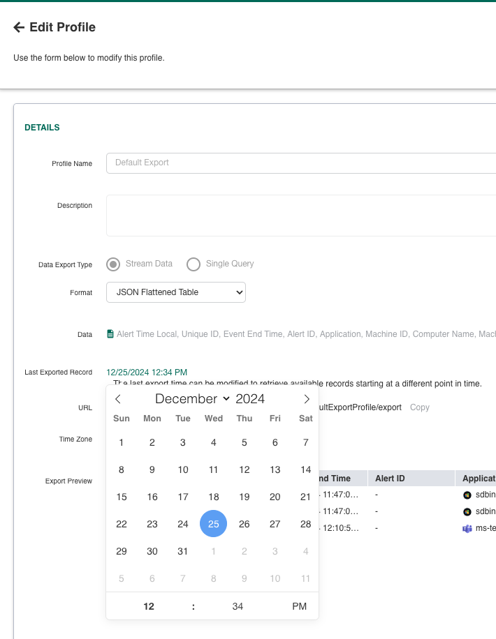

## Digital Guardian ARC Event Collector Help

### How to get the configuration parameters

The required configuration parameters to connect to the service API can be found via the Digital Guardian Management Console (DGMC) by navigating to **System** > **Configuration** > **Cloud Service**.

#### API Client ID

The value can be found under the **API Access ID** field on the **Cloud Service** screen.

#### API Client Secret

The value can be found under the **API Access Secret** field on the **Cloud Service** screen.

If you are unable to access the value you of this field, you may need to contact [Digital Guardian Support](https://www.digitalguardian.com/services/support).

#### Gateway Base URL

The value can be found under the **Access Gateway Base URL** field on the **Cloud Service** screen.

#### Auth Server URL

The value can be found under the **Authorization Server URL** field on the **Cloud Service** screen.

#### Export Profiles

To view, create, or edit export profiles, in the DGMC, navigate to **DG ARC** > **Reports** > **Export Profiles**.

* **Note:** While customers may input custom Digital Guardian export profiles while configuring the integration instance, only `defaultExportProfile` and `demisto` are officially supported.

    The internal document name of an export profile can be confirmed via the **Export Profiles** page by hovering over the 'Link' icon in the URL column in the table. For example, if the export profile URL is `{access_gateway_base_url}/rest/1.0/export_profiles/demisto/export`, the internal document name is `demisto`.

* **Important:** Events are fetched starting from the **Last Exported Record** timestamp of the export profile. It is highly recommended to adjust the value of this field in the selected export profile(s) to a recent timestamp for optimal fetch performance.

    _Failure to update this setting to a current timestamp during the initial configuration of the integration instance may result in unnecessary system overhead and the accumulation of outdated events until the event collector eventually begins fetching recent events._

    To update the **Last Exported Record** field, select the relevant export profile and edit its settings. Ensure all changes are saved.

    If older events are still being fetched from the export profile despite updating this setting, you may need to contact [Digital Guardian Support](https://www.digitalguardian.com/services/support).

#### Number of Export Requests per Fetch

By default, a maximum of **10,000** events can be retrieved per fetch for each Digital Guardian export profile. To increase the volume of fetched events beyond this value, set the "Number of Export Requests per Fetch" configuration parameter to greater than 1. For example, setting this parameter to 4 would fetch up to 40,000 events per export profile. Note that fetching a large number of events may result in exceeding the daily data ingestion quota in the Cortex XSIAM license plan. Consult with the engineering team before changing this value.
