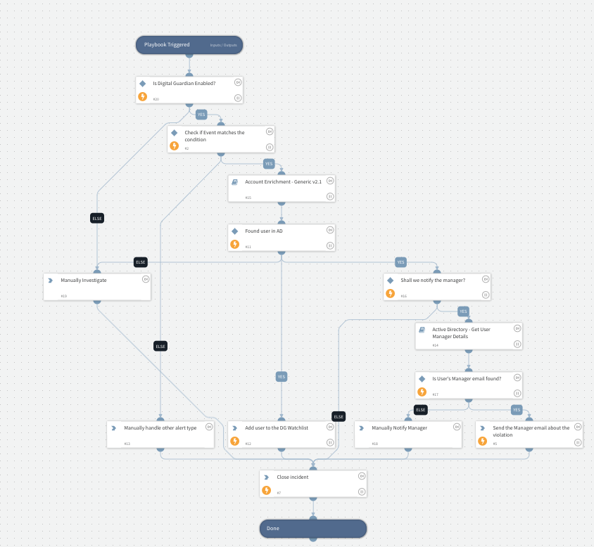

This playbook will show how to handle an exfiltration event through Digital Guardian by emailing a user's manager and adding the user to a DG Watchlist.

## Dependencies
This playbook uses the following sub-playbooks, integrations, and scripts.

### Sub-playbooks
* Active Directory - Get User Manager Details
* Account Enrichment - Generic v2.1

### Integrations
* Builtin
* Digital Guardian

### Scripts
This playbook does not use any scripts.

### Commands
* send-mail
* digitalguardian-add-watchlist-entry
* closeInvestigation

## Playbook Inputs
---

| **Name** | **Description** | **Default Value** | **Source** | **Required** |
| --- | --- | --- | --- | --- |
| User Name | User Name to check | ${incident.digitalguardianusername} |  | Required |
| Watchlist Name | The name of the DG watchlist to add the user to. | DLP-USB-USERS |  | Required |
| Incident Match | The incident name should contain this string in order for the playbook to handle the event.  The default is DLP1008 which is a USB Exfiltration event. | DLP1008 |  | Required |
| Notify Manager | Notify User's Manager | true |  | Optional |

## Playbook Outputs
---
There are no outputs for this playbook.

