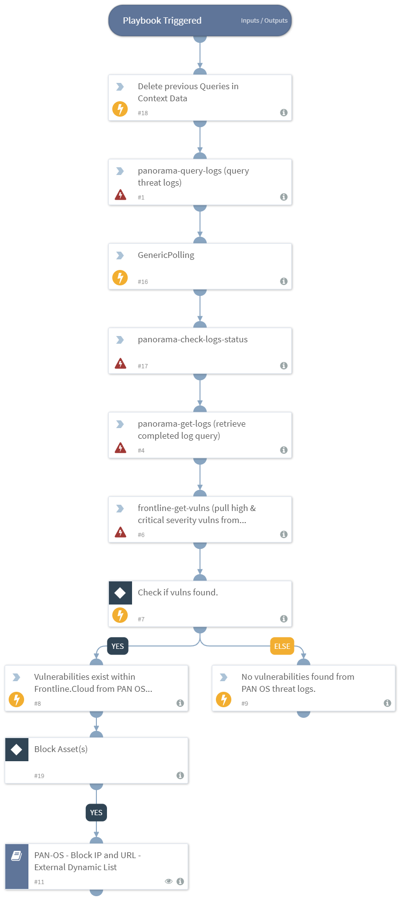

Pulls Panorama queried threat logs and check for any correlating assets that are found to have a minimum of high level vulnerabilities. If so, it will block the the IP using Panorama's `PAN-OS - Block IP` and `URL - External Dynamic List` playbook.

## Dependencies
This playbook uses the following sub-playbooks, integrations, and scripts.

### Sub-playbooks
* PAN-OS - Block IP and URL - External Dynamic List

### Integrations
* Digital Defense FrontlineVM
* Panorama

### Scripts
* DeleteContext
* Print
* ScheduleGenericPolling

### Commands
* frontline-get-vulns
* panorama-get-logs
* panorama-check-logs-status
* panorama-query-logs

## Playbook Inputs
---
There are no inputs for this playbook.

## Playbook Outputs
---
There are no outputs for this playbook.

## Playbook Image
---

