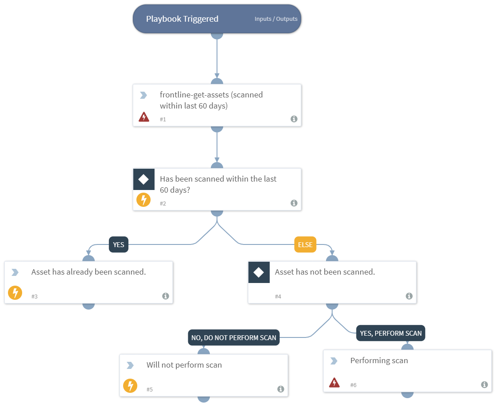

Pulls IP addresses from the detail value of an incident and check if that asset has been scanned within the past 60 days. If not then it will then prompt the user to perform a scan on the asset.

## Dependencies
This playbook uses the following sub-playbooks, integrations, and scripts.

### Sub-playbooks
This playbook does not use any sub-playbooks.

### Integrations
This playbook does not use any integrations.

### Scripts
* Print

### Commands
* frontline-scan-asset
* frontline-get-assets

## Playbook Inputs
---
There are no inputs for this playbook.

## Playbook Outputs
---
There are no outputs for this playbook.

## Playbook Image
---

