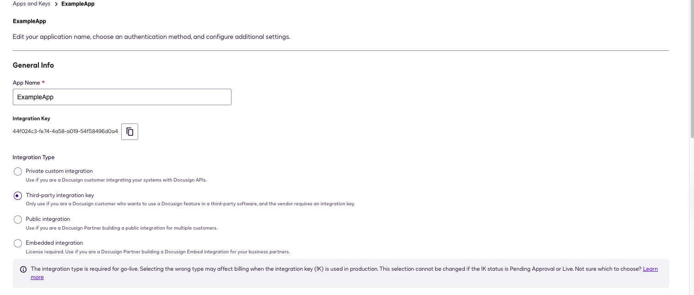
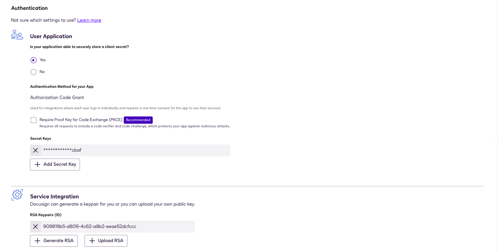
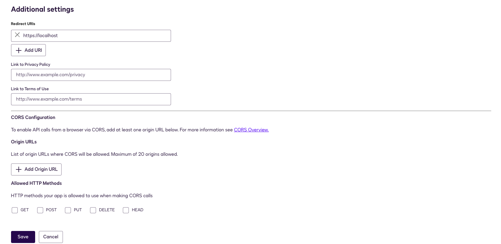

Docusign is a leading provider of electronic signature technology, allowing individuals and organizations to sign, send, and manage documents digitally.

### Customer Events API

The Docusign Monitor API provides access to customer events, which are events that occur in your Docusign account.  

### User Data API

The Docusign Admin API provides access to user data, which is information about users in your Docusign account.  

---

## Configure DocuSign new application

Follow the steps below to create and configure a DocuSign application for use with this integration:

#### 1. **Access DocuSign Developer Portal**

* Open the DocuSign web UI and log in.
* Navigate to **Account**.
* From the left sidebar, click **Apps and Keys**.

#### 2. **Create a New Application**

* Click **Add App**.
* Provide a name for your application.
* Copy the **Integration Key**.

#### 3. **Setting Integration Type**

* Select the App integration type required for your workflow.



#### 4. **Configure Application Settings**

* Under **User Application**, select **Yes**.
* Under **Authentication Method for your App**, leave the default option, **Authorization Code Grant**.

#### 5. **Generate a Secret Key**

* Click **Add Secret Key** and generate a new secret key.

#### 6. **Generate RSA Key Pair**

* Under **Service Integration** Click **Generate RSA**.
* Copy the **Private Key**. (The public key is not used by the integration)



#### 7. **Set Redirect URI**

* Navigate to **Additional Settings**.
* Set the **Redirect URI** to `https://localhost`.

#### 8. **Save the Application**

* Click **Save** to finalize your application configuration.



#### 9. **Retrieve Organization ID**

* Navigate to the **Organization** tab from the left sidebar.
* Copy the **Organization ID** from the URL.

#### 10. Configure and Test

* Configure and save the instance.
* To use the Docusign integration and allow access to Docusign events, an administrator has to approve our app using an admin consent flow by running the ***!docusign-generate-consent-url*** command.
* Run the command ***!docusign-auth-test*** to test the full authentication flow and API connectivity.

---

## Go-Live - Customer events data type

When you are ready to launch your app in production, you will need to promote your application’s integration key from your developer account to a production Docusign account by passing a Go-Live review, similar to the [Go-Live](https://developers.docusign.com/docs/esign-rest-api/go-live/) process for the eSignature REST API.

Before you can begin the Go-Live process, you must have:

* A paid production Docusign account with a plan that includes Docusign Monitor
* Completed at least 20 consecutive successful test eSignature API requests in the developer environment

**The 20 successful requests must be [eSignature REST API](https://developers.docusign.com/docs/esign-rest-api/reference/) requests, not Monitor API requests.**

To start the Go-Live review for your application, follow the steps described on the [Go-Live](https://developers.docusign.com/docs/esign-rest-api/go-live/) overview page for the Docusign eSignature REST API.

> **Note:** If your application fails the Go-Live review, you may be required to bring it into compliance with the [Rules and resource limits](https://developers.docusign.com/docs/esign-rest-api/esign101/rules-and-limits/) before proceeding.

Once the form is processed (which can take up to three business days), your integration key will be copied into production, enabling your app to call the production API endpoints.

---

## API Endpoints

The developer and production endpoints for most Docusign APIs use slightly different paths.  
The table below shows the base endpoint paths for each DocuSign environment, helping you update your code when migrating from the developer environment to production.

| Environment | API base URI | Web Site Login URL |
|-------------|--------------|--------------------|
| Developer   | `https://lens-d.docusign.net/api/v2.0/datasets/monitor/..` | `https://account-d.docusign.com` |
| Production  | `https://lens.docusign.net/api/v2.0/datasets/monitor/...` | `https://{server}.docusign.net/` |

> **Note:** To access production API endpoints, you will need to enable your integration key in the production environment. See [Go-Live](https://developers.docusign.com/platform/go-live/) for more information.

---

## Go-Live - Audit Users data type

Before you can begin the Go-Live process for an app that uses the Admin API, you must have:

* Admin API access enabled for your account  
* Completed at least 20 consecutive successful test eSignature API requests in the developer environment

**The 20 successful requests must be API Reference requests, not Admin API requests.**

When you are ready to start the Go-Live review for your application, follow the steps described on the Go-Live overview page for Docusign eSignature.

> **Note:** If your application fails the Go-Live review, you may need to bring it into compliance with the API rules and resource limits before proceeding.

After the form is processed, your integration key is copied to your production account, enabling your app to call production Admin API endpoints.  
Note that while the key is copied, you must configure all required values separately in the production environment; configuration settings are not copied automatically.

---

## API Endpoints

The developer and production endpoints for the Admin API use slightly different paths.  
The examples in the how-to section use the developer paths; the table below shows the production version of the base path.

| Environment | Admin API base URI | eSignature API base URI |
|-------------|---------------------|--------------------------|
| Developer   | `https://api-d.docusign.net/management/` | `https://demo.docusign.net/` |
| Production  | `https://api.docusign.net/management/`   | `https://{server}.docusign.net/` |

## Configure Docusign in Cortex

| **Parameter** | **Description** | **Required** |
| --- | --- | --- |
| Server URL |  | True |
| Integration Key |  | True |
| User ID |  | True |
| Redirect URL |  | True |
| Private Key |  | True |
| Account ID | For fetching user data only | False |
| Organization ID | For fetching user data only | False |
| Fetch events |  | False |
| Event types to fetch |  | False |
| Maximum number of customer events per fetch | Due to API limitations, the maximum is 2000. | False |
| Maximum number of user data events per fetch | Due to API limitations, the maximum is 1250. | False |
| Trust any certificate (not secure) |  | False |
| Use system proxy settings |  | False |

## Commands

You can execute these commands from the CLI, as part of an automation, or in a playbook.
After you successfully execute a command, a DBot message appears in the War Room showing the command details.

### docusign-generate-consent-url

***
Generates the Docusign admin consent URL based on configured parameters and environment.

#### Base Command

`docusign-generate-consent-url`

#### Input

There is no input for this command.

#### Context Output

There is no context output for this command.

#### Command Example

```!docusign-generate-login-url```

#### Human Readable Output

>### Docusign Consent URL
>
>[Click here to authorize]

### docusign-auth-test

***
Tests the full authentication flow and API connectivity by validating configuration, exchanging a JWT for an access token, and calling the /oauth/userinfo endpoint.

#### Base Command

`docusign-auth-test`

#### Input

There is no input for this command.

#### Context Output

There is no context output for this command.

#### Command Example

```!docusign-auth-test```

#### Human Readable Output

>ok

### docusign-get-events

***
Fetches events from Docusign. Used for debugging purposes on failures.

#### Base Command

`docusign-get-events`

#### Input

| **Argument Name** | **Description** | **Required** |
| --- | --- | --- |
| event_type | The type of events to fetch. Possible values are: Customer events, Audit Users. | True |
| limit | Maximum number of events to fetch, default is 10. | False |

#### Context Output

There is no context output for this command.

#### Command Example

```!docusign-get-events event_type="Customer events" limit=10```

#### Human Readable Output

>### Docusign Customer events (fetched 10)
>
>| eventId | timestamp | accountId |
>|---|---|---|
>| 11111111-1111-1111-1111-111111111111 | 2024-06-30T07:08:06Z | 11111111-1111-1111-1111-111111111111 |

### docusign-reset-access-token

***
Resets the access token stored in the integration context.

#### Base Command

`docusign-reset-access-token`

#### Input

There is no input for this command.

#### Context Output

There is no context output for this command.
