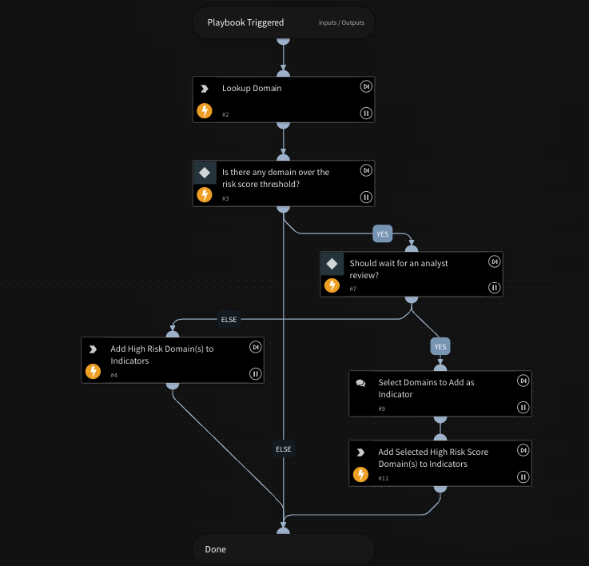

This playbook retrieves the Domain Risk Score of the given domain and check if the risk score is over the threshold and throws an Alert for the Analyst to manually review the domain indicator.

## Dependencies

This playbook uses the following sub-playbooks, integrations, and scripts.

### Sub-playbooks

This playbook does not use any sub-playbooks.

### Integrations

* DomainTools Iris

### Scripts

* SetIndicatorTableData

### Commands

* domaintoolsiris-investigate

## Playbook Inputs

---

| **Name** | **Description** | **Default Value** | **Required** |
| --- | --- | --- | --- |
| domains | The domain\(s\) to query. Can lookup multiple domains using a comma-separated values.   e.g mydomain1.com,mydomain2.com |  | Required |
| dt_min_riskscore_threshold | The minimum risk score threshold. | 70 | Required |
| should_wait_for_analyst_review | Flags if users should wait for an analyst to review. Default is true. Value can be either true/false only. | true | Required |

## Playbook Outputs

---
There are no outputs for this playbook.

## Playbook Image

---

