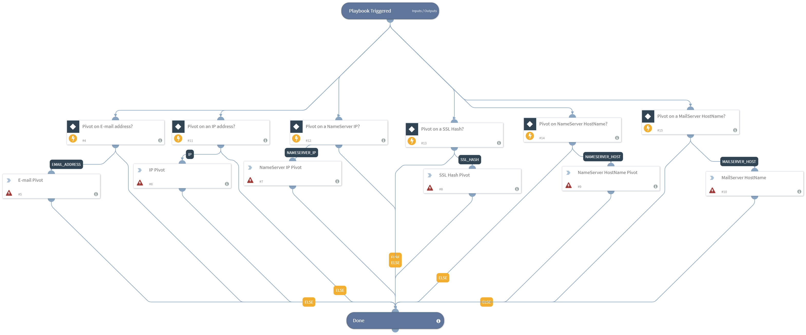

Gathers data through pivots that share a common attribute with a domain. For instance, pivoting on an IP address will give you back all domains related to that IP address.

## Dependencies

This playbook uses the following sub-playbooks, integrations, and scripts.

### Sub-playbooks

This playbook does not use any sub-playbooks.

### Integrations

* DomainTools Iris

### Scripts

This playbook does not use any scripts.

### Commands

* domaintoolsiris-pivot

## Playbook Inputs

---

| **Name** | **Description** | **Default Value** | **Source** | **Required** |
| --- | --- | --- | --- | --- |
| IPAddress | The IP address to pivot. | Address | IP | Optional |
| EmailAddress | The Email address for which to pivot. | Email.Address | Account | Optional |
| NameServerIPAddress | The name server IP address for which to pivot. | - | - | Optional |
| SSLHash | The SSL Hash for which to pivot. | - |-  | Optional |
| NameServerHostName | The name server host name for which to pivot. | - | - | Optional |
| MailServerHostName | The mail server host name for which to pivot. | - | - | Optional |
| IPAddressCount | The number of matches for the IP address. | - | - | Optional |
| EmailAddressCount | The number of matches for the email address. | - | - | Optional |
| NameServerIPAddressCount | The number of matches for the name server IP address. | - |-  | Optional |
| SSLHashCount | The number of matches for the SSL Hash. | - | - | Optional |
| NameServerHostNameCount | The number of matches for the name server host name. | - | - | Optional |
| MailServerHostNameCount | The number of matches for the mail server host name. | - | - | Optional |
| PivotThreshold | The threshold for matches less than to pivot on.  | 500 | - | Optional |

## Playbook Outputs

---

| **Path** | **Description** | **Type** |
| --- | --- | --- |
| DomainTools.PivotedDomains.Name | The DomainTools domain name. | String |
| DomainTools.PivotedDomains.LastEnriched | The last time DomainTools enriched domain data. | Date |
| DomainTools.PivotedDomains.Analytics.OverallRiskScore | The DomainTools overall risk score. | Number |
| DomainTools.PivotedDomains.Analytics.ProximityRiskScore | The DomainTools proximity risk score. | Number |
| DomainTools.PivotedDomains.Analytics.ThreatProfileRiskScore.RiskScore | The DomainTools threat profile risk score. | Number |
| DomainTools.PivotedDomains.Analytics.ThreatProfileRiskScore.Threats | The DomainTools threat profile threats. | String |
| DomainTools.PivotedDomains.Analytics.ThreatProfileRiskScore.Evidence | The DomainTools threat profile evidence. | String |
| DomainTools.PivotedDomains.Analytics.WebsiteResponseCode | The website response code. | Number |
| DomainTools.PivotedDomains.Analytics.AlexaRank | The Alexa rank. | Number |
| DomainTools.PivotedDomains.Analytics.Tags | The DomainTools Tags. | String |
| DomainTools.PivotedDomains.Identity.RegistrantName | The name of the registrant. | String |
| DomainTools.PivotedDomains.Identity.RegistrantOrg | The organization of the registrant. | String |
| DomainTools.PivotedDomains.Identity.RegistrantContact.Country.value | The country value of the registrant contact. | String |
| DomainTools.PivotedDomains.Identity.RegistrantContact.Country.count | The country count of the registrant contact. | Number |
| DomainTools.PivotedDomains.Identity.RegistrantContact.Email.value | The email value of the registrant contact. | String |
| DomainTools.PivotedDomains.Identity.RegistrantContact.Email.count | The email count of the registrant contact. | Number |
| DomainTools.PivotedDomains.Identity.RegistrantContact.Name.value | The name value of the registrant contact. | String |
| DomainTools.PivotedDomains.Identity.RegistrantContact.Name.count | The name count of the registrant contact. | Number |
| DomainTools.PivotedDomains.Identity.RegistrantContact.Phone.value | The phone value of the registrant contact. | String |
| DomainTools.PivotedDomains.Identity.RegistrantContact.Phone.count | The phone count of the registrant contact. | Number |
| DomainTools.PivotedDomains.Identity.SOAEmail | The SOA record Email. | String |
| DomainTools.PivotedDomains.Identity.SSLCertificateEmail | The SSL certificate email. | String |
| DomainTools.PivotedDomains.Identity.AdminContact.Country.value | The country value of the administrator contact. | String |
| DomainTools.PivotedDomains.Identity.AdminContact.Country.count | The country count of the administrator contact. | Number |
| DomainTools.PivotedDomains.Identity.AdminContact.Email.value | The email value of the administrator contact. | String |
| DomainTools.PivotedDomains.Identity.AdminContact.Email.count | The email count of the administrator contact. | Number |
| DomainTools.PivotedDomains.Identity.AdminContact.Name.value | The name value of the administrator contact. | String |
| DomainTools.PivotedDomains.Identity.AdminContact.Name.count | The name count of the administrator contact. | Number |
| DomainTools.PivotedDomains.Identity.AdminContact.Phone.value | The phone value of the administrator contact. | String |
| DomainTools.PivotedDomains.Identity.AdminContact.Phone.count | The phone count of the administrator contact. | Number |
| DomainTools.PivotedDomains.Identity.TechnicalContact.Country.value | The country value of the technical contact. | String |
| DomainTools.PivotedDomains.Identity.TechnicalContact.Country.count | The country count of the technical contact. | Number |
| DomainTools.PivotedDomains.Identity.TechnicalContact.Email.value | The email value of the technical contact. | String |
| DomainTools.PivotedDomains.Identity.TechnicalContact.Email.count | The email count of the technical contact. | Number |
| DomainTools.PivotedDomains.Identity.TechnicalContact.Name.value | The name value of the technical contact. | String |
| DomainTools.PivotedDomains.Identity.TechnicalContact.Name.count | The name count of the technical contact. | Number |
| DomainTools.PivotedDomains.Identity.TechnicalContact.Phone.value | The phone value of the technical contact. | String |
| DomainTools.PivotedDomains.Identity.TechnicalContact.Phone.count | The phone count of the technical contact. | Number |
| DomainTools.PivotedDomains.Identity.BillingContact.Country.value | The country value of the billing contact. | String |
| DomainTools.PivotedDomains.Identity.BillingContact.Country.count | The country count of the billing contact. | Number |
| DomainTools.PivotedDomains.Identity.BillingContact.Email.value | The email value of the billing contact. | String |
| DomainTools.PivotedDomains.Identity.BillingContact.Email.count | The email count of the billing contact. | Number |
| DomainTools.PivotedDomains.Identity.BillingContact.Name.value | The name value of the billing contact. | String |
| DomainTools.PivotedDomains.Identity.BillingContact.Name.count | The name count of the billing contact. | Number |
| DomainTools.PivotedDomains.Identity.BillingContact.Phone.value | The phone value of the billing contact. | String |
| DomainTools.PivotedDomains.Identity.BillingContact.Phone.count | The phone count of the billing contact. | Number |
| DomainTools.PivotedDomains.Identity.EmailDomains | The email domains. | String |
| DomainTools.PivotedDomains.Identity.AdditionalWhoisEmails.value | The value of the additional Whois emails. | String |
| DomainTools.PivotedDomains.Identity.AdditionalWhoisEmails.count | The count of the additional Whois emails. | Number |
| DomainTools.PivotedDomains.Registration.DomainRegistrant | The registrant of the domain. | String |
| DomainTools.PivotedDomains.Registration.RegistrarStatus | The status of the registrar. | String |
| DomainTools.PivotedDomains.Registration.DomainStatus | The active status of the domain. | Boolean |
| DomainTools.PivotedDomains.Registration.CreateDate | The date the domain was created. | Date |
| DomainTools.PivotedDomains.Registration.ExpirationDate | The expiry date of the domain. | Date |
| DomainTools.PivotedDomains.Hosting.IPAddresses.address.value | The address value of the IP Addresses. | String |
| DomainTools.PivotedDomains.Hosting.IPAddresses.address.count | The address count of the IP Addresses. | Number |
| DomainTools.PivotedDomains.Hosting.IPAddresses.asn.value | The ASN value of the IP Addresses. | String |
| DomainTools.PivotedDomains.Hosting.IPAddresses.asn.count | The ASN count of the IP Addresses. | Number |
| DomainTools.PivotedDomains.Hosting.IPAddresses.country_code.value | The country code value of the IP Addresses. | String |
| DomainTools.PivotedDomains.Hosting.IPAddresses.country_code.count | The country code count of the IP Addresses. | Number |
| DomainTools.PivotedDomains.Hosting.IPAddresses.isp.value | The ISP value of the IP Addresses. | String |
| DomainTools.PivotedDomains.Hosting.IPAddresses.isp.count | The ISP count of the IP Addresses. | Number |
| DomainTools.PivotedDomains.Hosting.IPCountryCode | The country code of the IP address. | String |
| DomainTools.PivotedDomains.Hosting.MailServers.domain.value | The domain value of the mail servers. | String |
| DomainTools.PivotedDomains.Hosting.MailServers.domain.count | The domain count of the mail servers. | Number |
| DomainTools.PivotedDomains.Hosting.MailServers.host.value | The host value of the mail servers. | String |
| DomainTools.PivotedDomains.Hosting.MailServers.host.count | The host count of the mail servers. | Number |
| DomainTools.PivotedDomains.Hosting.MailServers.ip.value | The IP value of the mail servers. | String |
| DomainTools.PivotedDomains.Hosting.MailServers.ip.count | The IP count of the mail servers. | Number |
| DomainTools.PivotedDomains.Hosting.SPFRecord | The SPF record. | String |
| DomainTools.PivotedDomains.Hosting.NameServers.domain.value | The domain value of the DomainTools domains name servers. | String |
| DomainTools.PivotedDomains.Hosting.NameServers.domain.count | The domain count of the domainTools Domains name servers. | Number |
| DomainTools.PivotedDomains.Hosting.NameServers.host.value | The host value of the DomainTools domains name servers. | String |
| DomainTools.PivotedDomains.Hosting.NameServers.host.count | The host count of the DomainTools domains name servers. | Number |
| DomainTools.PivotedDomains.Hosting.NameServers.ip.value | The IP value of the DomainTools domains name servers. | String |
| DomainTools.PivotedDomains.Hosting.NameServers.ip.count | The IP count of the DomainTools domains name servers. | Number |
| DomainTools.PivotedDomains.Hosting.SSLCertificate.hash.value | The hash value of the SSL certificate. | String |
| DomainTools.PivotedDomains.Hosting.SSLCertificate.hash.count | The hash count of the SSL certificate. | Number |
| DomainTools.PivotedDomains.Hosting.SSLCertificate.organization.value | The organization value of the SSL certificate. | String |
| DomainTools.PivotedDomains.Hosting.SSLCertificate.organization.count | The organization count of the SSL certificate. | Number |
| DomainTools.PivotedDomains.Hosting.SSLCertificate.subject.value | The subject value of the SSL certificate. | String |
| DomainTools.PivotedDomains.Hosting.SSLCertificate.subject.count | The subject count of the SSL certificate. | Number |
| DomainTools.PivotedDomains.Hosting.RedirectsTo.value | The redirects to value of the domain. | String |
| DomainTools.PivotedDomains.Hosting.RedirectsTo.count | The redirects to count of the domain. | Number |
| DomainTools.PivotedDomains.Analytics.GoogleAdsenseTrackingCode | The tracking code of Google Adsense. | Number |
| DomainTools.PivotedDomains.Analytics.GoogleAnalyticTrackingCode | The tracking code of Google Analytics. | Number |

## Playbook Image

---

