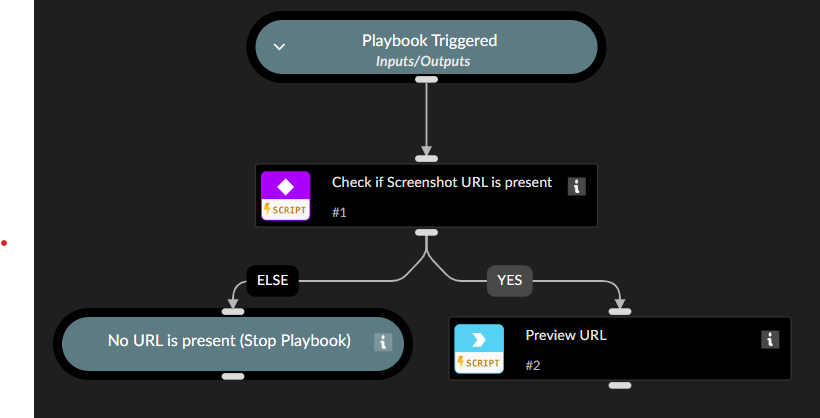

This playbook previews a screenshot URL from a Doppel alert in the incident War Room.

## Dependencies

This playbook uses the following sub-playbooks, integrations, and scripts.

### Sub-playbooks

This playbook does not use any sub-playbooks.

### Integrations

* Rasterize

### Scripts

This playbook does not use any scripts.

### Commands

* rasterize

## Playbook Inputs

---

| **Name** | **Description** | **Default Value** | **Required** |
| --- | --- | --- | --- |
| screenshot_url | The URL of the screenshot from Doppel alert | ${incident.doppelscreenshoturl} | Optional |

## Playbook Outputs

---
There are no outputs for this playbook.

## Playbook Image

---
