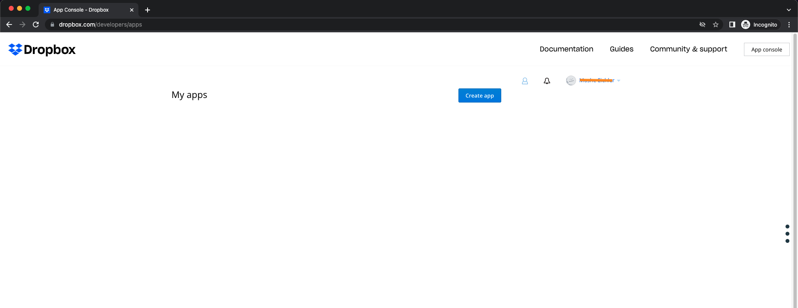
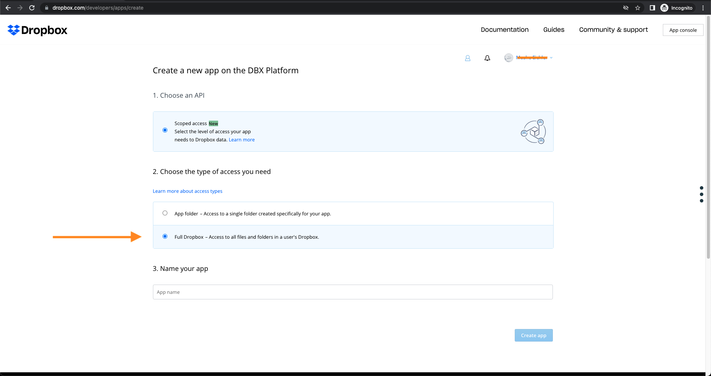
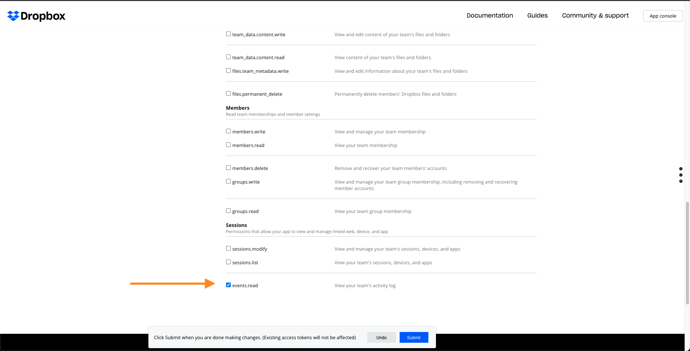
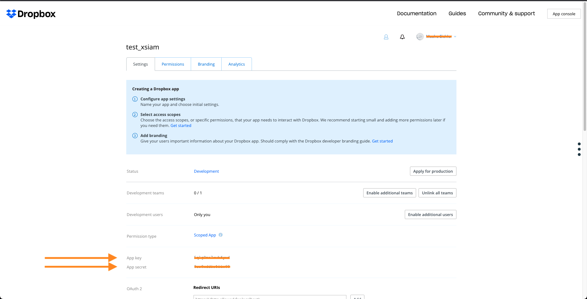

Use the Dropbox Event Collector integration to get Audit and Auth logs from dropbox using REST APIs.

Before you begin, in the [Dropbox app console](https://www.dropbox.com/developers/apps) Use the Dropbox Event Collector integration to get Audit and Auth logs from dropbox using REST APIs.

## Create an app in the Dropbox app console

1. Go to [Dropbox app console](https://www.dropbox.com/developers/apps) and click **Create app**.  

2. Give full dropbox access (not just a single folder).  

3. From the **Permissions** tab, in the **Sessions** section, select **events.read**.  

4. In the **Settings** tab, note the **App key** and the **App secret**.  

## Configuration Parameters

**Server URL**    
The endpoint to get the logs.

**App key and App secret**    
The App key and App secret.

## Test
In order to test the connection to the Dropbox app:
1. Fill in the required parameters.
2. Run the ***!dropbox-auth-start*** command from the [WarRoom](./incidents/war_room).
3. Follow the instructions that appear.
4. Run the ***!dropbox-auth-complete*** command with the code returned from Dropbox.
5. Run the ***!dropbox-auth-test*** command to verify success.
