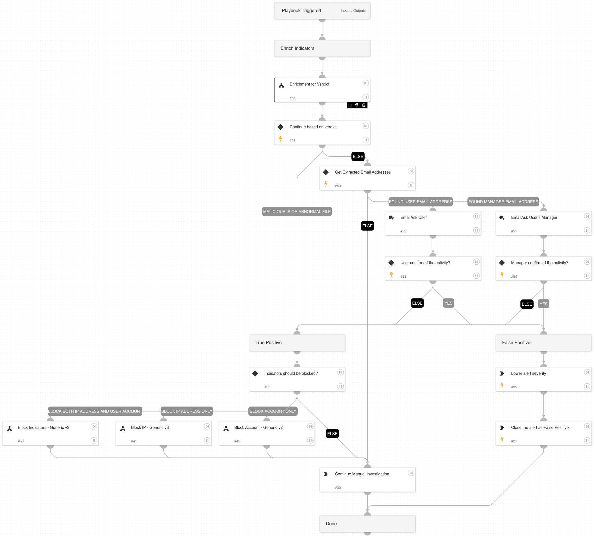

This playbook investigates “Massive File Alterations” and “DropBox - Massive File Downloads” alerts by gathering user and IP information and performing remediation based on the information gathered and received from the user.

Used Sub-playbooks:
* Enrichment for Verdict
* Block Indicators - Generic v3
* Block IP - Generic v3
* Block Account - Generic v2

If you wish to link this playbook to the relevant alerts automatically, we recommend using the following filters when configuring the playbook triggers: Alert Source = Correlation 
Alert Name = DropBox - Massive File Alterations, DropBox - Massive File Downloads

## Dependencies

This playbook uses the following sub-playbooks, integrations, and scripts.

### Sub-playbooks

* Block IP - Generic v3
* Block Indicators - Generic v3
* Enrichment for Verdict
* Block Account - Generic v2

### Integrations

This playbook does not use any integrations.

### Scripts

This playbook does not use any scripts.

### Commands

* setAlert
* closeInvestigation

## Playbook Inputs

---

| **Name** | **Description** | **Default Value** | **Required** |
| --- | --- | --- | --- |
| InternalRange | List of Internal IP ranges | lists.PrivateIPs | Optional |

## Playbook Outputs

---
There are no outputs for this playbook.

## Playbook Image

---

