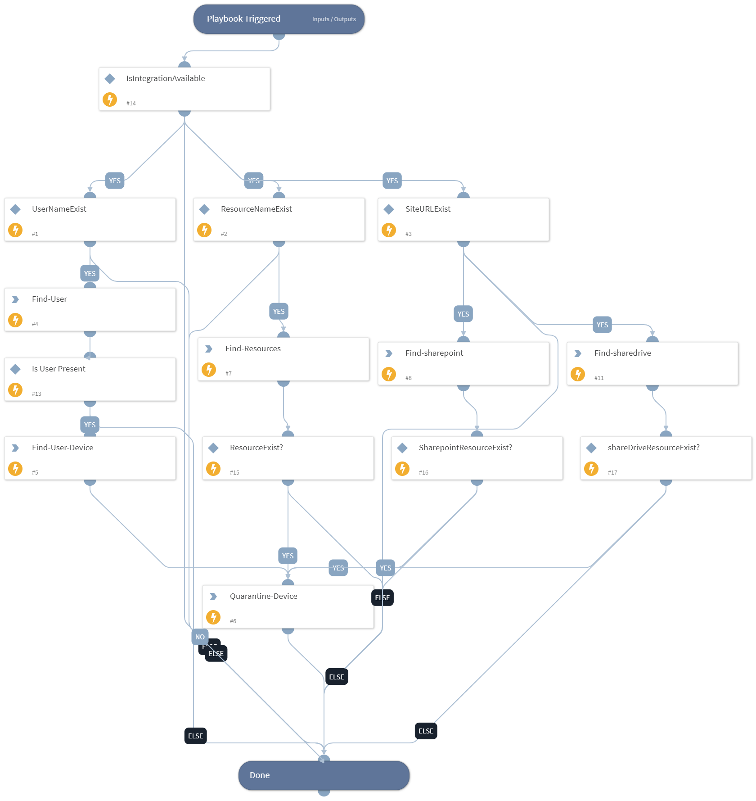

Automate response actions like quarantining effected resources or snapshots to stop the spread of ransomware and avoid reinfection or contamination spread.

## Dependencies
This playbook uses the following sub-playbooks, integrations, and scripts.

### Sub-playbooks
This playbook does not use any sub-playbooks.

### Integrations
* Druva Ransomware Response

### Scripts
* IsIntegrationAvailable

### Commands
* druva-view-quarantine-range
* druva-quarantine-resource
* druva-endpoint-search-file-hash
* druva-find-device

## Playbook Inputs
---

| **Name** | **Description** | **Default Value** | **Required** |
| --- | --- | --- | --- |
| OccuredTime | Date when incident occurred. This field will be used as the start date for Druva snapshot quarantine. Format: YYYY-MM-DD | incident.datetimeofthebreach | Required |
| ComputerName | ComputerName is used to search Druva for resourceID | incident.hostname | Required |
| SHA1 | FIle Hash of ransomware Detected | File.SHA1 | Optional |

## Playbook Outputs
---

| **Path** | **Description** | **Type** |
| --- | --- | --- |
| Druva.viewedQuarantineRange | Druva Range Output | unknown |

## Playbook Image
---

