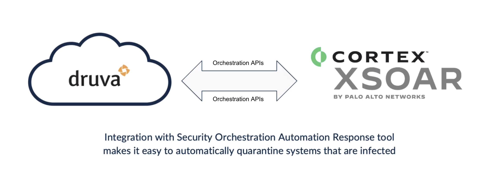

## Accelerate ransomware recovery with Druva Cloud Platform

Ransomware is a growing threat; sophisticated new variants specifically target backup data for encryption and deletion. Plus, ransomware attacks are intentionally timed for events like national holidays when security and IT professionals are likely to be out of office. Just having a backup solution is no longer enough; you need to integrate your data protection and security technologies to combat this threat.

The Druva Cloud Platform integration empowers you to automate ransomware incident response playbooks and orchestrate recovery actions across both your primary and backup environments.

**The Druva Cloud Platform offers**

- Data Integrity: Air-gapped, immutable backups - ransomware can’t execute in the Druva environment, so you’ll always have safe backup data you can use for recovery
- Operational Security: 24x7x365 fully managed security operations including automatic patching and continuous monitoring
- Accelerated Recovery: Robust API integrations with SIEM and SOAR platforms are coupled with our Accelerated Recovery solutions so you can get back to normal faster

**What does this pack do?**

This two way API integration enables customers to:

- Automate response actions like quarantining effected resources or snapshots to stop the spread of ransomware and avoid reinfection or contamination spread
- Initiate recovery actions like restoring an endpoint to a point in time prior to an attack
- Remotely wipe resources and delete quarantined snapshots affected by malware
- Search data for malicious hashes to accelerate remediation of malicious content
- Supported Event Types: inSync events (`insync_events`) and Cybersecurity events (`cybersecurity_events`).

## Configuration on Server Side

### Create an API credential (Client ID and Secret Key)

1. Log in to your **Druva Cloud Platform Console** as an administrator.
2. Navigate to the **Administration** area, then select **API Credentials** (under the **Cloud Settings** / **Manage** section).
3. Select **Create New Credentials** (or **+ New** / **Add API Credentials**).
4. Provide a **description** that identifies the purpose of the API credential.
5. Select **Save** (or **Create**). Druva generates a **Client ID** and a **Secret Key** for the new credential.
6. Select **Copy** to copy the **Client ID**, then copy the **Secret Key**.

   > **Note:** The **Secret Key** is displayed only once at the time of creation. Store it securely, as it cannot be retrieved again later. If lost, you must generate a new Secret Key.

7. Paste the **Client ID** and **Secret Key** into your Cortex XSIAM integration configuration.

> **Managing credentials:** You can return to the **API Credentials** page at any time to **activate**, **deactivate**, **regenerate the Secret Key**, or **delete** existing API credentials.

For more information, use the following guide [here](https://help.druva.com/en/articles/8580838-create-and-manage-api-credentials).
