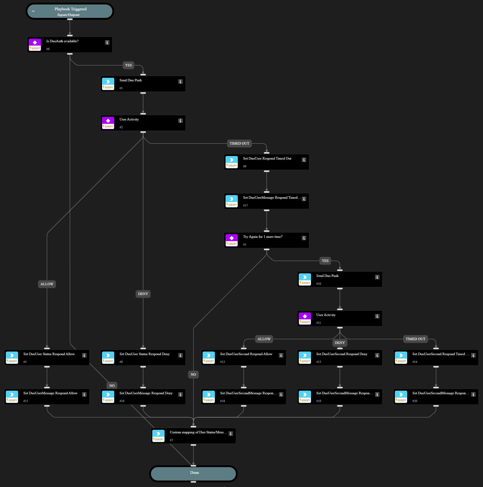

Send Duo Push message to enrolled user.

## Dependencies

This playbook uses the following sub-playbooks, integrations, and scripts.

### Sub-playbooks

This playbook does not use any sub-playbooks.

### Integrations

This playbook does not use any integrations.

### Scripts

* IsIntegrationAvailable
* Print
* Set

### Commands

* duoauth-push-notification

## Playbook Inputs

---

| **Name** | **Description** | **Default Value** | **Required** |
| --- | --- | --- | --- |
| Username | Enrolled user in Duo |  | Required |
| Pushinfo | Message to user in Duo |  | Required |
| TryAgain | Try sending message Again for 1 more time, default is False. | False | Required |

## Playbook Outputs

---
There are no outputs for this playbook.

## Playbook Image

---

