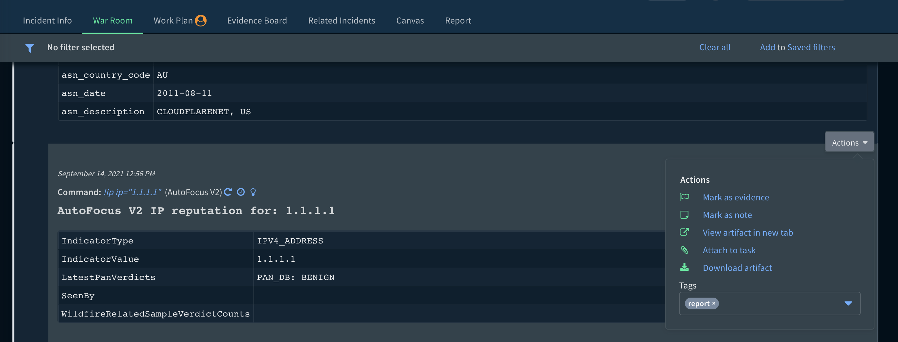

Dynamic sections allow you to populate content into indicator and incident layouts using an automation script.
The `DisplayIndicatorReputationContent` automation contained in this pack makes it easy to display all reputation information collected for a particular indicator directly on its layout.

The `DisplayTaggedWarroomEntries` automation allows for a tab on an incident layout to be populated with a dynamic section which grabs warroom entries that are tagged with the "report" tag.

You can add the "report" tag directly on entries in the warroom

or tags can be automatically applied on each task in the playbook editor

An incident level report can then be generated from this tab in the layout.

