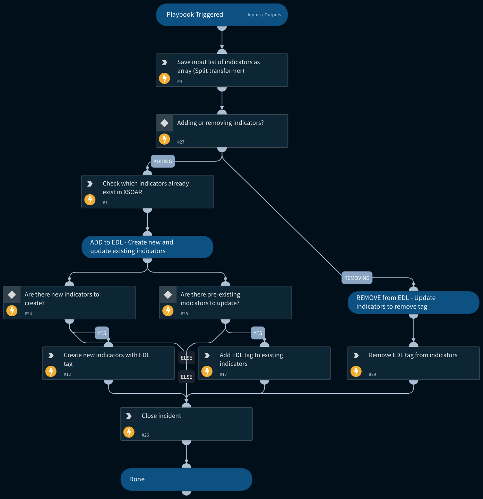

Adds indicators to or removes indicators from an external dynamic list (EDL) by adding or removing an indicator tag. The EDL itself is generated by using the Cortex XSOAR Generic Export Indicators Service integration and querying on tag in the Indicator Query parameter.

Incident fields that control the behavior of this playbook:
- EDL Action: Whether to add or remove EDL indicators/
- EDL Indicators List: Input list of indicators to add to or remove from EDL (according to the value of EDL Action).
- EDL Tag: Tag value in the Generic Export Indicators Service integration instance Indicator Query, which controls which indicators are on the EDL.
- EDL Indicator Type: (Only relevant if adding to EDL) Type of indicators to add to EDL.

## Dependencies
This playbook uses the following sub-playbooks, integrations, and scripts.

### Sub-playbooks
This playbook does not use any sub-playbooks.

### Integrations
This playbook does not use any integrations.

### Scripts
Set

### Commands
* createNewIndicator
* findIndicators
* removeIndicatorField
* closeInvestigation
* appendIndicatorField

## Playbook Inputs
---
There are no inputs for this playbook.

## Playbook Outputs
---
There are no outputs for this playbook.

## Playbook Image
---

