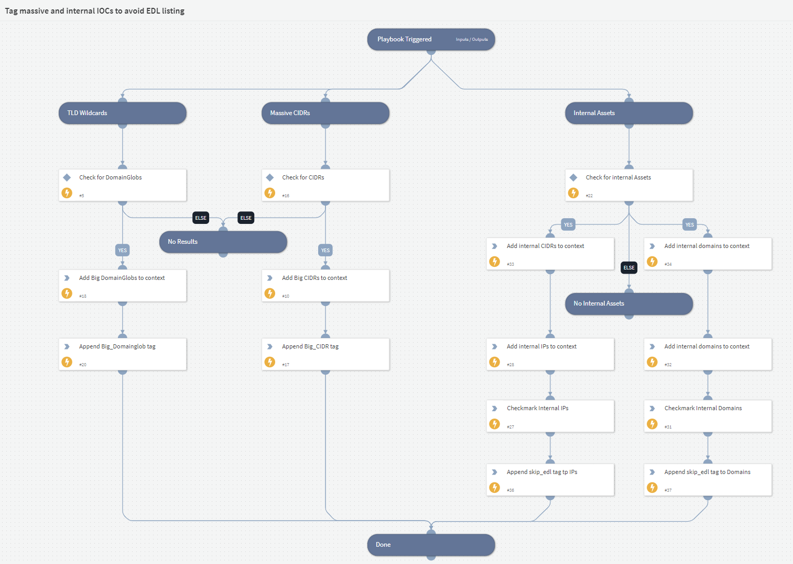

This playbook tags internal assets and massive IOCs (TLD wildcards and CIDRs) to be avoided by the EDL. The playbook does the following according to indicator type:  
- **CIDRs** - If the CIDR prefix is larger than the set max prefix it tags it with `Massive_CIDR` and also with `skip_edl`.
- **TLD Wildcards** - If a DomainGlob is a TLD wildcard (for example *.net) it tags it with `TLD_Wildcard` and also with `skip_edl`.
- **Internal IPs** - If an IP is internal and also part of the CIDR configured by the user in the "Internal Assets" list it is checked as `internal` and tagged with `skip_edl`.
- **Internal Domains** - If a domain is a subdomain of the domains configured in the "Internal Assets" list it is checked as `internal` and tagged with `skip_edl`.

We recommend running the playbook as a job to keep tags up to date on new indicators.

## Playbook Inputs

---
| **Name** | **Description** | **Default Value** | **Required** |
| --- | --- | --- | --- |
| Indicator Query | This query retrieves the following indicator types - IP, IPv6, CIDR, and IPv6CIDR | type:CIDR or type:IP or type:DomainGlob or type:IPv6CIDR or type:Domain | Optional |
| Internal Assets | A list of internal assets consisting of CIDRs and domains that belong to the user.  | lists.Internal assets | Optional |
| Maximum CIDR Prefix | The maximum prefix to allow, any prefix bigger than the specified is tagged to be ignored by the EDL. | 8 | Optional |

## Playbook Image

---

