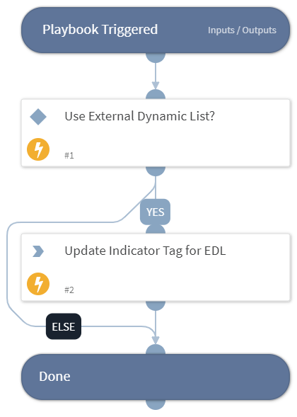

This playbook blocks domains using External Dynamic Link.
The playbook adds a tag to the inputs domain indicators. the tagged indicators can be publish as External Dynamic list that can be added to blocklist using products like Panorama by Palo Alto Networks.

## Dependencies
This playbook uses the following sub-playbooks, integrations, and scripts.

### Sub-playbooks
This playbook does not use any sub-playbooks.

### Integrations
This playbook does not use any integrations.

### Scripts
This playbook does not use any scripts.

### Commands
* setIndicators

## Playbook Inputs
---

| **Name** | **Description** | **Default Value** | **Required** |
| --- | --- | --- | --- |
| Domains | The domains to block |  | Optional |
| Tag | Indicator tag to assign |  | Optional |

## Playbook Outputs
---
There are no outputs for this playbook.

## Playbook Image
---
