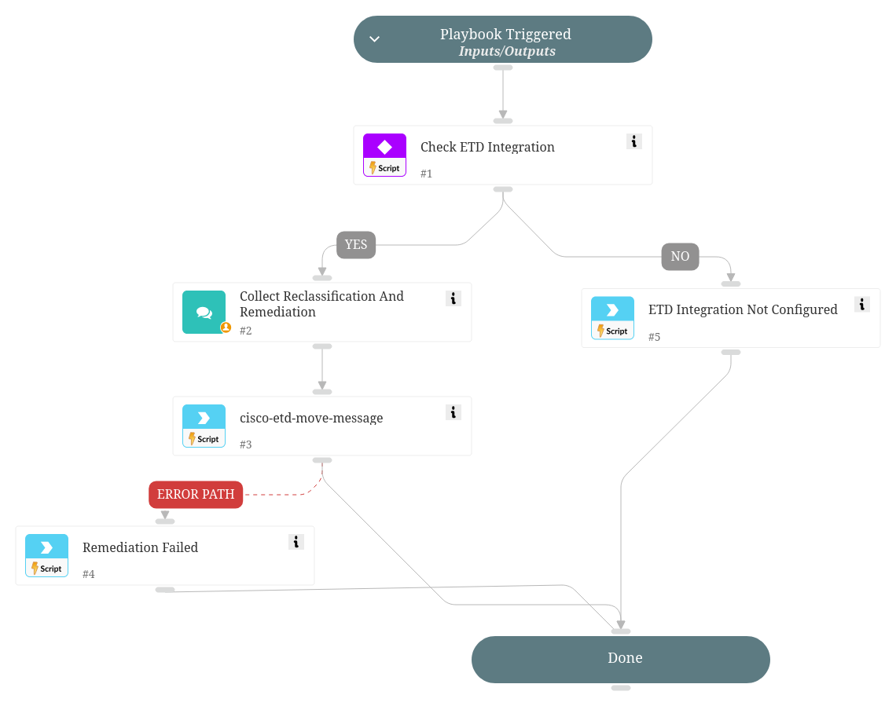

Allows analysts to review Cisco ETD emails, reclassify message verdicts, and perform remediation actions.

## Dependencies

This playbook uses the following sub-playbooks, integrations, and scripts.

### Sub-playbooks

This playbook does not use any sub-playbooks.

### Integrations

* ETDXsoarConnector

### Scripts

* IsIntegrationAvailable
* Print

### Commands

* cisco-etd-move-message

## Playbook Inputs

---
There are no inputs for this playbook.

## Playbook Outputs

---
There are no outputs for this playbook.

## Playbook Image

---

