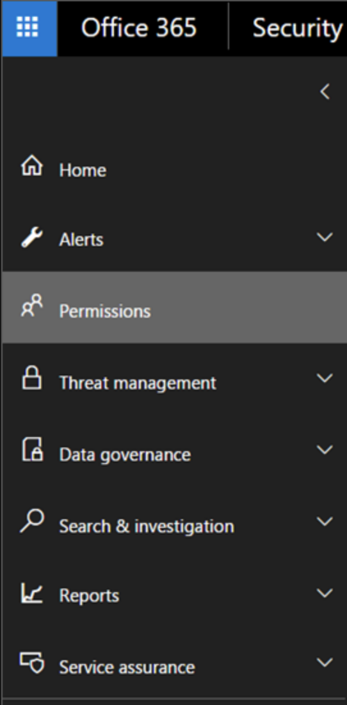
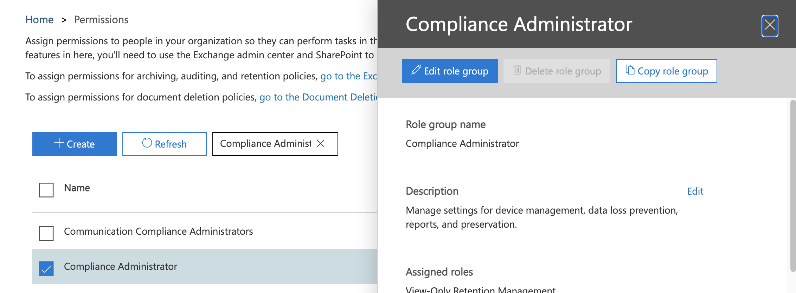
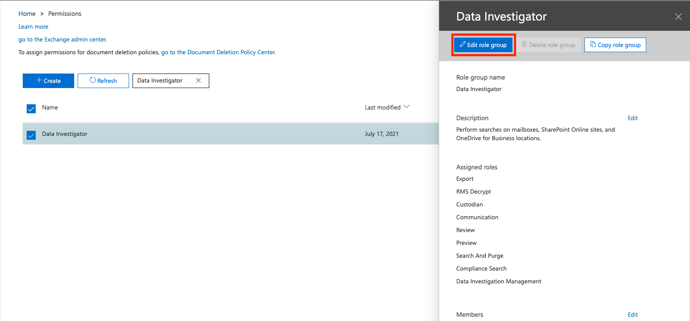
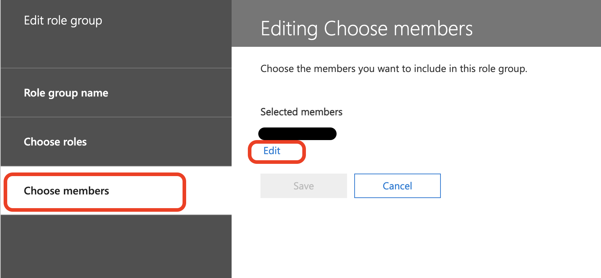
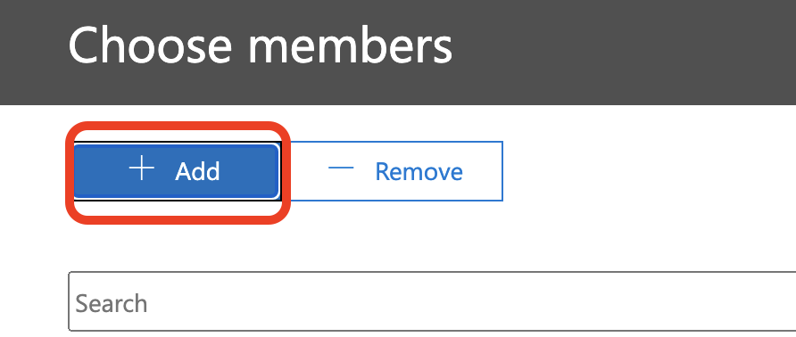

This integration enables you to manage and interact with Microsoft security and compliance content search. You can manage the security of all your organization's emails, SharePoint sites, OneDrives, etc., by searching for text strings or queries based on attributes of a malicious email. However, you can only perform actions (preview and delete) on emails.
This integration was integrated and tested with [Security & Compliance Center](https://docs.microsoft.com/en-us/powershell/module/exchange/?view=exchange-ps#policy-and-compliance-content-search). 

## Use Cases

* Create / Modify / Get / List / Remove / Trigger  a search in the Security & Compliance Center - Content search service.
* Create / Get / List / Remove search actions in the Security & Compliance Center - Content search service. Supported actions for emails only are Purge (Delete) and Preview.

## Playbooks

* O365 - Security And Compliance - Search And Delete: Creates and starts a compliance search in the Security and Compliance Center to identify emails with similar attributes of a malicious email. If configured, will preview or delete the emails that were located. This playbook uses the following playbooks as sub-playbooks in its workflow.
* O365 - Security And Compliance - Search: Creates and starts a compliance search in the Security and Compliance Center to identify emails with attributes similar to a malicious email.
* O365 - Security And Compliance - Search Action - Delete: Deletes emails located by the **O365 SecurityAndCompliance Search** sub-playbook.
* O365 - Security And Compliance - Search Action - Preview: Provides a preview of the results of emails located by the **O365 SecurityAndCompliance Search** sub-playbook.


## Permissions in the Security & Compliance Center

To access the Security & Compliance Center, you need to be a global administrator or a member of one or more Security & Compliance Center role groups.

1. Login into the [Security & Compliance Center](https://ps.compliance.protection.outlook.com):

1. From the side menu, click **Permissions**.

   

2. Search for and select the **Compliance Administrator** role.

   

3. Click **Edit role group**. 

   

4. Click **Choose Members** and click **Edit**. Add the user you intend to be used in the integration:

   
5. Click **Add**.
   
6. Choose which members to add from the displayed list and click **Add**.
7. Click **Done**.
   

## Configure SecurityAndCompliance on Cortex XSOAR

1. Navigate to **Settings** > **Integrations** > **Servers & Services**.

2. Search for SecurityAndCompliance.

3. Authentication / Authorization methods:

   1. OAuth2.0 authorization (recommended):

         1. Click **Add instance** to create and configure a new integration instance.

            | **Parameter** | **Description**                                          | **Required** |
            | ------------- | -------------------------------------------------------- | ------------ |
            | url           | Search and Compliance URL                                | True         |
            | credentials   | Fill **only** Email (aka UPN), Password should be empty. | False        |
            | insecure      | Trust any certificate \(not secure\)                     | False        |

         2. Open playground -  War-room:

            1. Run the ***!o365-sc-auth-start*** command and follow the instructions. Expected output is:


            >## Security And Compliance - Authorize instructions
            >
            >1. To sign in, use a web browser to open the page [https://microsoft.com/devicelogin](https://microsoft.com/devicelogin) and enter the code **XXXXXXX** to authenticate.
            >2. Run the command ***!o365-sc-auth-complete*** command in the War Room.

            

            2. Test - OAuth2.0 authorization, Run the ***!o365-sc-auth-test*** command. 

   2. Basic authentication (Not recommended):

      1. Click **Add instance** to create and configure a new integration instance.

         | **Parameter** | **Description** | **Required** |
         | --- | --- | --- |
         | url | Search and Compliance URL | True |
         | credentials | Fill Email (aka UPN) and password | False |
         | insecure | Trust any certificate \(not secure\) | False |

      2. Click **Test** to validate the URLs, token, and connection.

   

## Commands
You can execute these commands from the Cortex XSOAR CLI, as part of an automation, or in a playbook.
After you successfully execute a command, a DBot message appears in the War Room with the command details.

### o365-sc-auth-start
***
OAuth2.0 - Start authorization.


#### Base Command

`o365-sc-auth-start`
#### Input

There are no input arguments for this command.

#### Context Output

There is no context output for this command.

#### Command Example
```!o365-sc-auth-start```

#### Human Readable Output

>## Security And Compliance - Authorize instructions
>1. To sign in, use a web browser to open the page [https://microsoft.com/devicelogin](https://microsoft.com/devicelogin) and enter the code **XXXXXXX** to authenticate.
>2. Run the ***!o365-sc-auth-complete*** command in the War Room.


### o365-sc-auth-complete
***
OAuth2.0 - Complete authorization.


#### Base Command

`o365-sc-auth-complete`
#### Input

There are no input arguments for this command.

#### Context Output

There is no context output for this command.

#### Command Example
```!o365-sc-auth-complete```

#### Human Readable Output

>Your account **successfully** authorized!


### o365-sc-auth-test
***
OAuth2.0 - Test authorization.


#### Base Command

`o365-sc-auth-test`
#### Input

There are no input arguments for this command.

#### Context Output

There is no context output for this command.

#### Command Example
```!o365-sc-auth-test```

#### Human Readable Output

>**Test ok!**


### o365-sc-new-search
***
Create compliance search in the Security & Compliance Center.


#### Base Command

`o365-sc-new-search`
#### Input

| **Argument Name** | **Description** | **Required** |
| --- | --- | --- |
| search_name | The name of the compliance search. | Required |
| case | The name of a Core eDiscovery case to associate with the new compliance search. | Optional |
| kql | Text search string or a query that is formatted using the Keyword Query Language (KQL). | Optional |
| description | Description of the compliance search. | Optional |
| allow_not_found_exchange_locations | Whether to include mailboxes other than regular user mailboxes in the compliance search. Default is "false". | Optional |
| exchange_location | Comma-separated list of mailboxes/distribution groups to include, or you can use the value "All" to include all. | Optional |
| exchange_location_exclusion | Comma-separated list of mailboxes/distribution groups to exclude when you use the value "All" for the exchange_location parameter. | Optional |
| public_folder_location | Comma-separated list of public folders to include, or you can use the value "All" to include all. | Optional |
| share_point_location | Comma-separated list of SharePoint online sites to include. You can identify the sites by their URL value, or you can use the value "All" to include all sites. | Optional |
| share_point_location_exclusion | Comma-separated list of SharePoint online sites to exclude when you use the value "All" for the share_point_location argument. You can identify the sites by their URL value. | Optional |


#### Context Output

| **Path** | **Type** | **Description** |
| --- | --- | --- |
| O365.SecurityAndCompliance.ContentSearch.Search.AllowNotFoundExchangeLocationsEnabled | Boolean | Whether to include mailboxes other than regular user mailboxes in the compliance search. |
| O365.SecurityAndCompliance.ContentSearch.Search.AzureBatchFrameworkEnabled | Boolean | Whether the Azure Batch Framework is enabled for job processing. |
| O365.SecurityAndCompliance.ContentSearch.Search.CaseId | String | Identity of a Core eDiscovery case which is associated with the compliance search. |
| O365.SecurityAndCompliance.ContentSearch.Search.CaseName | String | Name of a Core eDiscovery case which is associated with the compliance search. |
| O365.SecurityAndCompliance.ContentSearch.Search.ContentMatchQuery | String | Compliance text search string or a query that is formatted using the Keyword Query Language \(KQL\). |
| O365.SecurityAndCompliance.ContentSearch.Search.CreatedBy | String | Security and compliance search creator. |
| O365.SecurityAndCompliance.ContentSearch.Search.CreatedTime | Date | Security and compliance search creation time. |
| O365.SecurityAndCompliance.ContentSearch.Search.Description | String | Security and compliance search description. |
| O365.SecurityAndCompliance.ContentSearch.Search.Errors | String | Security and compliance search errors. |
| O365.SecurityAndCompliance.ContentSearch.Search.ExchangeLocation | String | Security and compliance search exchange locations to include. |
| O365.SecurityAndCompliance.ContentSearch.Search.Identity | String | Security and compliance search identity. |
| O365.SecurityAndCompliance.ContentSearch.Search.IsValid | Boolean | Whether the security and compliance search is valid. |
| O365.SecurityAndCompliance.ContentSearch.Search.Items | Number | The number of security and compliance search scanned items. |
| O365.SecurityAndCompliance.ContentSearch.Search.JobEndTime | Date | Security and compliance search job end time. |
| O365.SecurityAndCompliance.ContentSearch.Search.JobId | String | Security and compliance search job ID. |
| O365.SecurityAndCompliance.ContentSearch.Search.JobRunId | String | Security and compliance search job run ID. |
| O365.SecurityAndCompliance.ContentSearch.Search.JobStartTime | Date | Security and compliance search job run start time. |
| O365.SecurityAndCompliance.ContentSearch.Search.LastModifiedTime | Date | Security and compliance search last modification time. |
| O365.SecurityAndCompliance.ContentSearch.Search.LogLevel | String | Security and compliance search Azure log level. |
| O365.SecurityAndCompliance.ContentSearch.Search.Name | String | Security and compliance search name. |
| O365.SecurityAndCompliance.ContentSearch.Search.OneDriveLocation | String | Security and compliance search OneDrive locations to include. |
| O365.SecurityAndCompliance.ContentSearch.Search.OneDriveLocationExclusion | String | Security and compliance search OneDrive locations to exclude. |
| O365.SecurityAndCompliance.ContentSearch.Search.PublicFolderLocation | String | Security and compliance search public folder locations to include. |
| O365.SecurityAndCompliance.ContentSearch.Search.PublicFolderLocationExclusion | String | Security and compliance search public folder locations to exclude. |
| O365.SecurityAndCompliance.ContentSearch.Search.RunBy | String | Security and compliance search last run by UPN \(Email representation\). |
| O365.SecurityAndCompliance.ContentSearch.Search.RunspaceId | String | Security and compliance search run space ID. |
| O365.SecurityAndCompliance.ContentSearch.Search.SharePointLocation | String | Security and compliance search SharePoint locations to include. |
| O365.SecurityAndCompliance.ContentSearch.Search.Size | Number | Security and compliance search bytes results size. |
| O365.SecurityAndCompliance.ContentSearch.Search.Status | String | Security and compliance search status. |
| O365.SecurityAndCompliance.ContentSearch.Search.TenantId | String | Security and compliance search Tenant ID. |


#### Command Example
```!o365-sc-new-search search_name="example" exchange_location="user1@demistodev.onmicrosoft.com,user2@demistodev.onmicrosoft.com" allow_not_found_exchange_locations=true kql="Rodrigo"```

#### Context Example
```json
{
    "O365": {
        "SecurityAndCompliance": {
            "ContentSearch": {
                "Search": {
                    "AllowNotFoundExchangeLocationsEnabled": true,
                    "AzureBatchFrameworkEnabled": false,
                    "CaseId": null,
                    "CaseName": "",
                    "ContentMatchQuery": "Rodrigo",
                    "CreatedBy": "XSOAR-user",
                    "CreatedTime": "2020-11-29T07:12:46.5943533Z",
                    "Description": "Short description",
                    "Errors": null,
                    "ExchangeLocation": [
                        "test1@onmicrosoft.com",
                        "test2@onmicrosoft.com"
                    ],
                    "ExchangeLocationExclusion": [],
                    "Identity": "xxxxx",
                    "IsValid": true,
                    "Items": 0,
                    "JobEndTime": null,
                    "JobId": "xxxxx",
                    "JobRunId": null,
                    "JobStartTime": null,
                    "LastModifiedTime": "2020-11-29T07:12:46.5943533Z",
                    "LogLevel": "Suppressed",
                    "Name": "example",
                    "OneDriveLocation": null,
                    "OneDriveLocationExclusion": null,
                    "PublicFolderLocation": null,
                    "PublicFolderLocationExclusion": null,
                    "RunBy": "",
                    "RunspaceId": null,
                    "SharePointLocation": null,
                    "SharePointLocationExclusion": null,
                    "Size": 0,
                    "Status": "NotStarted",
                    "SuccessResults": null,
                    "TenantId": "xxxxx"
                }
            }
        }
    }
}
```

#### Human Readable Output

>### Security And Compliance - New search 'example' created
>| ContentMatchQuery | CreatedBy | Description | LastModifiedTime | Name
>| --- | --- | --- | --- | ---
>| Rodrigo | XSOAR-user | Short description | 11/29/2020 7:12:46 AM | example


### o365-sc-set-search

***
Modifies non-running compliance searches in the Security & Compliance Center.


#### Base Command

`o365-sc-set-search`
#### Input

| **Argument Name** | **Description** | **Required** |
| --- | --- | --- |
| search_name | The name of the compliance search. | Required |
| kql | Modify the text search string or a query that is formatted using the Keyword Query Language (KQL). | Optional |
| description | Modify the description for the compliance search. | Optional |
| allow_not_found_exchange_locations | Whether to include mailboxes other than regular user mailboxes in the compliance search. | Optional |
| add_exchange_location | Comma-separated list of added mailboxes/distribution groups to include, or you can use the value "All" to include all mailboxes. | Optional |
| add_exchange_location_exclusion | Comma-separated list of added mailboxes/distribution groups to exclude when you use the value "All" for the exchange_location (used in create new compliance search) or the add_exchange_location argument. | Optional |
| add_public_folder_location | Comma-separated list of added public folders to include, or you can use the value "All" to include all. | Optional |
| add_share_point_location | Comma-separated list of added SharePoint online sites to include. You identify the sites by their URL value, or you can use the value "All" to include all sites. | Optional |
| add_share_point_location_exclusion | Comma-separated list of added SharePoint online sites to exclude when you use the value "All" for the exchange_location (used in create new compliance search) argument or the share_point_location argument. You can identify the sites by their URL value. | Optional |
| remove_exchange_location | Comma-separated list of removed mailboxes/distribution group to include. | Optional |
| remove_exchange_location_exclusion | Comma-separated list of removed mailboxes/distribution group to exclude when you use the value "All" for the exchange_location (Used in create new compliance search) or the add_exchange_location argument. | Optional |
| remove_public_folder_location | Comma-separated list of removed public folders to include. | Optional |
| remove_share_point_location | Comma-separated list of removed SharePoint online sites to include. You can identify the sites by their URL value. | Optional |
| remove_share_point_location_exclusion | Comma-separated list of removed SharePoint online sites to exclude when you use the value "All" for the exchange_location (Used in create new compliance search) argument or the share_point_location argument. You can identify the sites by their URL value. | Optional |


#### Context Output

There is no context output for this command.

#### Command Example
```!o365-sc-set-search search_name="example" remove_exchange_location="test2@demistodev.onmicrosoft.com"```

#### Human Readable Output

>Security And Compliance - Search **example** modified!


### o365-sc-remove-search

***
Remove compliance search by name from the Security & Compliance Center.


#### Base Command

`o365-sc-remove-search`
#### Input

| **Argument Name** | **Description** | **Required** |
| --- | --- | --- |
| search_name | The name of the compliance search. | Required |


#### Context Output

There is no context output for this command.

#### Command Example
```!o365-sc-remove-search search_name="example"```

#### Human Readable Output

>Security And Compliance - Search **example** removed!


### o365-sc-list-search

***
List compliance searches in the Security & Compliance Center.


#### Base Command

`o365-sc-list-search`
#### Input

There are no input arguments for this command.

#### Context Output

| **Path** | **Type** | **Description** |
| --- | --- | --- |
| O365.SecurityAndCompliance.ContentSearch.Search.AllowNotFoundExchangeLocationsEnabled | Boolean | Whether to include mailboxes other than regular user mailboxes in the compliance search. |
| O365.SecurityAndCompliance.ContentSearch.Search.AzureBatchFrameworkEnabled | Boolean | Whether the Azure Batch Framework is enabled for job processing. |
| O365.SecurityAndCompliance.ContentSearch.Search.CaseId | String | Identity of a Core eDiscovery case which is associated with the compliance search. |
| O365.SecurityAndCompliance.ContentSearch.Search.CaseName | String | Name of a Core eDiscovery case which is associated with the compliance search. |
| O365.SecurityAndCompliance.ContentSearch.Search.ContentMatchQuery | String | Compliance text search string or a query that is formatted using the Keyword Query Language \(KQL\). |
| O365.SecurityAndCompliance.ContentSearch.Search.CreatedBy | String | Security and compliance search creator. |
| O365.SecurityAndCompliance.ContentSearch.Search.CreatedTime | Date | Security and compliance search creation time. |
| O365.SecurityAndCompliance.ContentSearch.Search.Description | String | Security and compliance search description. |
| O365.SecurityAndCompliance.ContentSearch.Search.Errors | String | Security and compliance search errors. |
| O365.SecurityAndCompliance.ContentSearch.Search.ExchangeLocation | String | Security and compliance search exchange locations to include. |
| O365.SecurityAndCompliance.ContentSearch.Search.Identity | String | Security and compliance search identity. |
| O365.SecurityAndCompliance.ContentSearch.Search.IsValid | Boolean | Whether the security and compliance search is valid. |
| O365.SecurityAndCompliance.ContentSearch.Search.Items | Number | The number of security and compliance search scanned items. |
| O365.SecurityAndCompliance.ContentSearch.Search.JobEndTime | Date | Security and compliance search job end time. |
| O365.SecurityAndCompliance.ContentSearch.Search.JobId | String | Security and compliance search job ID. |
| O365.SecurityAndCompliance.ContentSearch.Search.JobRunId | String | Security and compliance search job run ID. |
| O365.SecurityAndCompliance.ContentSearch.Search.JobStartTime | Date | Security and compliance search job run start time. |
| O365.SecurityAndCompliance.ContentSearch.Search.LastModifiedTime | Date | Security and compliance search last modification time. |
| O365.SecurityAndCompliance.ContentSearch.Search.LogLevel | String | Security and compliance search Azure log level. |
| O365.SecurityAndCompliance.ContentSearch.Search.Name | String | Security and compliance search name. |
| O365.SecurityAndCompliance.ContentSearch.Search.OneDriveLocation | String | Security and compliance search OneDrive locations to include. |
| O365.SecurityAndCompliance.ContentSearch.Search.OneDriveLocationExclusion | String | Security and compliance search OneDrive locations to exclude. |
| O365.SecurityAndCompliance.ContentSearch.Search.PublicFolderLocation | String | Security and compliance search public folder locations to include. |
| O365.SecurityAndCompliance.ContentSearch.Search.PublicFolderLocationExclusion | String | Security and compliance search public folder locations to exclude. |
| O365.SecurityAndCompliance.ContentSearch.Search.RunBy | String | Security and compliance search last run by UPN \(Email representation\). |
| O365.SecurityAndCompliance.ContentSearch.Search.RunspaceId | String | Security and compliance search run space ID. |
| O365.SecurityAndCompliance.ContentSearch.Search.SharePointLocation | String | Security and compliance search SharePoint locations to include. |
| O365.SecurityAndCompliance.ContentSearch.Search.Size | Number | Security and compliance search bytes results size. |
| O365.SecurityAndCompliance.ContentSearch.Search.Status | String | Security and compliance search status. |
| O365.SecurityAndCompliance.ContentSearch.Search.TenantId | String | Security and compliance search Tenant ID. |


#### Command Example
```!o365-sc-list-search```

#### Context Example
```json
{
    "O365": {
        "SecurityAndCompliance": {
            "ContentSearch": {
                "Search": [
                    {
                        "AllowNotFoundExchangeLocationsEnabled": false,
                        "AzureBatchFrameworkEnabled": false,
                        "CaseId": null,
                        "CaseName": "",
                        "ContentMatchQuery": "subject:test",
                        "CreatedBy": "XSOAR-user1",
                        "CreatedTime": "2019-08-22T06:43:48.747",
                        "Description": "Short description",
                        "Errors": null,
                        "ExchangeLocation": null,
                        "ExchangeLocationExclusion": null,
                        "Identity": "xxxxx",
                        "IsValid": true,
                        "Items": 0,
                        "JobEndTime": "2019-09-05T13:21:11.563",
                        "JobId": "xxxx",
                        "JobRunId": null,
                        "JobStartTime": "2019-09-05T13:20:34.633",
                        "LastModifiedTime": "2019-08-22T06:43:48.747",
                        "LogLevel": "Suppressed",
                        "Name": "example1",
                        "OneDriveLocation": null,
                        "OneDriveLocationExclusion": null,
                        "PublicFolderLocation": null,
                        "PublicFolderLocationExclusion": null,
                        "RunBy": "XSOAR-user1",
                        "RunspaceId": null,
                        "SharePointLocation": null,
                        "SharePointLocationExclusion": null,
                        "Size": 0,
                        "Status": "Completed",
                        "SuccessResults": null,
                        "TenantId": "xxxx"
                    },
                    {
                        "AllowNotFoundExchangeLocationsEnabled": false,
                        "AzureBatchFrameworkEnabled": false,
                        "CaseId": null,
                        "CaseName": "",
                        "ContentMatchQuery": "subject:Incident Summary Report",
                        "CreatedBy": "XSOAR-user2",
                        "CreatedTime": "2020-01-08T00:44:30.94",
                        "Description": "Short description",
                        "Errors": null,
                        "ExchangeLocation": null,
                        "ExchangeLocationExclusion": null,
                        "Identity": "xxxxx",
                        "IsValid": true,
                        "Items": 0,
                        "JobEndTime": "2020-01-08T00:45:13.433",
                        "JobId": "xxxxx",
                        "JobRunId": null,
                        "JobStartTime": "2020-01-08T00:44:33.717",
                        "LastModifiedTime": "2020-01-08T00:44:30.94",
                        "LogLevel": "Suppressed",
                        "Name": "example2",
                        "OneDriveLocation": null,
                        "OneDriveLocationExclusion": null,
                        "PublicFolderLocation": null,
                        "PublicFolderLocationExclusion": null,
                        "RunBy": "XSOAR-user2",
                        "RunspaceId": null,
                        "SharePointLocation": null,
                        "SharePointLocationExclusion": null,
                        "Size": 0,
                        "Status": "Completed",
                        "SuccessResults": null,
                        "TenantId": "xxxxx"
                    }
                ]
            }
        }
    }
}
```

#### Human Readable Output

>### Security And Compliance - Search configurations
>| CreatedBy | Description | LastModifiedTime | Name | RunBy
>| --- | --- | --- | --- | ---
>| XSOAR-user1 | Short description | 8/22/2019 6:43:48 AM | example1 | XSOAR-user1
>| XSOAR-user2 | Short description | 1/8/2020 12:44:30 AM | example2 | XSOAR-user2


### o365-sc-get-search
***
Gets compliance search by name from the Security & Compliance Center.


#### Base Command

`o365-sc-get-search`
#### Input

| **Argument Name** | **Description** | **Required** |
| --- | --- | --- |
| search_name | The name of the compliance search. | Required |
| limit | The maximum number of results to return. If you want to return all requests that match the query, use "-1" for the value of this argument. | Optional |
| all_results | Whether to include mailboxes which have no results in results entry context. | Optional |
| export | Whether to export search results as json file to war-room. | Optional |
| statistics | Show search statistics. Default is "false". | Optional |


#### Context Output

| **Path** | **Type** | **Description** |
| --- | --- | --- |
| O365.SecurityAndCompliance.ContentSearch.Search.AllowNotFoundExchangeLocationsEnabled | Boolean | Whether to include mailboxes other than regular user mailboxes in the compliance search. |
| O365.SecurityAndCompliance.ContentSearch.Search.AzureBatchFrameworkEnabled | Boolean | Whether the Azure Batch Framework is enabled for job processing. |
| O365.SecurityAndCompliance.ContentSearch.Search.CaseId | String | Identity of a Core eDiscovery case which is associated with the compliance search. |
| O365.SecurityAndCompliance.ContentSearch.Search.CaseName | String | Name of a Core eDiscovery case which is associated with the compliance search. |
| O365.SecurityAndCompliance.ContentSearch.Search.ContentMatchQuery | String | Compliance text search string or a query that is formatted using the Keyword Query Language \(KQL\). |
| O365.SecurityAndCompliance.ContentSearch.Search.CreatedBy | String | Security and compliance search creator. |
| O365.SecurityAndCompliance.ContentSearch.Search.CreatedTime | Date | Security and compliance search creation time. |
| O365.SecurityAndCompliance.ContentSearch.Search.Description | String | Security and compliance search description. |
| O365.SecurityAndCompliance.ContentSearch.Search.Errors | String | Security and compliance search errors. |
| O365.SecurityAndCompliance.ContentSearch.Search.ExchangeLocation | String | Security and compliance search exchange locations to include. |
| O365.SecurityAndCompliance.ContentSearch.Search.Identity | String | Security and compliance search identity. |
| O365.SecurityAndCompliance.ContentSearch.Search.IsValid | Boolean | Whether the security and compliance search is valid. |
| O365.SecurityAndCompliance.ContentSearch.Search.Items | Number | Number of security and compliance search scanned items. |
| O365.SecurityAndCompliance.ContentSearch.Search.JobEndTime | Date | Security and compliance search job end time. |
| O365.SecurityAndCompliance.ContentSearch.Search.JobId | String | Security and compliance search job ID. |
| O365.SecurityAndCompliance.ContentSearch.Search.JobRunId | String | Security and compliance search job run ID. |
| O365.SecurityAndCompliance.ContentSearch.Search.JobStartTime | Date | Security and compliance search job run start time. |
| O365.SecurityAndCompliance.ContentSearch.Search.LastModifiedTime | Date | Security and compliance search last modification time. |
| O365.SecurityAndCompliance.ContentSearch.Search.LogLevel | String | Security and compliance search the Azure log level. |
| O365.SecurityAndCompliance.ContentSearch.Search.Name | String | Security and compliance search name. |
| O365.SecurityAndCompliance.ContentSearch.Search.OneDriveLocation | String | Security and compliance search OneDrive locations to include. |
| O365.SecurityAndCompliance.ContentSearch.Search.OneDriveLocationExclusion | String | Security and compliance search OneDrive locations to exclude. |
| O365.SecurityAndCompliance.ContentSearch.Search.PublicFolderLocation | String | Security and compliance search public folder locations to include. |
| O365.SecurityAndCompliance.ContentSearch.Search.PublicFolderLocationExclusion | String | Security and compliance search public folder locations to exclude. |
| O365.SecurityAndCompliance.ContentSearch.Search.RunBy | String | Security and compliance search last run by UPN \(Email representation\). |
| O365.SecurityAndCompliance.ContentSearch.Search.RunspaceId | String | Security and compliance search run space ID. |
| O365.SecurityAndCompliance.ContentSearch.Search.SharePointLocation | String | Security and compliance search SharePoint locations to include. |
| O365.SecurityAndCompliance.ContentSearch.Search.Size | Number | Security and compliance search bytes results size. |
| O365.SecurityAndCompliance.ContentSearch.Search.Status | String | Security and compliance search status. |
| O365.SecurityAndCompliance.ContentSearch.Search.TenantId | String | Security and compliance search Tenant ID. |
| O365.SecurityAndCompliance.ContentSearch.Search.SuccessResults.Location | String | Security and compliance search result location. |
| O365.SecurityAndCompliance.ContentSearch.Search.SuccessResults.ItemsCount | Number | The number of security and compliance search results in location. |
| O365.SecurityAndCompliance.ContentSearch.Search.SuccessResults.Size | Number | The byte size of the security and compliance search results in location. |


#### Command Example
```!o365-sc-get-search search_name="example"```

#### Context Example
```json
{
    "O365": {
        "SecurityAndCompliance": {
            "ContentSearch": {
                "Search": {
                    "Errors": "", 
                    "AzureBatchFrameworkEnabled": false,
                    "TenantId": "xxxxx", 
                    "SharePointLocationExclusion": null, 
                    "JobStartTime": "2020-11-29T07:20:59.37", 
                    "CreatedTime": "2020-11-29T07:18:04.283", 
                    "OneDriveLocation": null, 
                    "PublicFolderLocation": null, 
                    "Status": "Completed", 
                    "CaseName": "", 
                    "AllowNotFoundExchangeLocationsEnabled": false, 
                    "LogLevel": "Suppressed", 
                    "JobRunId": null, 
                    "CaseId": null, 
                    "JobId": "xxxxx", 
                    "SuccessResults": {
                        "ItemsCount": "122303", 
                        "Location": "user@onmicrosoft.com", 
                        "Size": "12339007379"
                    }, 
                    "LastModifiedTime": "2020-11-29T07:20:43.283", 
                    "Identity": "1d130723-fe0a-4726-6d2a-08d89437520e", 
                    "Name": "example", 
                    "Items": 122303, 
                    "ExchangeLocation": [
                        "user@onmicrosoft.com"
                    ], 
                    "RunBy": "XSOAR-user", 
                    "Description": "Short description", 
                    "ExchangeLocationExclusion": [], 
                    "IsValid": true, 
                    "PublicFolderLocationExclusion": null, 
                    "SharePointLocation": null, 
                    "CreatedBy": "XSOAR-user", 
                    "JobEndTime": "2020-11-29T07:22:01.99", 
                    "RunspaceId": null, 
                    "Size": 12339007379, 
                    "OneDriveLocationExclusion": null, 
                    "ContentMatchQuery": "Rodrigo"
                }
            }
        }
    }
}
```

#### Human Readable Output

>### Security And Compliance - 'example' search
>| CreatedBy | Description | LastModifiedTime | Name | RunBy | Status
>| --- | --- | --- | --- | --- | ---
>| XSOAR-user | Short description | 2020-11-29T07:20:43.283 | example | XSOAR-user | NotStarted


### o365-sc-start-search
***
Starts stopped, completed, or not started compliance search in the Security & Compliance Center.


#### Base Command

`o365-sc-start-search`
#### Input

| **Argument Name** | **Description** | **Required** |
| --- | --- | --- |
| search_name | The name of the compliance search. | Required |


#### Context Output

There is no context output for this command.

#### Command Example
```!o365-sc-start-search search_name="example"```

#### Human Readable Output

>Security And Compliance - search **example** started !

### o365-sc-stop-search
***
Stop running compliance search in the Security & Compliance Center.


#### Base Command

`o365-sc-stop-search`
#### Input

| **Argument Name** | **Description** | **Required** |
| --- | --- | --- |
| search_name | The name of the compliance search. | Required |


#### Context Output

There is no context output for this command.

#### Command Example
```!o365-sc-stop-search search_name="example"```

#### Human Readable Output

>Security And Compliance - search **example** stopped !


### o365-sc-new-search-action
***
After you create a content search using the ***o365-sc-new-search*** command and run it using the ***o365-sc-start-search*** command, you assign a search action to the search using the ***o365-sc-new-search-action*** command.


#### Base Command

`o365-sc-new-search-action`
#### Input

| **Argument Name** | **Description** | **Required** |
| --- | --- | --- |
| search_name | The name of the compliance search. | Required |
| action | Search action to perform. Possible values are: "Preview" and "Purge". Default is "Preview". | Optional |
| purge_type | Purge type. Possible values are: "Soft Delete" and "HardDelete". Default is "SoftDelete". | Optional |


#### Context Output

| **Path** | **Type** | **Description** |
| --- | --- | --- |
| O365.SecurityAndCompliance.ContentSearch.SearchAction.Action | String | Security and compliance search action type. Either "Purge" or "Preview". |
| O365.SecurityAndCompliance.ContentSearch.SearchAction.AllowNotFoundExchangeLocationsEnabled | Boolean | Whether to include mailboxes other than regular user mailboxes in the compliance search. |
| O365.SecurityAndCompliance.ContentSearch.SearchAction.AzureBatchFrameworkEnabled | Boolean | Whether the Azure Batch Framework is enabled for job processing. |
| O365.SecurityAndCompliance.ContentSearch.SearchAction.CaseId | String | Identity of a Core eDiscovery case which is associated with the compliance search. |
| O365.SecurityAndCompliance.ContentSearch.SearchAction.CaseName | String | Name of a Core eDiscovery case which is associated with the compliance search. |
| O365.SecurityAndCompliance.ContentSearch.SearchAction.CreatedBy | String | Security and compliance search action creator. |
| O365.SecurityAndCompliance.ContentSearch.SearchAction.CreatedTime | Date | Security and compliance search action creation time. |
| O365.SecurityAndCompliance.ContentSearch.SearchAction.Description | String | Security and compliance search action description. |
| O365.SecurityAndCompliance.ContentSearch.SearchAction.Errors | String | Security and compliance search action errors. |
| O365.SecurityAndCompliance.ContentSearch.SearchAction.EstimateSearchJobId | String | Security and compliance search action job ID estimation. |
| O365.SecurityAndCompliance.ContentSearch.SearchAction.EstimateSearchRunId | String | Security and compliance search action run ID estimation. |
| O365.SecurityAndCompliance.ContentSearch.SearchAction.ExchangeLocation | String | Security and compliance search action exchange locations to include. |
| O365.SecurityAndCompliance.ContentSearch.SearchAction.ExchangeLocationExclusion | String | Security and compliance search action exchange locations to exclude. |
| O365.SecurityAndCompliance.ContentSearch.SearchAction.Identity | String | Security and compliance search action identity. |
| O365.SecurityAndCompliance.ContentSearch.SearchAction.IsValid | Boolean | Whether the security and compliance search action is valid. |
| O365.SecurityAndCompliance.ContentSearch.SearchAction.JobEndTime | Date | Security and compliance search action job end time. |
| O365.SecurityAndCompliance.ContentSearch.SearchAction.JobId | String | Security and compliance search action job ID. |
| O365.SecurityAndCompliance.ContentSearch.SearchAction.JobRunId | String | Security and compliance search action job run ID. |
| O365.SecurityAndCompliance.ContentSearch.SearchAction.JobStartTime | Date | Security and compliance search action job start time. |
| O365.SecurityAndCompliance.ContentSearch.SearchAction.LastModifiedTime | Date | Security and compliance search action last modified time. |
| O365.SecurityAndCompliance.ContentSearch.SearchAction.Name | String | Security and compliance search action name. |
| O365.SecurityAndCompliance.ContentSearch.SearchAction.PublicFolderLocation | String | Security and compliance search action public folder locations to include. |
| O365.SecurityAndCompliance.ContentSearch.SearchAction.PublicFolderLocationExclusion | String | Security and compliance search action public folder locations to exclude. |
| O365.SecurityAndCompliance.ContentSearch.SearchAction.Retry | Boolean | Whether to retry if the search action failed. |
| O365.SecurityAndCompliance.ContentSearch.SearchAction.RunBy | String | Security and compliance search action run by UPN \(email address\). |
| O365.SecurityAndCompliance.ContentSearch.SearchAction.RunspaceId | String | Security and compliance search action run space ID. |
| O365.SecurityAndCompliance.ContentSearch.SearchAction.SearchName | String | Security and compliance search action search name. |
| O365.SecurityAndCompliance.ContentSearch.SearchAction.SharePointLocation | String | Security and compliance search action SharePoint locations to include. |
| O365.SecurityAndCompliance.ContentSearch.SearchAction.SharePointLocationExclusion | String | Security and compliance search action SharePoint locations to exclude. |
| O365.SecurityAndCompliance.ContentSearch.SearchAction.Status | String | Security and compliance search action status. Either "Started" or "Completed". |
| O365.SecurityAndCompliance.ContentSearch.SearchAction.TenantId | String | Security and compliance search action Tenant ID. |


#### Command Example
```!o365-sc-new-search-action search_name="example" action="Preview"```

#### Context Example
```json
{
    "O365": {
        "SecurityAndCompliance": {
            "ContentSearch": {
                "SearchAction": {
                    "Action": "Preview",
                    "AllowNotFoundExchangeLocationsEnabled": false,
                    "AzureBatchFrameworkEnabled": false,
                    "CaseId": null,
                    "CaseName": "",
                    "CreatedBy": "XSOAR-user",
                    "CreatedTime": "2020-11-29T07:23:50.05",
                    "Description": "",
                    "Errors": "",
                    "EstimateSearchJobId": "xxxxx",
                    "EstimateSearchRunId": "xxxxx",
                    "ExchangeLocation": [
                        "user@onmicrosoft.com"
                    ],
                    "ExchangeLocationExclusion": null,
                    "Identity": "xxxxx",
                    "IsValid": true,
                    "JobEndTime": "2020-11-29T07:24:05.76",
                    "JobId": "xxxxx",
                    "JobRunId": "xxxxx",
                    "JobStartTime": "2020-11-29T07:23:50.297",
                    "LastModifiedTime": "2020-11-29T07:23:50.05",
                    "Name": "example_Preview",
                    "PublicFolderLocation": null,
                    "PublicFolderLocationExclusion": null,
                    "Results": null,
                    "Retry": false,
                    "RunBy": "XSOAR-user",
                    "RunspaceId": "xxxxx",
                    "SearchName": "example",
                    "SharePointLocation": null,
                    "SharePointLocationExclusion": null,
                    "Status": "Completed",
                    "TenantId": "xxxxx"
                }
            }
        }
    }
}
```

#### Human Readable Output

>### Security And Compliance - search action 'example_Preview' created
>| Action | LastModifiedTime | Name | RunBy | SearchName | Status
>| --- | --- | --- | --- | --- | ---
>| Preview | 11/29/2020 7:23:50 AM | example\_Preview | XSOAR-user | example | Completed


### o365-sc-remove-search-action
***
Removes compliance search action by search the action name from the Security & Compliance Center.


#### Base Command

`o365-sc-remove-search-action`
#### Input

| **Argument Name** | **Description** | **Required** |
| --- | --- | --- |
| search_action_name | The name of the compliance search action. | Required |


#### Context Output

There is no context output for this command.

#### Command Example
```!o365-sc-remove-search-action search_action_name="example_Preview"```

#### Human Readable Output

>Security And Compliance - search action **example_Preview** removed!

### o365-sc-list-search-action
***
Lists compliance search actions from the Security & Compliance Center.


#### Base Command

`o365-sc-list-search-action`
#### Input

There are no input arguments for this command.

#### Context Output

| **Path** | **Type** | **Description** |
| --- | --- | --- |
| O365.SecurityAndCompliance.ContentSearch.SearchAction.Action | String | Security and compliance search action type. Either "Purge or "Preview". |
| O365.SecurityAndCompliance.ContentSearch.SearchAction.AllowNotFoundExchangeLocationsEnabled | Boolean | Whether to include mailboxes other than regular user mailboxes in the compliance search. |
| O365.SecurityAndCompliance.ContentSearch.SearchAction.AzureBatchFrameworkEnabled | Boolean | Whether the Azure Batch Framework is enabled for job processing. |
| O365.SecurityAndCompliance.ContentSearch.SearchAction.CaseId | String | Identity of a Core eDiscovery case which is associated with the compliance search. |
| O365.SecurityAndCompliance.ContentSearch.SearchAction.CaseName | String | Name of a Core eDiscovery case which is associated with the compliance search. |
| O365.SecurityAndCompliance.ContentSearch.SearchAction.CreatedBy | String | Security and compliance search action creator. |
| O365.SecurityAndCompliance.ContentSearch.SearchAction.CreatedTime | Date | Security and compliance search action creation time. |
| O365.SecurityAndCompliance.ContentSearch.SearchAction.Description | String | Security and compliance search action description. |
| O365.SecurityAndCompliance.ContentSearch.SearchAction.Errors | String | Security and compliance search action errors. |
| O365.SecurityAndCompliance.ContentSearch.SearchAction.EstimateSearchJobId | String | Security and compliance search action job ID estimation. |
| O365.SecurityAndCompliance.ContentSearch.SearchAction.EstimateSearchRunId | String | Security and compliance search action run ID estimation. |
| O365.SecurityAndCompliance.ContentSearch.SearchAction.ExchangeLocation | String | Security and compliance search action exchange locations to include. |
| O365.SecurityAndCompliance.ContentSearch.SearchAction.ExchangeLocationExclusion | String | Security and compliance search action exchange locations to exclude. |
| O365.SecurityAndCompliance.ContentSearch.SearchAction.Identity | String | Security and compliance search action identity. |
| O365.SecurityAndCompliance.ContentSearch.SearchAction.IsValid | Boolean | Whether the security and compliance search action is valid. |
| O365.SecurityAndCompliance.ContentSearch.SearchAction.JobEndTime | Date | Security and compliance search action job end time. |
| O365.SecurityAndCompliance.ContentSearch.SearchAction.JobId | String | Security and compliance search action job ID. |
| O365.SecurityAndCompliance.ContentSearch.SearchAction.JobRunId | String | Security and compliance search action job run ID. |
| O365.SecurityAndCompliance.ContentSearch.SearchAction.JobStartTime | Date | Security and compliance search action job start time. |
| O365.SecurityAndCompliance.ContentSearch.SearchAction.LastModifiedTime | Date | Security and compliance search action last modified time. |
| O365.SecurityAndCompliance.ContentSearch.SearchAction.Name | String | Security and compliance search action name. |
| O365.SecurityAndCompliance.ContentSearch.SearchAction.PublicFolderLocation | String | Security and compliance search action public folder locations to include. |
| O365.SecurityAndCompliance.ContentSearch.SearchAction.PublicFolderLocationExclusion | String | Security and compliance search action public folder locations to exclude. |
| O365.SecurityAndCompliance.ContentSearch.SearchAction.Retry | Boolean | Whether to retry if the search action failed. |
| O365.SecurityAndCompliance.ContentSearch.SearchAction.RunBy | String | Security and compliance search action run by UPN \(email address\). |
| O365.SecurityAndCompliance.ContentSearch.SearchAction.RunspaceId | String | Security and compliance search action run space ID. |
| O365.SecurityAndCompliance.ContentSearch.SearchAction.SearchName | String | Security and compliance search action search name. |
| O365.SecurityAndCompliance.ContentSearch.SearchAction.SharePointLocation | String | Security and compliance search action SharePoint locations to include. |
| O365.SecurityAndCompliance.ContentSearch.SearchAction.SharePointLocationExclusion | String | Security and compliance search action SharePoint locations to exclude. |
| O365.SecurityAndCompliance.ContentSearch.SearchAction.Status | String | Security and compliance search action status \(Started/Completed\). |
| O365.SecurityAndCompliance.ContentSearch.SearchAction.TenantId | String | Security and compliance search action Tenant ID. |


#### Command Example
```!o365-sc-list-search-action```

#### Context Example
```json
{
    "O365": {
        "SecurityAndCompliance": {
            "ContentSearch": {
                "SearchAction": [
                    {
                        "Action": "Preview",
                        "AllowNotFoundExchangeLocationsEnabled": false,
                        "AzureBatchFrameworkEnabled": false,
                        "CaseId": null,
                        "CaseName": "",
                        "CreatedBy": "XSOAR-user",
                        "CreatedTime": "2020-10-14T13:45:44.14",
                        "Description": "",
                        "Errors": "",
                        "EstimateSearchJobId": "xxxxx",
                        "EstimateSearchRunId": "xxxxx",
                        "ExchangeLocation": null,
                        "ExchangeLocationExclusion": null,
                        "Identity": "xxxxx",
                        "IsValid": true,
                        "JobEndTime": "2020-10-14T13:47:00.103",
                        "JobId": "xxxxx",
                        "JobRunId": "xxxxx",
                        "JobStartTime": "2020-10-14T13:45:58.443",
                        "LastModifiedTime": "2020-10-14T13:45:44.14",
                        "Name": "example_Preview",
                        "PublicFolderLocation": null,
                        "PublicFolderLocationExclusion": null,
                        "Results": null,
                        "Retry": false,
                        "RunBy": "XSOAR-user",
                        "RunspaceId": "xxxxx",
                        "SearchName": "example",
                        "SharePointLocation": null,
                        "SharePointLocationExclusion": null,
                        "Status": "Completed",
                        "TenantId": "xxxxx"
                    },
                  	{
                        "Action": "Purge",
                        "AllowNotFoundExchangeLocationsEnabled": false,
                        "AzureBatchFrameworkEnabled": false,
                        "CaseId": null,
                        "CaseName": "",
                        "CreatedBy": "XSOAR-user1",
                        "CreatedTime": "2020-10-14T13:45:44.14",
                        "Description": "",
                        "Errors": "",
                        "EstimateSearchJobId": "xxxxx",
                        "EstimateSearchRunId": "xxxxx",
                        "ExchangeLocation": null,
                        "ExchangeLocationExclusion": null,
                        "Identity": "xxxxx",
                        "IsValid": true,
                        "JobEndTime": "2020-10-14T13:47:00.103",
                        "JobId": "xxxxx",
                        "JobRunId": "xxxxx",
                        "JobStartTime": "2020-10-14T13:45:58.443",
                        "LastModifiedTime": "2020-10-14T13:45:44.14",
                        "Name": "example_Purge",
                        "PublicFolderLocation": null,
                        "PublicFolderLocationExclusion": null,
                        "Results": null,
                        "Retry": false,
                        "RunBy": "XSOAR-user1",
                        "RunspaceId": "xxxxx",
                        "SearchName": "Rodrigo-diffrent",
                        "SharePointLocation": null,
                        "SharePointLocationExclusion": null,
                        "Status": "Completed",
                        "TenantId": "xxxxx"
                    }
                ]
            }
        }
    }
}
```

#### Human Readable Output

>### Security And Compliance - search actions
>| Action | JobEndTime | LastModifiedTime | Name | RunBy | SearchName | Status
>| --- | --- | --- | --- | --- | --- | ---
>| Preview | 10/14/2020 1:47:00 PM | 10/14/2020 1:45:44 PM | example_Preview | XSOAR-user | example | Completed
>| Purge | 11/25/2020 10:51:04 AM | 11/25/2020 10:50:37 AM | example\_Purge | XSOAR-user | example | Completed
>


### o365-sc-get-search-action
***
Gets compliance search action from the Security & Compliance Center.


#### Base Command

`o365-sc-get-search-action`
#### Input

| **Argument Name** | **Description** | **Required** |
| --- | --- | --- |
| search_action_name | The name of the compliance search action. | Required |
| limit | The maximum number of results to return. If you want to return all requests that match the query, use "-1" for the value of this argument. | Optional |
| export | Whether to export search results as json file to war-room. | Optional |
| results | Whether to print the results in the War Room. Default is "false". | Optional |


#### Context Output

| **Path** | **Type** | **Description** |
| --- | --- | --- |
| O365.SecurityAndCompliance.ContentSearch.SearchAction.Action | String | Security and compliance search action type. Either "Purge" or "Preview". |
| O365.SecurityAndCompliance.ContentSearch.SearchAction.AllowNotFoundExchangeLocationsEnabled | Boolean | Whether to include mailboxes other than regular user mailboxes in the compliance search. |
| O365.SecurityAndCompliance.ContentSearch.SearchAction.AzureBatchFrameworkEnabled | Boolean | Whether the Azure Batch Framework is enabled for job processing. |
| O365.SecurityAndCompliance.ContentSearch.SearchAction.CaseId | String | Identity of a Core eDiscovery case which is associated with the compliance search. |
| O365.SecurityAndCompliance.ContentSearch.SearchAction.CaseName | String | Name of a Core eDiscovery case which is associated with the compliance search. |
| O365.SecurityAndCompliance.ContentSearch.SearchAction.CreatedBy | String | Security and compliance search action creator. |
| O365.SecurityAndCompliance.ContentSearch.SearchAction.CreatedTime | Date | Security and compliance search action creation time. |
| O365.SecurityAndCompliance.ContentSearch.SearchAction.Description | String | Security and compliance search action description. |
| O365.SecurityAndCompliance.ContentSearch.SearchAction.Errors | String | Security and compliance search action errors. |
| O365.SecurityAndCompliance.ContentSearch.SearchAction.EstimateSearchJobId | String | Security and compliance search action job ID estimation. |
| O365.SecurityAndCompliance.ContentSearch.SearchAction.EstimateSearchRunId | String | Security and compliance search action run ID estimation. |
| O365.SecurityAndCompliance.ContentSearch.SearchAction.ExchangeLocation | String | Security and compliance search action exchange locations to include. |
| O365.SecurityAndCompliance.ContentSearch.SearchAction.ExchangeLocationExclusion | String | Security and compliance search action exchange locations to exclude. |
| O365.SecurityAndCompliance.ContentSearch.SearchAction.Identity | String | Security and compliance search action identity. |
| O365.SecurityAndCompliance.ContentSearch.SearchAction.IsValid | Boolean | Whether the security and compliance search action is valid. |
| O365.SecurityAndCompliance.ContentSearch.SearchAction.JobEndTime | Date | Security and compliance search action job end time. |
| O365.SecurityAndCompliance.ContentSearch.SearchAction.JobId | String | Security and compliance search action job ID. |
| O365.SecurityAndCompliance.ContentSearch.SearchAction.JobRunId | String | Security and compliance search action job run ID. |
| O365.SecurityAndCompliance.ContentSearch.SearchAction.JobStartTime | Date | Security and compliance search action job start time. |
| O365.SecurityAndCompliance.ContentSearch.SearchAction.LastModifiedTime | Date | Security and compliance search action last modified time. |
| O365.SecurityAndCompliance.ContentSearch.SearchAction.Name | String | Security and compliance search action name. |
| O365.SecurityAndCompliance.ContentSearch.SearchAction.PublicFolderLocation | String | Security and compliance search action public folder locations to include. |
| O365.SecurityAndCompliance.ContentSearch.SearchAction.PublicFolderLocationExclusion | String | Security and compliance search action public folder locations to exclude. |
| O365.SecurityAndCompliance.ContentSearch.SearchAction.Results.Location | String | Security and compliance search action result location. |
| O365.SecurityAndCompliance.ContentSearch.SearchAction.Results.Sender | String | Security and compliance search action result mail sender. |
| O365.SecurityAndCompliance.ContentSearch.SearchAction.Results.Subject | String | Security and compliance search action result subject. |
| O365.SecurityAndCompliance.ContentSearch.SearchAction.Results.Type | String | Security and compliance search action result type. |
| O365.SecurityAndCompliance.ContentSearch.SearchAction.Results.Size | String | Security and compliance search action result size. |
| O365.SecurityAndCompliance.ContentSearch.SearchAction.Results.ReceivedTime | Date | Security and compliance search action result received time. |
| O365.SecurityAndCompliance.ContentSearch.SearchAction.Results.DataLink | String | Security and compliance search action data link. |
| O365.SecurityAndCompliance.ContentSearch.SearchAction.Retry | Boolean | Whether to retry if the search action failed. |
| O365.SecurityAndCompliance.ContentSearch.SearchAction.RunBy | String | Security and compliance search action run by UPN \(email address\). |
| O365.SecurityAndCompliance.ContentSearch.SearchAction.RunspaceId | String | Security and compliance search action run space ID. |
| O365.SecurityAndCompliance.ContentSearch.SearchAction.SearchName | String | Security and compliance search action search name. |
| O365.SecurityAndCompliance.ContentSearch.SearchAction.SharePointLocation | String | Security and compliance search action SharePoint locations to include. |
| O365.SecurityAndCompliance.ContentSearch.SearchAction.SharePointLocationExclusion | String | Security and compliance search action SharePoint locations to exclude. |
| O365.SecurityAndCompliance.ContentSearch.SearchAction.Status | String | Security and compliance search action status. Either "Started" or "Completed". |
| O365.SecurityAndCompliance.ContentSearch.SearchAction.TenantId | String | Security and compliance search action Tenant ID. |


#### Command Example
```!o365-sc-get-search-action search_action_name="example_Preview"```

#### Context Example
```json
{
    "O365": {
        "SecurityAndCompliance": {
            "ContentSearch": {
                "SearchAction": {
                    "Action": "Preview",
                    "AllowNotFoundExchangeLocationsEnabled": false,
                    "AzureBatchFrameworkEnabled": false,
                    "CaseId": null,
                    "CaseName": "",
                    "CreatedBy": "XSOAR-user",
                    "CreatedTime": "2020-11-29T07:23:50.05",
                    "Description": "",
                    "Errors": "",
                    "EstimateSearchJobId": "2a967c40-07c3-4903-ed7f-08d89436e9b1",
                    "EstimateSearchRunId": "1d130723-fe0a-4726-6d2a-08d89437520e",
                    "ExchangeLocation": [
                        "user@onmicrosoft.com"
                    ],
                    "ExchangeLocationExclusion": null,
                    "Identity": "xxxxx",
                    "IsValid": true,
                    "JobEndTime": "2020-11-29T07:24:05.76",
                    "JobId": "xxxxx",
                    "JobRunId": "xxxxx",
                    "JobStartTime": "2020-11-29T07:23:50.297",
                    "LastModifiedTime": "2020-11-29T07:23:50.05",
                    "Name": "example_Preview",
                    "PublicFolderLocation": null,
                    "PublicFolderLocationExclusion": null,
                    "Results": [
                        {
                            "DataLink": "data/All/xxxx.eml",
                            "Location": "user@onmicrosoft.com",
                            "ReceivedTime": "11/26/2020 2:59:01 PM",
                            "Sender": "Some user",
                            "Size": "19683",
                            "Subject": "Test1",
                            "Type": "Email"
                        },
                       {
                            "DataLink": "data/All/xxxx.eml",
                            "Location": "user@onmicrosoft.com",
                            "ReceivedTime": "12/26/2020 2:59:01 PM",
                            "Sender": "Some user",
                            "Size": "20225",
                            "Subject": "Test2",
                            "Type": "Email"
                        },
                    ],
                    "Retry": false,
                    "RunBy": "XSOAR-user",
                    "RunspaceId": "xxxxx",
                    "SearchName": "example",
                    "SharePointLocation": null,
                    "SharePointLocationExclusion": null,
                    "Status": "Completed",
                    "TenantId": "xxxxx"
                }
            }
        }
    }
}
```

#### Human Readable Output

>### Security And Compliance - search action 'example_Preview'
>| Action | JobEndTime | LastModifiedTime | Name | RunBy | SearchName | Status
>| --- | --- | --- | --- | --- | --- | ---
>| Preview | 11/29/2020 7:24:05 AM | 11/29/2020 7:23:50 AM | example\_Preview | XSOAR-user | example | Completed


## Known Limitations

* Security and compliance integrations do not support Security and compliance on-premise .
* Each security and compliance command creates a PSSession (PowerShell session). The security and compliance PowerShell limits the number of concurrent sessions to 3. Since this affects the behavior of multiple playbooks running concurrently it we recommend that you retry failed tasks when using the integration commands in playbooks.
* Proxies are not supported due to a Microsoft [limitation](https://github.com/PowerShell/PowerShell/issues/9721).


