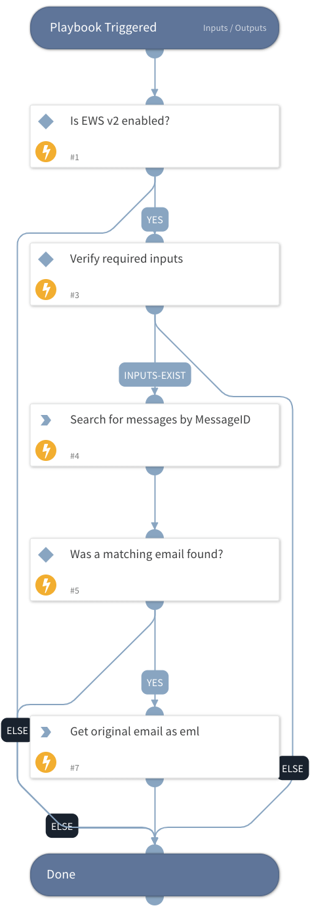

This v2 playbook retrieves the original email in a thread as an EML file (and not an email object as in the previous version) by using the EWS v2 or EWSO365 integration.
It also reduces the number of tasks to perform the fetch action.
Note: You must have the necessary eDiscovery permissions in the EWS integration to execute a global search.

## Dependencies
This playbook uses the following sub-playbooks, integrations, and scripts.

### Sub-playbooks
This playbook does not use any sub-playbooks.

### Integrations
* EWSO365
* EWSv2

### Scripts
* IsIntegrationAvailable

### Commands
* ews-get-items-as-eml
* ews-search-mailbox

## Playbook Inputs
---

| **Name** | **Description** | **Default Value** | **Required** |
| --- | --- | --- | --- |
| TargetMailbox | The target mailbox to retrieve the EML file from. |  | Optional |
| MessageID | The InReplyTo header in the forwarded email. |  | Optional |

## Playbook Outputs
---

| **Path** | **Description** | **Type** |
| --- | --- | --- |
| File | The original email as an EML file. | string |

## Playbook Image
---
