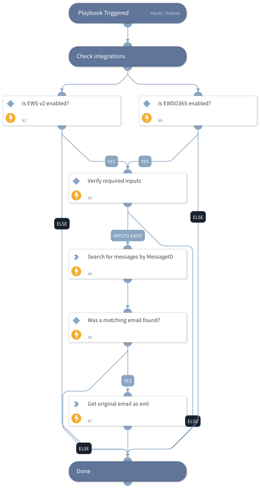

This v2 playbook retrieves the original email in the thread (as eml file) by using the EWS v2 integration.
The main difference between this playbook and its previous version is that this playbook will retrieve the email as eml and not as an Email object. This version also reduces the amount of tasks needed to perform the fetch action.
You must have the necessary permissions in the EWS integration to execute global search: eDiscovery

## Dependencies
This playbook uses the following sub-playbooks, integrations, and scripts.

### Sub-playbooks
This playbook does not use any sub-playbooks.

### Integrations
* EWS v2

### Scripts
* IsIntegrationAvailable

### Commands
* ews-search-mailbox
* ews-get-items-as-eml

## Playbook Inputs
---

| **Name** | **Description** | **Default Value** | **Required** |
| --- | --- | --- | --- |
| TargetMailbox | The target mailbox to retrieve the eml file from. |  | Optional |
| MessageID | The InReplyTo header in the forwarded email. |  | Optional |

## Playbook Outputs
---

| **Path** | **Description** | **Type** |
| --- | --- | --- |
| File | The original email as eml file. | unknown |

## Playbook Image
---
