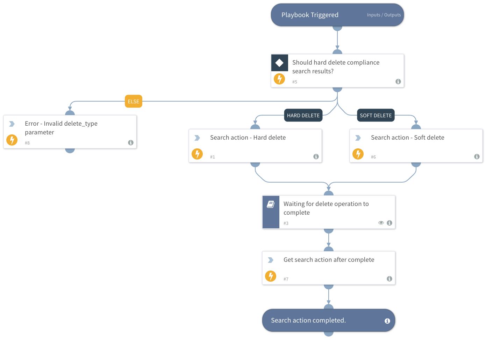

This playbook performs the following steps:
1. Creates a new compliance search action Purge - Hard or Soft.
2. Waits for the compliance search action to complete.
3. Retrieves the delete search action.

## Dependencies
This playbook uses the following sub-playbooks, integrations, and scripts.

### Sub-playbooks
* Waiting for delete operation to complete

### Integrations
* SecurityAndCompliance

### Scripts
* PrintErrorEntry

### Commands
* o365-sc-new-search-action
* o365-sc-get-search-action

## Playbook Inputs
---

| **Name** | **Description** | **Default Value** | **Required** |
| --- | --- | --- | --- |
| search_name | The name of the compliance search. |  | Required |
| delete_type | Purge type. Possible values are: "Soft" and "Hard". Default is "Soft". | Soft | Required |

## Playbook Outputs
---

| **Path** | **Description** | **Type** |
| --- | --- | --- |
| O365.SecurityAndCompliance.ContentSearch.SearchAction.Action | Security and compliance search action type. Either "Purge" or "Preview". | String |
| O365.SecurityAndCompliance.ContentSearch.SearchAction.AllowNotFoundExchangeLocationsEnabled | Whether to include mailboxes other than regular user mailboxes in the compliance search. | Boolean |
| O365.SecurityAndCompliance.ContentSearch.SearchAction.AzureBatchFrameworkEnabled | Whether the Azure Batch Framework is enabled for job processing. | Boolean |
| O365.SecurityAndCompliance.ContentSearch.SearchAction.CaseId | Identity of a Core eDiscovery case which is associated with the compliance search. | String |
| O365.SecurityAndCompliance.ContentSearch.SearchAction.CaseName | Name of a Core eDiscovery case which is associated with the compliance search. | String |
| O365.SecurityAndCompliance.ContentSearch.SearchAction.CreatedBy | Security and compliance search action creator. | String |
| O365.SecurityAndCompliance.ContentSearch.SearchAction.CreatedTime | Security and compliance search action creation time. | Date |
| O365.SecurityAndCompliance.ContentSearch.SearchAction.Description | Security and compliance search action description. | String |
| O365.SecurityAndCompliance.ContentSearch.SearchAction.Errors | Security and compliance search action errors. | String |
| O365.SecurityAndCompliance.ContentSearch.SearchAction.EstimateSearchJobId | Security and compliance search action job ID estimation. | String |
| O365.SecurityAndCompliance.ContentSearch.SearchAction.EstimateSearchRunId | Security and compliance search action run ID estimation. | String |
| O365.SecurityAndCompliance.ContentSearch.SearchAction.ExchangeLocation | Security and compliance search action exchange locations to include. | String |
| O365.SecurityAndCompliance.ContentSearch.SearchAction.ExchangeLocationExclusion | Security and compliance search action exchange locations to exclude. | String |
| O365.SecurityAndCompliance.ContentSearch.SearchAction.Identity | Security and compliance search action identity. | String |
| O365.SecurityAndCompliance.ContentSearch.SearchAction.IsValid | Whether the security and compliance search action is valid. | Boolean |
| O365.SecurityAndCompliance.ContentSearch.SearchAction.JobEndTime | Security and compliance search action job end time. | Date |
| O365.SecurityAndCompliance.ContentSearch.SearchAction.JobId | Security and compliance search action job ID. | String |
| O365.SecurityAndCompliance.ContentSearch.SearchAction.JobRunId | Security and compliance search action job run ID. | String |
| O365.SecurityAndCompliance.ContentSearch.SearchAction.JobStartTime | Security and compliance search action job start time. | Date |
| O365.SecurityAndCompliance.ContentSearch.SearchAction.LastModifiedTime | Security and compliance search action last modified time. | Date |
| O365.SecurityAndCompliance.ContentSearch.SearchAction.Name | Security and compliance search action name. | String |
| O365.SecurityAndCompliance.ContentSearch.SearchAction.PublicFolderLocation | Security and compliance search action public folder locations to include. | String |
| O365.SecurityAndCompliance.ContentSearch.SearchAction.PublicFolderLocationExclusion | Security and compliance search action public folder locations to exclude. | String |
| O365.SecurityAndCompliance.ContentSearch.SearchAction.Results.Location | Security and compliance search action result location. | String |
| O365.SecurityAndCompliance.ContentSearch.SearchAction.Results.Sender | Security and compliance search action result mail sender. | String |
| O365.SecurityAndCompliance.ContentSearch.SearchAction.Results.Subject | Security and compliance search action result subject. | String |
| O365.SecurityAndCompliance.ContentSearch.SearchAction.Results.Type | Security and compliance search action result type. | String |
| O365.SecurityAndCompliance.ContentSearch.SearchAction.Results.Size | Security and compliance search action result size. | String |
| O365.SecurityAndCompliance.ContentSearch.SearchAction.Results.ReceivedTime | Security and compliance search action result received time. | Date |
| O365.SecurityAndCompliance.ContentSearch.SearchAction.Results.DataLink | Security and compliance search action data link. | String |
| O365.SecurityAndCompliance.ContentSearch.SearchAction.Retry | Whether to retry if the search action failed. | Boolean |
| O365.SecurityAndCompliance.ContentSearch.SearchAction.RunBy | Security and compliance search action run by UPN \(email address\). | String |
| O365.SecurityAndCompliance.ContentSearch.SearchAction.RunspaceId | Security and compliance search action run space ID. | String |
| O365.SecurityAndCompliance.ContentSearch.SearchAction.SearchName | Security and compliance search action search name. | String |
| O365.SecurityAndCompliance.ContentSearch.SearchAction.SharePointLocation | Security and compliance search action SharePoint locations to include. | String |
| O365.SecurityAndCompliance.ContentSearch.SearchAction.SharePointLocationExclusion | Security and compliance search action SharePoint locations to exclude. | String |
| O365.SecurityAndCompliance.ContentSearch.SearchAction.Status | Security and compliance search action status. Either "Started" or "Completed". | String |
| O365.SecurityAndCompliance.ContentSearch.SearchAction.TenantId | Security and compliance search action Tenant ID. | String |

## Playbook Image
---
