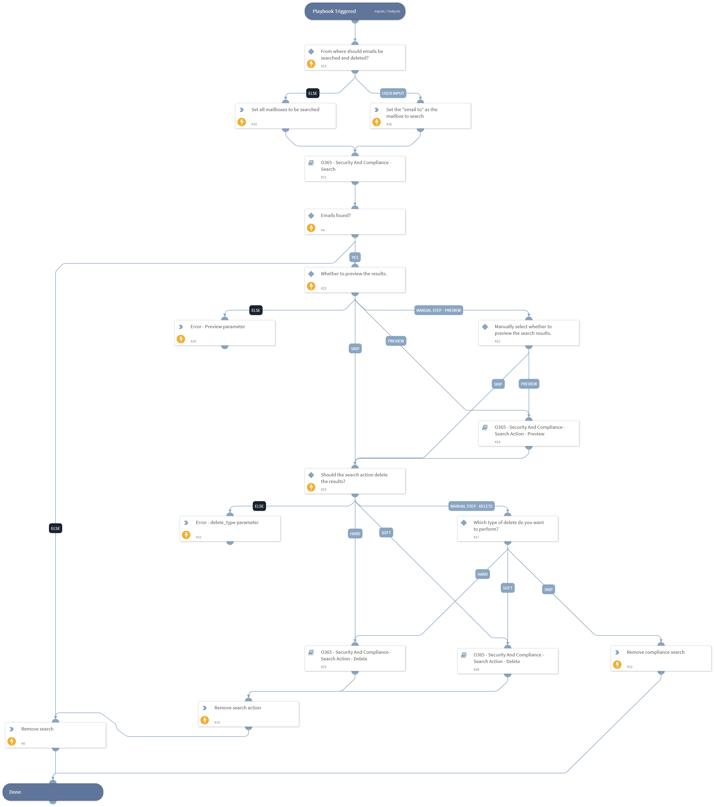

This playbook performs the following steps:
1. Creates a compliance search.
2. Starts a compliance search.
3. Waits for the compliance search to complete.
4. Gets the results of the compliance search.
5. Gets the preview results, if specified.
6. Deletes the search results (Hard/Soft).

## Dependencies
This playbook uses the following sub-playbooks, integrations, and scripts.

### Sub-playbooks
* O365 - Security And Compliance - Search
* Hard delete
* Soft delete
* O365 - Security And Compliance - Search Action - Preview

### Integrations
* SecurityAndCompliance

### Scripts
* PrintErrorEntry

### Commands
* o365-sc-remove-search
* o365-sc-remove-search-action

## Playbook Inputs
---

| **Name** | **Description** | **Default Value** | **Required** |
| --- | --- | --- | --- |
| search_name | The name of the compliance search. If not specified will have prefix of "XSOAR-" and GUID e.g. XSOAR-d6228fd0-756b-4e4b-8721-76776df91526. |  | Optional |
| case | The name of a Core eDiscovery case to associate with the new compliance search. |  | Optional |
| kql | Text search string or a query that is formatted using the Keyword Query Language \(KQL\). |  | Required |
| description | Description of the compliance search. |  | Optional |
| allow_not_found_exchange_locations | Whether to include mailboxes other than regular user mailboxes in the compliance search. Default is "false". | true | Optional |
| exchange_location | Comma-separated list of mailboxes/distribution groups to include, or use the value "All" to include all. |  | Required |
| exchange_location_exclusion | Comma-separated list of mailboxes/distribution groups to exclude when you use the value "All" for the exchange_location parameter. |  | Optional |
| force | Whether to replace the existing search. If "true", the existing search will be removed and a new search will be created. If "false", the existing search will be used and any new search configurations will be ignored. | false | Required |
| preview | Whether to preview the results using the search action "Preview". Possible values are: "true" and "false" or leave empty to select manually. | true | Required |
| delete_type | Specify the delete type to perform on the search results. Possible values are Hard and Soft or leave empty to select manually. \(Hard = Unrecoverable, Soft=Recoverable\) | Soft | Required |

## Playbook Outputs
---
There are no outputs for this playbook.

## Playbook Image
---

## Known Limitations
---
* Each security and compliance command creates a PSSession (PowerShell session). The security and compliance PowerShell limits the number of concurrent sessions to 3. Since this affects the behavior of multiple playbooks running concurrently it we recommend that you retry failed tasks when using the integration commands in playbooks.
* In order to handle sessions limits, A retry mechanism is applied which will retry for 10 time with 30 sec breaks. (The retry isn't applied on the generic polling as its not supported yet)  