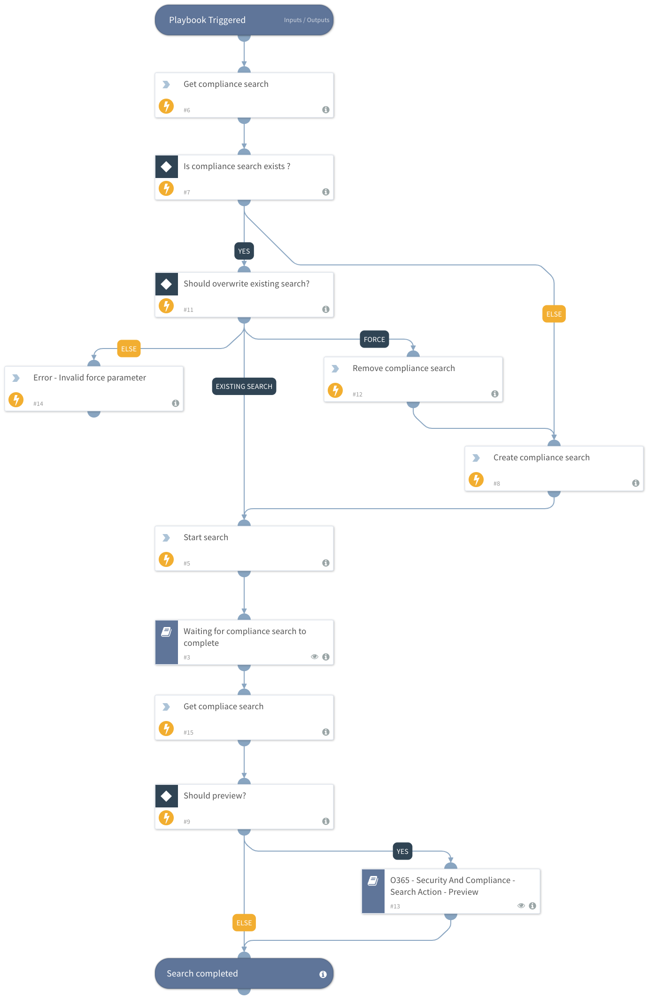

This playbook performs the following steps:
1. Creates a compliance search.
2. Starts a compliance search.
3. Waits for the compliance search to complete.
4. Gets the results of the compliance search as an output.
5. Gets the preview results, if specified.

## Dependencies
This playbook uses the following sub-playbooks, integrations, and scripts.

### Sub-playbooks
* O365 - Security And Compliance - Search Action - Preview
* Waiting for the compliance search to complete.

### Integrations
* SecurityAndCompliance

### Scripts
* PrintErrorEntry

### Commands
* o365-sc-remove-search
* o365-sc-new-search
* o365-sc-start-search
* o365-sc-get-search

## Playbook Inputs
---

| **Name** | **Description** | **Default Value** | **Required** |
| --- | --- | --- | --- |
| search_name | The name of the compliance search. |  | Required |
| force | If false, use the existing search without modifying any search parameters. If true, overwrite the existing search. Possible values are: "true" and "false". | false | Required |
| preview | Whether to preview results using the search action. Possible values are: "true" and "false". | false | Required |
| case | The name of a Core eDiscovery case to associate with the new compliance search. |  | Optional |
| kql | Text search string or a query that is formatted using the Keyword Query Language \(KQL\). |  | Optional |
| description | Description of the compliance search. |  | Optional |
| allow_not_found_exchange_locations | Whether to include mailboxes other than regular user mailboxes in the compliance search. Possible values are: "true" and "false". | true | Optional |
| exchange_location | Comma-separated list of mailboxes/distribution groups to include, or use the value "All" to include all. | All | Optional |
|  exchange_location_exclusion | Comma-separated list of mailboxes/distribution groups to exclude when you use the value "All" for the exchange_location parameter. |  | Optional |
| public_folder_location | Comma-separated list of public folders to include, or use the value "All" to include all. |  | Optional |
| share_point_location | Comma-separated list of SharePoint online sites to include. You can identify the sites by their URL value, or use the value "All" to include all sites. |  | Optional |
| share_point_location_exclusion | Comma-separated list of SharePoint online sites to exclude when you use the value "All" for the share_point_location argument. You can identify the sites by their URL value. |  | Optional |

## Playbook Outputs
---

| **Path** | **Description** | **Type** |
| --- | --- | --- |
| O365.SecurityAndCompliance.ContentSearch.Search.AllowNotFoundExchangeLocationsEnabled | Whether to include mailboxes other than regular user mailboxes in the compliance search. | Boolean |
| O365.SecurityAndCompliance.ContentSearch.Search.AzureBatchFrameworkEnabled | Whether the Azure Batch Framework is enabled for job processing. | Boolean |
| O365.SecurityAndCompliance.ContentSearch.Search.CaseId | Identity of a Core eDiscovery case which is associated with the compliance search. | String |
| O365.SecurityAndCompliance.ContentSearch.Search.CaseName | Name of a Core eDiscovery case which is associated with the compliance search. | String |
| O365.SecurityAndCompliance.ContentSearch.Search.ContentMatchQuery | Compliance text search string or a query that is formatted using the Keyword Query Language \(KQL\). | String |
| O365.SecurityAndCompliance.ContentSearch.Search.CreatedBy | Security and compliance search creator. | String |
| O365.SecurityAndCompliance.ContentSearch.Search.CreatedTime | Security and compliance search creation time. | Date |
| O365.SecurityAndCompliance.ContentSearch.Search.Description | Security and compliance search description. | String |
| O365.SecurityAndCompliance.ContentSearch.Search.Errors | Security and compliance search errors. | String |
| O365.SecurityAndCompliance.ContentSearch.Search.ExchangeLocation | Security and compliance search exchange locations to include. | String |
| O365.SecurityAndCompliance.ContentSearch.Search.Identity | Security and compliance search identity. | String |
| O365.SecurityAndCompliance.ContentSearch.Search.IsValid | Whether the security and compliance search is valid. | Boolean |
| O365.SecurityAndCompliance.ContentSearch.Search.Items | Number of security and compliance search scanned items. | Number |
| O365.SecurityAndCompliance.ContentSearch.Search.JobEndTime | Security and compliance search job end time. | Date |
| O365.SecurityAndCompliance.ContentSearch.Search.JobId | Security and compliance search job ID. | String |
| O365.SecurityAndCompliance.ContentSearch.Search.JobRunId | Security and compliance search job run ID. | String |
| O365.SecurityAndCompliance.ContentSearch.Search.JobStartTime | Security and compliance search job run start time. | Date |
| O365.SecurityAndCompliance.ContentSearch.Search.LastModifiedTime | Security and compliance search last modification time. | Date |
| O365.SecurityAndCompliance.ContentSearch.Search.LogLevel | Security and compliance search Azure log level. | String |
| O365.SecurityAndCompliance.ContentSearch.Search.Name | Security and compliance search name. | String |
| O365.SecurityAndCompliance.ContentSearch.Search.OneDriveLocation | Security and compliance search OneDrive locations to include. | String |
| O365.SecurityAndCompliance.ContentSearch.Search.OneDriveLocationExclusion | Security and compliance search OneDrive locations to exclude. | String |
| O365.SecurityAndCompliance.ContentSearch.Search.PublicFolderLocation | Security and compliance search public folder locations to include. | String |
| O365.SecurityAndCompliance.ContentSearch.Search.PublicFolderLocationExclusion | Security and compliance search public folder locations to exclude. | String |
| O365.SecurityAndCompliance.ContentSearch.Search.RunBy | Security and compliance search last run by UPN \(Email representation\). | String |
| O365.SecurityAndCompliance.ContentSearch.Search.RunspaceId | Security and compliance search run space ID. | String |
| O365.SecurityAndCompliance.ContentSearch.Search.SharePointLocation | Security and compliance search SharePoint locations to include. | String |
| O365.SecurityAndCompliance.ContentSearch.Search.Size | Security and compliance search bytes results size. | Number |
| O365.SecurityAndCompliance.ContentSearch.Search.Status | Security and compliance search status. | String |
| O365.SecurityAndCompliance.ContentSearch.Search.TenantId | Security and compliance search Tenant ID. | String |
| O365.SecurityAndCompliance.ContentSearch.Search.SuccessResults.Location | Security and compliance search result location. | String |
| O365.SecurityAndCompliance.ContentSearch.Search.SuccessResults.ItemsCount | The number of security and compliance search results in the location. | Number |
| O365.SecurityAndCompliance.ContentSearch.Search.SuccessResults.Size | The byte size of the security and compliance search results in the location. | Number |
| O365.SecurityAndCompliance.ContentSearch.SearchAction.Action | Security and compliance search action type. Either "Purge" or "Preview". | String |
| O365.SecurityAndCompliance.ContentSearch.SearchAction.AllowNotFoundExchangeLocationsEnabled | Whether to include mailboxes other than regular user mailboxes in the compliance search. | Boolean |
| O365.SecurityAndCompliance.ContentSearch.SearchAction.AzureBatchFrameworkEnabled | Whether the Azure Batch Framework is enabled for job processing. | Boolean |
| O365.SecurityAndCompliance.ContentSearch.SearchAction.CaseId | Identity of a Core eDiscovery case which is associated with the compliance search. | String |
| O365.SecurityAndCompliance.ContentSearch.SearchAction.CaseName | Name of a Core eDiscovery case which is associated with the compliance search. | String |
| O365.SecurityAndCompliance.ContentSearch.SearchAction.CreatedBy | Security and compliance search action creator. | String |
| O365.SecurityAndCompliance.ContentSearch.SearchAction.CreatedTime | Security and compliance search action creation time. | Date |
| O365.SecurityAndCompliance.ContentSearch.SearchAction.Description | Security and compliance search action description. | String |
| O365.SecurityAndCompliance.ContentSearch.SearchAction.Errors | Security and compliance search action errors. | String |
| O365.SecurityAndCompliance.ContentSearch.SearchAction.EstimateSearchJobId | Security and compliance search action job ID estimation. | String |
| O365.SecurityAndCompliance.ContentSearch.SearchAction.EstimateSearchRunId | Security and compliance search action run ID estimation. | String |
| O365.SecurityAndCompliance.ContentSearch.SearchAction.ExchangeLocation | Security and compliance search action exchange locations to include. | String |
| O365.SecurityAndCompliance.ContentSearch.SearchAction.ExchangeLocationExclusion | Security and compliance search action exchange locations to exclude. | String |
| O365.SecurityAndCompliance.ContentSearch.SearchAction.Identity | Security and compliance search action identity. | String |
| O365.SecurityAndCompliance.ContentSearch.SearchAction.IsValid | Whether the security and compliance search action is valid. | Boolean |
| O365.SecurityAndCompliance.ContentSearch.SearchAction.JobEndTime | Security and compliance search action job end time. | Date |
| O365.SecurityAndCompliance.ContentSearch.SearchAction.JobId | Security and compliance search action job ID. | String |
| O365.SecurityAndCompliance.ContentSearch.SearchAction.JobRunId | Security and compliance search action job run ID. | String |
| O365.SecurityAndCompliance.ContentSearch.SearchAction.JobStartTime | Security and compliance search action job start time. | Date |
| O365.SecurityAndCompliance.ContentSearch.SearchAction.LastModifiedTime | Security and compliance search action last modified time. | Date |
| O365.SecurityAndCompliance.ContentSearch.SearchAction.Name | Security and compliance search action name. | String |
| O365.SecurityAndCompliance.ContentSearch.SearchAction.PublicFolderLocation | Security and compliance search action public folder locations to include. | String |
| O365.SecurityAndCompliance.ContentSearch.SearchAction.PublicFolderLocationExclusion | Security and compliance search action public folder locations to exclude. | String |
| O365.SecurityAndCompliance.ContentSearch.SearchAction.Results.Location | Security and compliance search action result location. | String |
| O365.SecurityAndCompliance.ContentSearch.SearchAction.Results.Sender | Security and compliance search action result mail sender. | String |
| O365.SecurityAndCompliance.ContentSearch.SearchAction.Results.Subject | Security and compliance search action result subject. | String |
| O365.SecurityAndCompliance.ContentSearch.SearchAction.Results.Type | Security and compliance search action result type. | String |
| O365.SecurityAndCompliance.ContentSearch.SearchAction.Results.Size | Security and compliance search action result size. | String |
| O365.SecurityAndCompliance.ContentSearch.SearchAction.Results.ReceivedTime | Security and compliance search action result received time. | Date |
| O365.SecurityAndCompliance.ContentSearch.SearchAction.Results.DataLink | Security and compliance search action data link. | String |
| O365.SecurityAndCompliance.ContentSearch.SearchAction.Retry | Whether to retry if the search action failed. | Boolean |
| O365.SecurityAndCompliance.ContentSearch.SearchAction.RunBy | Security and compliance search action run by UPN \(email address\). | String |
| O365.SecurityAndCompliance.ContentSearch.SearchAction.RunspaceId | Security and compliance search action run space ID. | String |
| O365.SecurityAndCompliance.ContentSearch.SearchAction.SearchName | Security and compliance search action search name. | String |
| O365.SecurityAndCompliance.ContentSearch.SearchAction.SharePointLocation | Security and compliance search action SharePoint locations to include. | String |
| O365.SecurityAndCompliance.ContentSearch.SearchAction.SharePointLocationExclusion | Security and compliance search action SharePoint locations to exclude. | String |
| O365.SecurityAndCompliance.ContentSearch.SearchAction.Status | Security and compliance search action status. Either "Started" or "Completed". | String |
| O365.SecurityAndCompliance.ContentSearch.SearchAction.TenantId | Security and compliance search action Tenant ID. | String |

## Playbook Image
---
