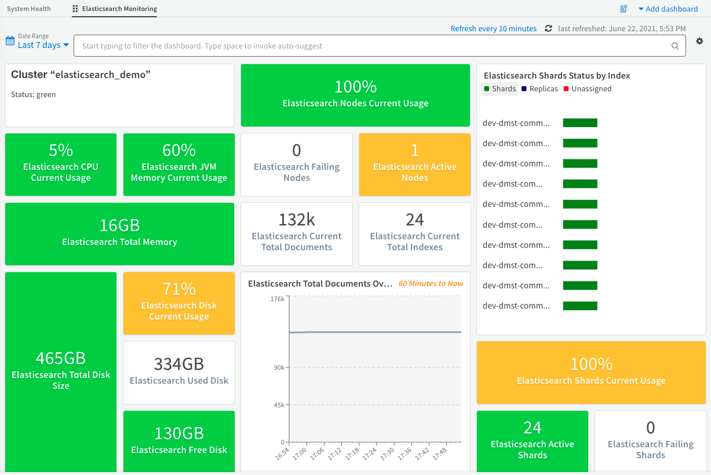

Use the Elasticsearch Monitoring pack to monitor Elasticsearch and OpenSearch used by XSOAR. 

## What does this pack do?
Various widgets support cluster, nodes, memory, CPU, and disk statistics as well as advanced sharding, indices distribution, and more.
Supported from version 6.1 and later.

After installing this pack, you will be able to add the "Elastisearch Monitoring" dashboard to your Dashboards page. 

