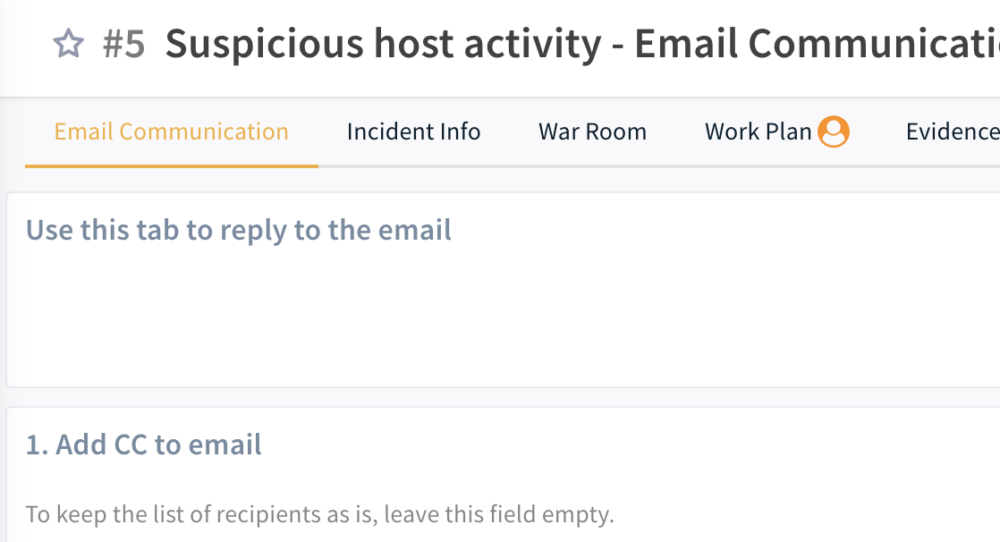

The SOC team needs to communicate and respond to end-users to get more details about an alert, continue with an investigation, etc, usually using emails. 
 
This email communications content pack enables security teams to automate the communication and notification process with end users.
 
With this Content Pack, you can use the layouts as-is for email communication. They can also be used for other incident types by adding the either the "Email Communication" or "Email Threads" layout to the different incident types.

##### What does this pack do?

This pack contains two layouts - "Email Communication" and "Email Threads".  These layouts can be used to add different methods of interacting with end users via email.

The "Email Communication" layout helps you communicate and respond to emails in the Cortex XSOAR system for incidents that were created by fetching an email:
- Add CC to the email
- Write the email you want to send
- Add attachments if needed to the email.
- Tag all the related emails (incoming/outgoing) to the incident and manage as an email thread - the user can view all the communications in the layout without leaving the system.

The "Email Threads" layout allows you to integrate email communication into any Incident type, regardless of the Incident source:
- Initiate outbound "first contact" emails to end users
- Include multiple recipients, CC, and BCC
- Add attachments to outgoing emails
- Save attachments from incoming emails to the Incident
- Create, view, and reply to multiple separate email threads from a single Incident

This pack includes, out of the box, a full layout, scripts, and incident fields. All of these are customizable to suit the needs of your organization.

# Configure Email Communication on Cortex XSOAR
---

1. In Cortex XSOAR, go to **Settings > About > Troubleshooting**.
2. In the **Server Configuration** section, verify that the *preprocessing.support.default.arguments* key is set to *true*. If this key does not exist, click **+ Add Server Configuration** and add the *preprocessing.support.default.arguments* key and set the value to *true*.
3. (Optional for Cortex XSOAR 6.x): Increase the server configuration widget.entry.max.size entry to prevent the email thread dynamic display widget from erroring out from too much content. Note, increasing this too much can cause a performance impact.

---
For more information about the pack, visit our [Cortex XSOAR Developer Docs](https://xsoar.pan.dev/docs/reference/packs/email-communication)

