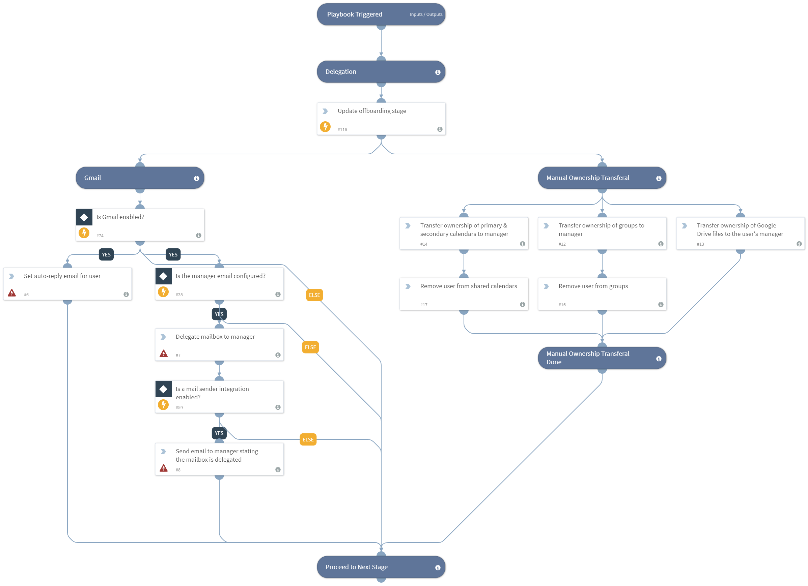

Delegates user resources and permissions as part of the IT - Employee Offboarding playbook.

## Dependencies
This playbook uses the following sub-playbooks, integrations, and scripts.

### Sub-playbooks
This playbook does not use any sub-playbooks.

### Integrations
* Builtin

### Scripts
This playbook does not use any scripts.

### Commands
* setIncident
* gmail-delegate-user-mailbox
* send-mail
* gmail-set-autoreply

## Playbook Inputs
---

| **Name** | **Description** | **Default Value** | **Source** | **Required** |
| --- | --- | --- | --- | --- |
| UserManagerEmail | The email of the manager of the user that is being offboarded. | employeemanageremail | incident | Optional |
| OffboardingUserEmail | The email address of the user that is being offboarded. | employeeemail | incident | Required |
| AutoreplyMessage | The automatic message that is sent as a reply message from the user that has been offboarded once they no longer have access to their email account. | This employee is no longer with our company. | - | Optional |

## Playbook Outputs
---
There are no outputs for this playbook.

## Playbook Image
---

