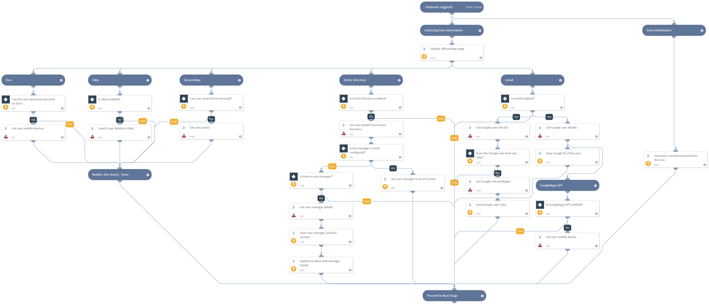

Gathers user information as part of the IT - Employee Offboarding playbook.

## Dependencies
This playbook uses the following sub-playbooks, integrations, and scripts.

### Sub-playbooks
This playbook does not use any sub-playbooks.

### Integrations
* Builtin

### Scripts
* Set
* GeneratePassword

### Commands
* gmail-get-user
* servicenow-query-table
* setIncident
* ad-get-user
* googleapps-get-devices-for-user
* gmail-get-role
* okta-search
* duoadmin-get-devices-by-user
* gmail-get-user-roles

## Playbook Inputs
---

| **Name** | **Description** | **Default Value** | **Source** | **Required** |
| --- | --- | --- | --- | --- |
| UserManagerEmail | The email of the manager of the user you are offboarding. | employeemanageremail | incident | Optional |
| OffboardingUserEmail | The email address of the user that you are offboarding. | employeeemail | incident | Required |
| DuoUsername | The username, in Duo, of the user you are offboarding. | - | - | Optional |
| ServiceNowAssetsTableName | The name of the "Assets" table in ServiceNow. This will be used to get the assets that belong to the user you are offboarding. | alm_asset | - | Optional |

## Playbook Image
---

