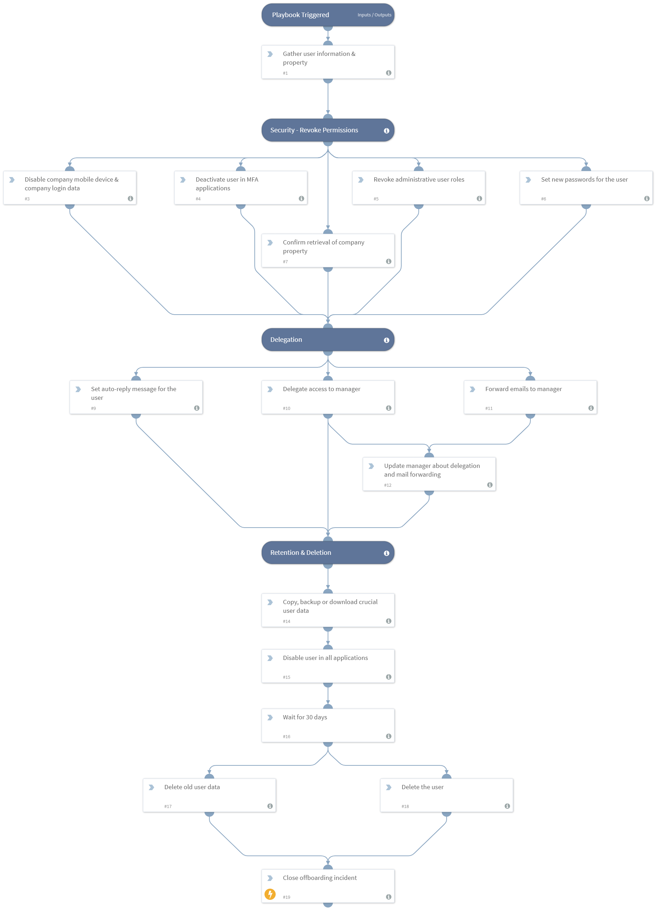

Provides a manual alternative to the IT - Employee Offboarding playbook. The playbook guides the user in the process of manually offboarding an employee.

## Dependencies
This playbook uses the following sub-playbooks, integrations, and scripts.

### Sub-playbooks
* Wait Until Datetime

### Integrations
* Builtin

### Scripts
This playbook does not use any scripts.

### Commands
* closeInvestigation

## Playbook Inputs
---
There are no inputs for this playbook.

## Playbook Outputs
---
There are no outputs for this playbook.

## Playbook Image
---

