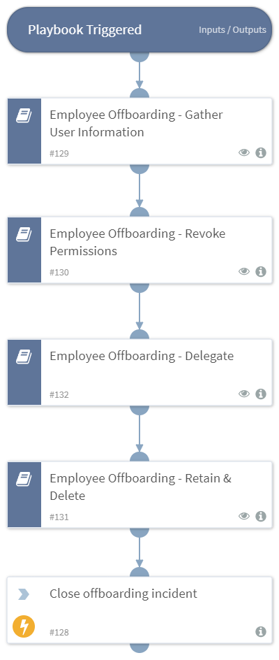

The process of offboarding employees is time-consuming and involves multiple departments of the organization - HR, IT, logistics and so on. Due to the multitude of processes, the right actions are not always taken and the process takes too long to complete or never completes fully - leaving the company vulnerable to data leaks, unauthorized access and other risks associated with an incomplete offboarding process. Using Cortex XSOAR, you can streamline this process, track your offboarding checklist and automate any tasks that don't require physical human interaction.

##### What does this pack do?
- Schedules a time for the offboarding process to begin.
- Gathers employee and manager information from various sources such as Active Directory, Okta, Duo, Google, ServiceNow and more.
- Delegates permissions and access from offboarded employee to manager.
- Revokes roles, security and access permissions for the offboarded employee and resets passwords.
- Retains important employee information for legal purposes, for a configurable period of time.
- Removes employee information from all systems or applies special policies for offboarded employees.

As part of this pack, you will also get out-of-the-box incident fields, layouts and playbooks for employee offboarding. All of these are easily customizable to suit the needs of your organization. The pack features an additional, fully manual playbook for organizations that prefer to keep the process manual, that tracks items on your offboarding checklist.

_For more information, visit our [Cortex XSOAR Developer Docs](https://xsoar.pan.dev/docs/reference/playbooks/it---employee-offboarding)_

