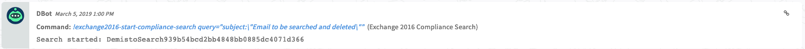
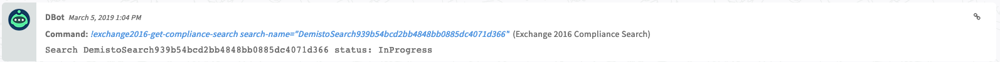
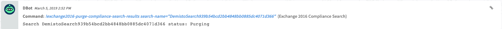
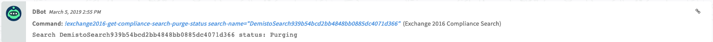

<!-- HTML_DOC -->

Deprecated, use EWS V2 instead.

Use this integration to run and manage compliance searches on your Exchange 2016 Server.

This integration was integrated and tested with Exchange 2016 Server.

<h2 id="use-cases">Use Cases</h2>

Exchange Server 2016 Compliance Search enables you to search for and delete an email message from all mailboxes in your organization. There are no limits to the number of target mailboxes in a single search.

<h2 id="prerequisite">Prerequisite</h2>

<strong>Install Cortex XSOAR Engine</strong>

<ul>
<li>Cortex XSOAR Engine must be installed on a target window machine which is part of the domain of your Exchange 2016 server.</li>
<li>Make sure you have Python 2.7 installed on the Engine machine.</li>
<li>Add the necessary Python lbs to the Engine machine.  <a href="https://github.com/demisto/content/blob/master/Packs/Exchange2016_Compliance/Integrations/Exchange2016_Compliance/doc_files/requirements.txt">https://github.com/demisto/content/blob/master/Packs/Exchange2016_Compliance/Integrations/Exchange2016_Compliance/doc_files/requirements.txt</a>  Run the pip install --no-cache-dir -r requirements.txt command.</li>
<li>Make sure the integration runs without docker image.</li>
<li>For more information regarding Installing and Deploying Cortex XSOAR Engines, see the <a href="https://docs-cortex.paloaltonetworks.com/r/Cortex-XSOAR/6.13/Cortex-XSOAR-Administrator-Guide/Install-a-Cortex-XSOAR-Engine">Engines Documentation (Cortex XSOAR 6.13)</a> or <a href="https://docs-cortex.paloaltonetworks.com/r/Cortex-XSOAR/8/Cortex-XSOAR-Cloud-Documentation/Install-an-engine">Engines Documentation (Cortex XSOAR 8 Cloud)</a> or <a href="https://docs-cortex.paloaltonetworks.com/r/Cortex-XSOAR/8.7/Cortex-XSOAR-On-prem-Documentation/Install-an-engine">Engines Documentation (Cortex XSOAR 8.7 On-prem)</a>.</li>
</ul>

<strong>Permissions</strong>  The user that you configure for the integration instance requires the Compliance Management role to run the integration commands. For more information, see the <a href="https://docs.microsoft.com/en-us/powershell/exchange/exchange-server/find-exchange-cmdlet-permissions?view=exchange-ps">Microsoft Documentation</a>.

<h2 id="configure-exchange-2016-compliance-search-on-demisto">Configure Exchange 2016 Compliance Search on Cortex XSOAR</h2>

<ol>
<li>Navigate to <strong>Settings</strong><strong>&gt;</strong><strong>Integrations</strong><strong>&gt;</strong><strong>Servers &amp; Services</strong>.</li>
<li>Search for Exchange 2016 Compliance Search.</li>
<li>Click <strong>Add instance</strong> to create and configure a new integration instance.
<ul>
<li>
<strong>Name</strong>: a textual name for the integration instance.</li>
<li><strong>DOMAIN\USERNAME (e.g., XSOAR.INT\admin)</strong></li>
<li><strong>Exchange Server fully qualified domain name (FQDN)</strong></li>
<li>
<strong>Use single engine</strong>: engine to run the integration on</li>
<li>
<strong>Note</strong>: the integration requires engine and there is no option to use it without engine.</li>
<li><strong>Trust any certificate (not secure)</strong></li>
</ul>
</li>
<li>Click <strong>Test</strong> to validate the URLs, token, and connection.</li>
</ol>

<h2 id="commands">Commands</h2>

You can execute these commands from the Cortex XSOAR CLI, as part of an automation, or in a playbook.  After you successfully execute a command, a DBot message appears in the War Room with the command details.

<ol>
<li>Start a compliance search: exchange2016-start-compliance-search</li>
<li>Get the results and status of a compliance search: exchange2016-get-compliance-search</li>
<li>Remove a compliance search: exchange2016-remove-compliance-search</li>
<li>Purge the results of a compliance search: exchange2016-purge-compliance-search-results</li>
<li>Get the status of a purge operation: exchange2016-get-compliance-search-purge-status</li>
</ol>

<h3 id="start-a-compliance-search">1. Start a compliance search</h3>

Initiates a compliance search.

<h5 id="base-command">Base Command</h5>

<code>exchange2016-start-compliance-search</code>

<h5 id="input">Input</h5>

<table style="width: 748px;">
<thead>
<tr>
<th style="width: 209px;"><strong>Argument Name</strong></th>
<th style="width: 407px;"><strong>Description</strong></th>
<th style="width: 124px;"><strong>Required</strong></th>
</tr>
</thead>
<tbody>
<tr>
<td style="width: 209px;">query</td>
<td style="width: 407px;">Query for finding mail messages</td>
<td style="width: 124px;">Required</td>
</tr>
</tbody>
</table>

 

<h5 id="context-output">Context Output</h5>

<table style="width: 748px;">
<thead>
<tr>
<th style="width: 309px;"><strong>Path</strong></th>
<th style="width: 64px;"><strong>Type</strong></th>
<th style="width: 367px;"><strong>Description</strong></th>
</tr>
</thead>
<tbody>
<tr>
<td style="width: 309px;">EWS.ComplianceSearch.Name</td>
<td style="width: 64px;">string</td>
<td style="width: 367px;">The name of the compliance search</td>
</tr>
<tr>
<td style="width: 309px;">EWS.ComplianceSearch.Status</td>
<td style="width: 64px;">string</td>
<td style="width: 367px;">The status of the compliance search</td>
</tr>
</tbody>
</table>

 

<h5 id="command-example">Command Example</h5>

<pre>exchange2016-start-compliance-search query="subject:\"Email to be searched and deleted\""
  </pre>

<h5 id="context-example">Context Example</h5>

<pre>{
    "EWS": {
        "ComplianceSearch": {
            "Status": "Starting", 
            "Name": "DemistoSearch939b54bcd2bb4848bb0885dc4071d366"
        }
    }
}
</pre>

<h5 id="human-readable-output">Human Readable Output</h5>

<h3 id="get-the-results-and-status-of-a-compliance-search">2. Get the results and status of a compliance search</h3>

Gets the status and results of a compliance search.

<h5 id="base-command-1">Base Command</h5>

<code>exchange2016-get-compliance-search</code>

<h5 id="input-1">Input</h5>

<table style="width: 746px;">
<thead>
<tr>
<th style="width: 226px;"><strong>Argument Name</strong></th>
<th style="width: 388px;"><strong>Description</strong></th>
<th style="width: 126px;"><strong>Required</strong></th>
</tr>
</thead>
<tbody>
<tr>
<td style="width: 226px;">search-name</td>
<td style="width: 388px;">Name of the compliance search</td>
<td style="width: 126px;">Required</td>
</tr>
</tbody>
</table>

 

<h5 id="context-output-1">Context Output</h5>

<table style="width: 748px;">
<thead>
<tr>
<th style="width: 316px;"><strong>Path</strong></th>
<th style="width: 57px;"><strong>Type</strong></th>
<th style="width: 367px;"><strong>Description</strong></th>
</tr>
</thead>
<tbody>
<tr>
<td style="width: 316px;">EWS.ComplianceSearch.Status</td>
<td style="width: 57px;">string</td>
<td style="width: 367px;">The status of the compliance search</td>
</tr>
</tbody>
</table>

 

<h5 id="command-example-1">Command Example</h5>

<pre>exchange2016-get-compliance-search search-name=DemistoSearch939b54bcd2bb4848bb0885dc4071d366
  </pre>

<h5 id="context-example-1">Context Example</h5>

<pre>{
    "EWS": {
        "ComplianceSearch": {
            "Status": "InProgress", 
            "Name": "DemistoSearch939b54bcd2bb4848bb0885dc4071d366"
        }
    }
}
</pre>

<h5 id="human-readable-output-1">Human Readable Output</h5>

<h3 id="remove-a-compliance-search">3. Remove a compliance search</h3>

Removes the compliance search from the Exchange Server.

<h5 id="base-command-2">Base Command</h5>

<code>exchange2016-remove-compliance-search</code>

<h5 id="input-2">Input</h5>

<table style="width: 748px;">
<thead>
<tr>
<th style="width: 225px;"><strong>Argument Name</strong></th>
<th style="width: 389px;"><strong>Description</strong></th>
<th style="width: 126px;"><strong>Required</strong></th>
</tr>
</thead>
<tbody>
<tr>
<td style="width: 225px;">search-name</td>
<td style="width: 389px;">Name of the compliance search</td>
<td style="width: 126px;">Required</td>
</tr>
</tbody>
</table>

 

<h5 id="context-output-2">Context Output</h5>

<table style="width: 748px;">
<thead>
<tr>
<th style="width: 310px;"><strong>Path</strong></th>
<th style="width: 63px;"><strong>Type</strong></th>
<th style="width: 367px;"><strong>Description</strong></th>
</tr>
</thead>
<tbody>
<tr>
<td style="width: 310px;">EWS.ComplianceSearch.Status</td>
<td style="width: 63px;">string</td>
<td style="width: 367px;">The status of the compliance search</td>
</tr>
</tbody>
</table>

 

<h5 id="command-example-2">Command Example</h5>

<pre>exchange2016-remove-compliance-search search-name="DemistoSearch939b54bcd2bb4848bb0885dc4071d366"
  </pre>

<h5 id="context-example-2">Context Example</h5>

<pre>{
    "EWS": {
        "ComplianceSearch": {
            "Status": "Removed", 
            "Name": "DemistoSearch939b54bcd2bb4848bb0885dc4071d366"
        }
    }
}
</pre>

<h5 id="human-readable-output-2">Human Readable Output</h5>

<h3 id="purge-the-results-of-a-compliance-search">4. Purge the results of a compliance search</h3>

Purges the results found during the compliance search.

<h5 id="base-command-3">Base Command</h5>

<code>exchange2016-purge-compliance-search-results</code>

<h5 id="input-3">Input</h5>

<table style="width: 748px;">
<thead>
<tr>
<th style="width: 207px;"><strong>Argument Name</strong></th>
<th style="width: 407px;"><strong>Description</strong></th>
<th style="width: 126px;"><strong>Required</strong></th>
</tr>
</thead>
<tbody>
<tr>
<td style="width: 207px;">search-name</td>
<td style="width: 407px;">Name of the compliance search</td>
<td style="width: 126px;">Required</td>
</tr>
</tbody>
</table>

 

<h5 id="context-output-3">Context Output</h5>

There is no context output for this command.

<h5 id="command-example-3">Command Example</h5>

<pre>exchange2016-purge-compliance-search-results search-name="DemistoSearch939b54bcd2bb4848bb0885dc4071d366"
  </pre>

<h5 id="context-example-3">Context Example</h5>

<pre>{
    "EWS": {
        "ComplianceSearch": {
            "Status": "Purging", 
            "Name": "DemistoSearch939b54bcd2bb4848bb0885dc4071d366"
        }
    }
}
</pre>

<h5 id="human-readable-output-3">Human Readable Output</h5>

<h3 id="get-the-status-of-a-purge-operation">5. Get the status of a purge operation</h3>

Checks the status of the purge operation on the compliance search.

<h5 id="base-command-4">Base Command</h5>

<code>exchange2016-get-compliance-search-purge-status</code>

<h5 id="input-4">Input</h5>

<table style="width: 748px;">
<thead>
<tr>
<th style="width: 224px;"><strong>Argument Name</strong></th>
<th style="width: 390px;"><strong>Description</strong></th>
<th style="width: 126px;"><strong>Required</strong></th>
</tr>
</thead>
<tbody>
<tr>
<td style="width: 224px;">search-name</td>
<td style="width: 390px;">Name of the compliance search</td>
<td style="width: 126px;">Required</td>
</tr>
</tbody>
</table>

 

<h5 id="context-output-4">Context Output</h5>

There is no context output for this command.

<h5 id="command-example-4">Command Example</h5>

<pre>exchange2016-get-compliance-search-purge-status search-name="DemistoSearch939b54bcd2bb4848bb0885dc4071d366"
  </pre>

<h5 id="context-example-4">Context Example</h5>

<pre>{
    "EWS": {
        "ComplianceSearch": {
            "Status": "Purging", 
            "Name": "DemistoSearch939b54bcd2bb4848bb0885dc4071d366"
        }
    }
}
</pre>

<h5 id="human-readable-output-4">Human Readable Output</h5>

