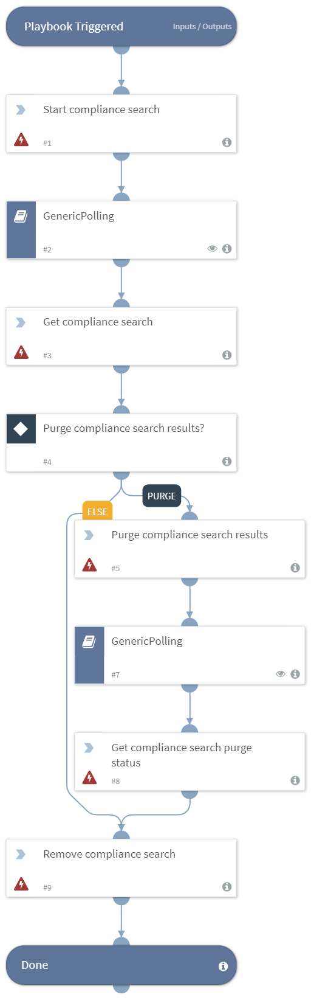

Runs a compliance search in Exchange Server 2016, and delete the results.

## Dependencies
This playbook uses the following sub-playbooks, integrations, and scripts.

### Sub-playbooks
* GenericPolling

### Integrations
This playbook does not use any integrations.

### Scripts
This playbook does not use any scripts.

### Commands
* exchange2016-remove-compliance-search
* exchange2016-get-compliance-search-purge-status
* exchange2016-purge-compliance-search-results
* exchange2016-get-compliance-search
* exchange2016-start-compliance-search

## Playbook Inputs
---

| **Name** | **Description** | **Required** |
| --- | --- | --- |
| Query | The query used to find mail messages. |Required |

## Playbook Outputs
---
There are no outputs for this playbook.

## Playbook Image
---

