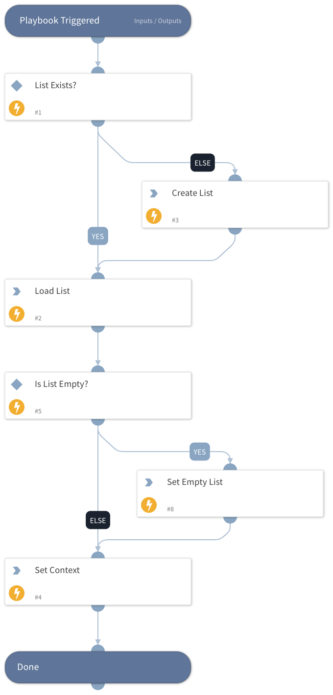

Sub-playbook to support Expanse Handle Incident playbook.
Loads a list to be used in the Expanse playbook.
Creates the list if it does not exist.

## Dependencies
This playbook uses the following sub-playbooks, integrations, and scripts.

### Sub-playbooks
This playbook does not use any sub-playbooks.

### Integrations
This playbook does not use any integrations.

### Scripts
* Set
* IsListExist

### Commands
* setList
* createList
* getList

## Playbook Inputs
---

| **Name** | **Description** | **Default Value** | **Required** |
| --- | --- | --- |--------------|
| ListName | Name of the list to load. List will be created if it does not exist or is empty. |  | Required     |
| ListValues | If the list does not exist or is empty, it will be created with these values. In case this input is empty, the default value would be "\{\}". |  | Optional     |

## Playbook Outputs
---

| **Path** | **Description** | **Type** |
| --- | --- | --- |
| ParsedList | Contents of parsed list. | unknown |

## Playbook Image
---
