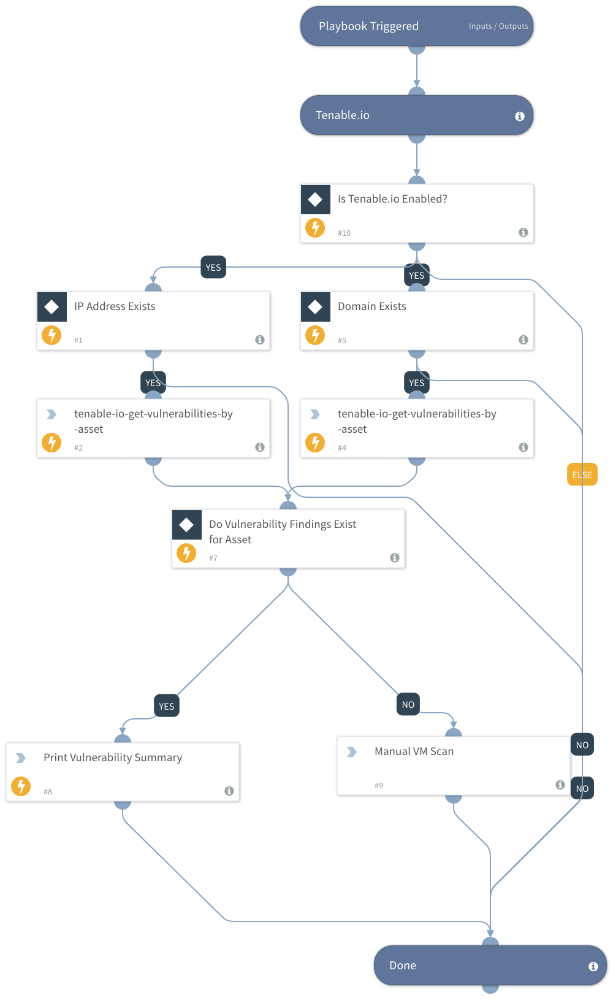

This Playbook is used to verify that all assets found by Expanse are being scanned by a vulnerability management tool by: 
- Searching the IP and / or domain of the identified Expanse asset in the vulnerability management tool

## Dependencies
This playbook uses the following sub-playbooks, integrations, and scripts.

### Sub-playbooks
* This does not use any sub-playbooks

### Integrations
* Tenable.io

### Scripts
* This playbook does not use any scripts.

### Commands
* tenable-io-get-vulnerabilities-by-asset

## Playbook Inputs

---

| **Name** | **Description** | **Default Value** | **Required** |
| --- | --- | --- | --- |
| Tenable.io Enabled | Identifies whether the integration of Tenable.io is enabled | modules.brand Equals Tenable.io, modules.state Equals active | Optional |
| IP | IP to identify asset | incident.labels.ip | Optional |
| FQDN | FQDN to identify asset | incident.labels.domain | Optional |
| Vulnerability Exist | Identifies whether in the last 30 days a vulnerability exists in Tenable.io for the associated asset within the last 30 days | TenableIO.Vulnerabilities | Optional |

## Playbook Outputs

---

| **Logic** | **Name** | **Description** | **Default Value** |
| --- | --- | --- | --- |
| Y - Finds Vulnerability | Prints vulnerability summary | Shows user the related information of the identified vulnerability for the asset | N/A |
| N - Does not find Vulnerability | Manual VM scan | Initiates a task for the user to kick of a manual VM scan of the identified asset | N/A |

## Playbook Image

---

