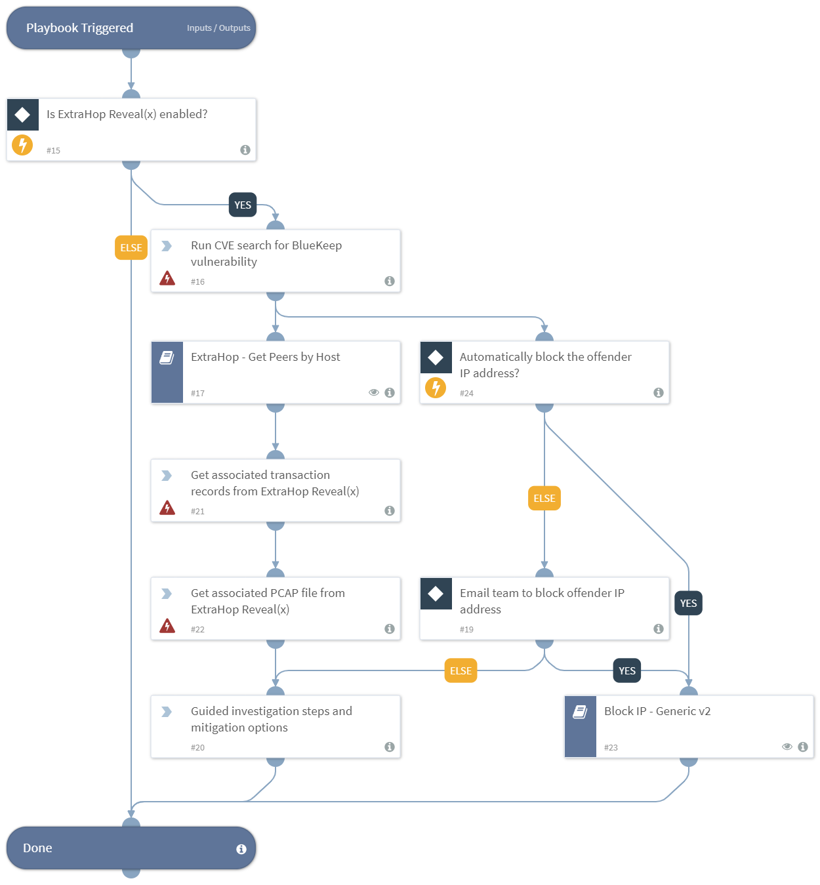

This server received a Remote Desktop Protocol (RDP) connection request that is consistent with a known vulnerability, also known as BlueKeep, in older versions of Microsoft Windows. This vulnerability allows an unauthenticated attacker to remotely run arbitrary code on an RDP server. The attacker can then tamper with data or install malware that could propagate to other Windows devices across the network. Investigate to determine if this server is hosting a version affected by CVE-2019-0708: Windows 7, Windows XP, Windows Vista, Windows Server 2003, and Windows Server 2008.

MITIGATION OPTIONS
- Disable Remote Desktop Services if they are not required
- Implement Network Level Authentication (NLA) on systems running supported versions of Windows 7, Windows Server 2008, and Windows Server 2008 R2
- Configure firewalls to block traffic on TCP port 3389

## Dependencies
This playbook uses the following sub-playbooks, integrations, and scripts.

### Sub-playbooks
* Block IP - Generic v2
* ExtraHop - Get Peers by Host

### Integrations
* CVE Search

### Scripts
* Exists

### Commands
* cve-search
* extrahop-packets-search

## Playbook Inputs
---

| **Name** | **Description** | **Default Value** | **Required** |
| --- | --- | --- | --- | 
| AutoBlockIp | Enables the `Block IP` capability automatically, can be,  "True" or "False". The `Block IP` sub-playbook will block the offender IP address in the relevant integrations. | False | Optional |

## Playbook Outputs
---

| **Path** | **Description** | **Type** |
| --- | --- | --- |
| CVE | The details on the CVE. | unknown |
| ExtraHop.Device | The details on the host and any peer devices found.  | unknown |
| ExtraHop.ActivityMap | The link to a visual activity map in ExtraHop. | string |
| ExtraHop.Record.Source | The associated transaction records from ExtraHop. | unknown |

## Playbook Image
---

