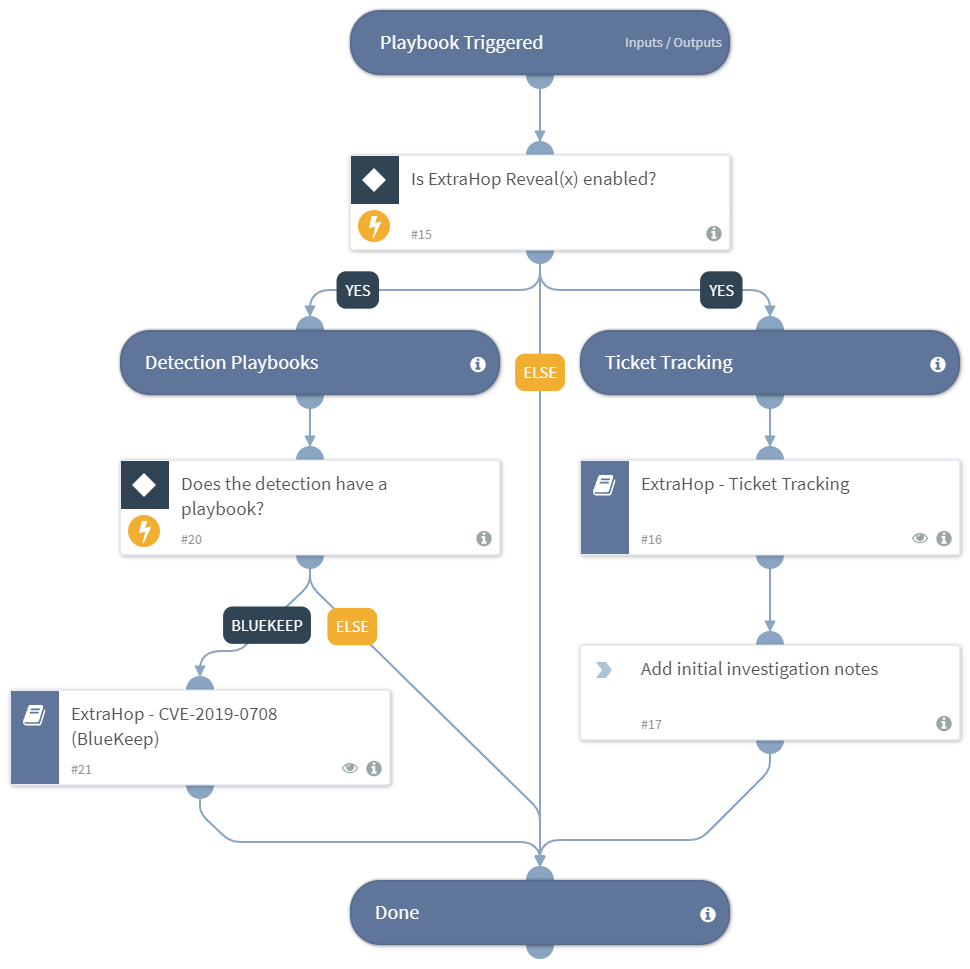

Handles ticket tracking as well as triggeres specific playbooks based on the name of the ExtraHop Detection. Default playbook to run for all ExtraHop Detection incidents.

## Dependencies
This playbook uses the following sub-playbooks, integrations, and scripts.

### Sub-playbooks
* ExtraHop - Ticket Tracking v2
* ExtraHop - CVE-2019-0708 (BlueKeep)

### Integrations
This playbook does not use any integrations.

### Scripts
* Exists

### Commands
This playbook does not use any commands.

## Playbook Inputs
---
There are no inputs for this playbook.

## Playbook Outputs
---

| **Path** | **Description** | **Type** |
| --- | --- | --- |
| CVE | The details on the CVE. | unknown |
| ExtraHop.Device | The details on the host and any peer devices found.  | unknown |
| ExtraHop.ActivityMap | The link to a visual activity map in ExtraHop. | string |
| ExtraHop.Record.Source | The associated transaction records from ExtraHop. | unknown |

## Playbook Image
---

