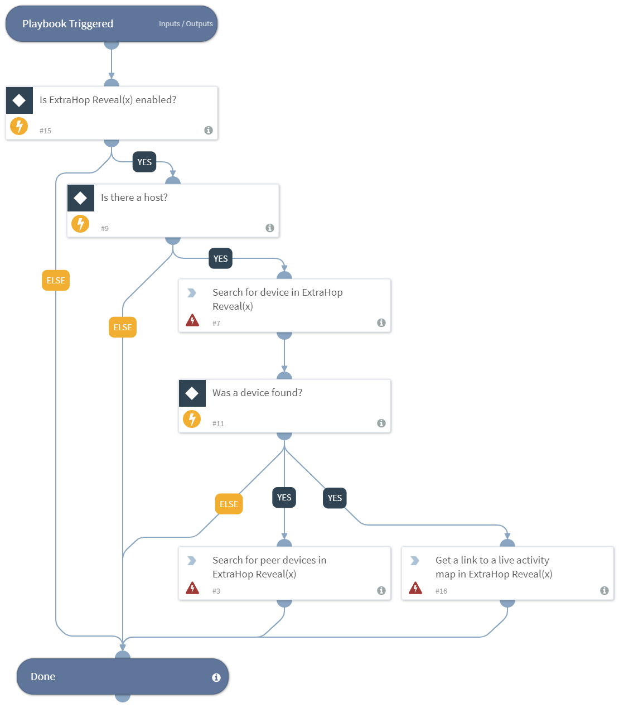

Retrieves the peer network devices that communicated with that host in a given time range, when given a host. In addition to a list of peers and protocols (sorted by bytes) the playbook returns a link to the ExtraHop Live Activity Map to visualize the peer relationships.

## Dependencies
This playbook uses the following sub-playbooks, integrations, and scripts.

### Sub-playbooks
This playbook does not use any sub-playbooks.

### Integrations
This playbook does not use any integrations.

### Scripts
* Exists

### Commands
* extrahop-peers-get
* extrahop-devices-search
* extrahop-activity-map-get

## Playbook Inputs
---

| **Name** | **Description** | **Required** |
| --- | --- | --- | 
| name | The name of the device. This searches for matches on all ExtraHop name fields (DHCP, DNS, NetBIOS, Cisco Discovery Protocol, etc.). | Optional |
| ip | The IP address of the device. | Optional |
| mac | The MAC address of the device. | Optional |
| from_time | The beginning timestamp of the time range the playbook will use to search, expressed in seconds since the epoch. | Optional |
| until_time | The ending timestamp of the time range the playbook will use to search, expressed in seconds since the epoch. | Optional |

## Playbook Outputs
---

| **Path** | **Description** | **Type** |
| --- | --- | --- |
| ExtraHop.Device | The details on the host and any peer devices found.  | unknown |
| ExtraHop.ActivityMap | The link to a visual activity map in ExtraHop. | string |

## Playbook Image
---

