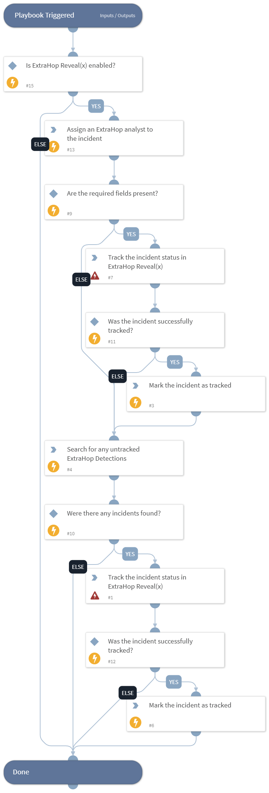

Links the Cortex XSOAR incident back to the ExtraHop detection that created it for ticket tracking purposes.

## Dependencies
This playbook uses the following sub-playbooks, integrations, and scripts.

### Sub-playbooks
This playbook does not use any sub-playbooks.

### Integrations
* Builtin

### Scripts
* AssignAnalystToIncident
* Exists
* SearchIncidentsV2

### Commands
* extrahop-ticket-track
* setIncident

## Playbook Inputs
---
There are no inputs for this playbook.

## Playbook Outputs
---
There are no outputs for this playbook.

## Playbook Image
---

