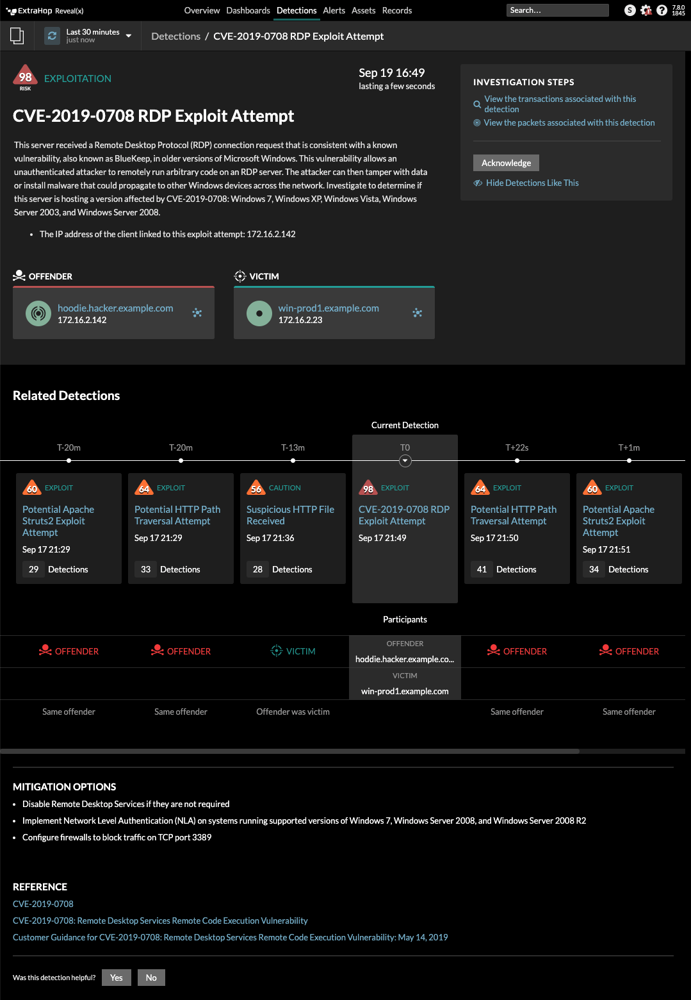
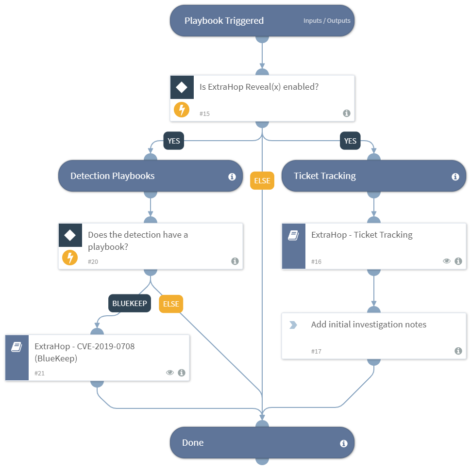

ExtraHop Reveal(x) for Cortex XSOAR is a network detection and response solution that provides complete visibility of network communications at enterprise scale, real-time threat detections backed by machine learning, and guided investigation workflows that simplify response.

##### What does this integration do?
This integration enables the following investigative tasks and workflows in Cortex XSOAR as an automated response to ExtraHop Reveal(x) detections:

- Create a Cortex XSOAR incident in real-time when a Reveal(x) detection identifies malicious or non-compliant behavior on your network.
- Leverage Reveal(x) playbooks to respond with thousands of security actions that accelerate automated investigation and remediation.
- Send real-time queries to Reveal(x) through the ExtraHop REST API that enable you to search for specific devices, network peers, active protocols, records, and packets that are part of your investigation.
- Track tickets in Reveal(x) that link detections to your Cortex XSOAR investigation.

The following figures show an example of an ExtraHop Reveal(x) detection and the resulting playbook workflows in Cortex XSOAR.

*Figure 1. Reveal(x) detection card for CVE-2019-0708 RDP Exploit Attempt*

*Figure 2. Reveal(x) Default playbook to set up ticket tracking and run the BlueKeep playbook*

*Figure 3. Reveal(x) CVE-2019-0708 BlueKeep playbook to automate detailed network investigation*