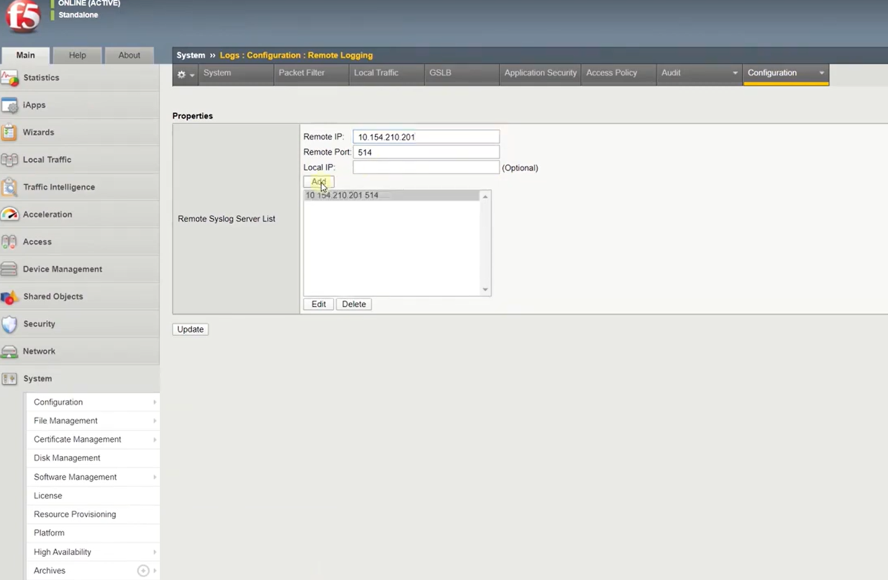

# F5 BIG-IP LTM

This pack includes Cortex XSIAM content.

## Configuration on Server Side
You need to configure F5 LTM to forward logs in Syslog format.

Go to F5 LTM and navigate to **System** -> **Logs** -> **Configuration** -> **Remote Logging** and enter the following:
1. Remote IP: add the Broker VM IP address.
2. Remote Port: add the designated Broker VM port. 

Press **Add** and **Update** to apply the new configuration. 

## Collect Events from Vendor

In order to use the collector, use the [Broker VM](#broker-vm) option.

### Broker VM 
To create or configure the Broker VM, use the information described [here](https://docs-cortex.paloaltonetworks.com/r/Cortex-XDR/Cortex-XDR-Pro-Administrator-Guide/Configure-the-Broker-VM).

You can configure the specific vendor and product for this instance.

1. Navigate to **Settings** > **Configuration** > **Data Broker** > **Broker VMs**. 
2. Right-click, and select **Syslog Collector** > **Configure**.
3. When configuring the Syslog Collector, set the following values:
   - vendor as vendor - f5
   - product as product - ltm

## What does this pack do?

- Gathers information about F5 LTM Nodes, Pools and Pool Members.
- Gathers information about F5 LTM Node and Pool Member connection and session statistics.
- Enables and Disables F5 LTM Nodes.
- Included with the Pack is a playbook to list all the Pools that are configured with single Nodes.
- Included with the Pack is a playbook to wait for current connections to a single Node to drop to zero.
- Adds modeling rules for XSIAM.

For more information, visit the Cortex XSOAR  and XSIAM Developer Docs.