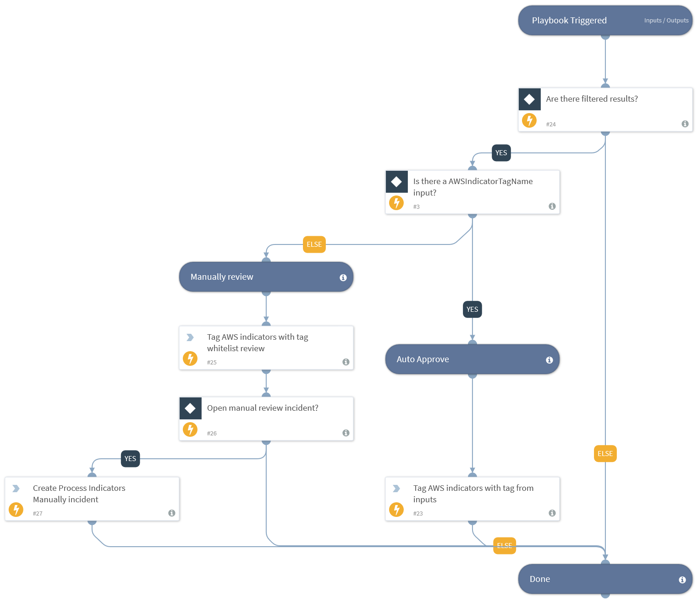

This playbook handles the tagging of AWS indicators. Specify the tag to apply to these indicators in the playbook inputs. An example tag will be approved_allow. If no inputs are specified, the indicators will be tagged for manual review. The user can specify whether a manual review incident is required.

## Dependencies
This playbook uses the following sub-playbooks, integrations, and scripts.

### Sub-playbooks
This playbook does not use any sub-playbooks.

### Integrations
This playbook does not use any integrations.

### Scripts
This playbook does not use any scripts.

### Commands
* appendIndicatorField
* createNewIncident

## Playbook Inputs
---

| **Name** | **Description** | **Default Value** | **Required** |
| --- | --- | --- | --- |
| AWSIndicatorTagName | Use this input to define which tag to apply to AWS indicators. An example tag can be allowlist\_review. If no tags are specified in the input, the tag allowlist\_review will be used.  |  | Optional |
| Indicator Query | Indicators matching the indicator query will be used as playbook input | sourceBrands:"AWS Feed" | Optional |
| OpenIncidentToReviewIndicatorsManually | This input determines if processed indicators that have the allowlist\_review tag are reviewed in a new incident. To create an incident, enter any value other than 'No'. | No | Optional |

## Playbook Outputs
---
There are no outputs for this playbook.

## Playbook Image
---

