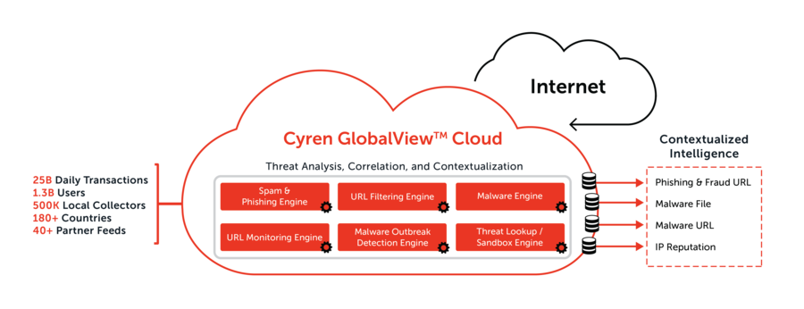

*Please use this Content Pack, if you already obtained API Keys from Cyren.*

---

Threat InDepth's correlated and contextualized intelligence helps enterprises improve their threat detection and response by providing unprecedented visibility into new email-borne security threats and actionable insights to make meaningful response decisions. By correlating insights gathered across email content, web traffic, and suspicious files; Cyren provides security teams with a multi-dimensional presentation of critical threat characteristics.

## Benefits include

- Access to Cyren's GlobalView™ Threat Intelligence Cloud that provides the earliest visibility into new and evolving attacks on a global basis
- Comprehensive, multi-dimensional presentation of critical threat characteristics to help analysts understand the evolving threat landscape
- Timely, Correlated, & Contextualized intelligence that helps reduce mean-time-to-detect (MTTD) and mean-time-to-respond (MTTR) for security analysts
- Improved threat detection for existing security products such as SIEM and SOAR solutions

## What makes Threat InDepth unique

- Global and Expanded Focus  
  Provides **unique** threat **visibility** into the evolving email-borne threats

- Synchronized Intelligence  
  **Correlated, contextualized** insights **speed** up threat detection and response

- Machine Generated, Human Curated  
  Industry **trusted** intelligence with **low** false positives **improves** detection efficacy of your security investments

- First to Detect, First to Protect  
  Provides **timely** protection against **evolving** email-borne threats

If you don't have an API key already, you should subscribe to one or more of these Content Packs:

- [Bundle: Threat Intelligence Feeds](#/market/browse/CyrenThreatInDepthFullBundle)
- [Bundle: Malware Intelligence Feeds](#/market/browse/CyrenThreatInDepthMalwareBundle)
- [IP Reputation Intelligence](#/market/browse/CyrenThreatInDepthIPReputationFeed)
- [Phishing & Fraud URL Intelligence](#/market/browse/CyrenThreatInDepthPhishingURLFeed)
- [Malware URL Intelligence](#/market/browse/CyrenThreatInDepthMalwareURLFeed)
- [Malware File Intelligence](#/market/browse/CyrenThreatInDepthMalwareFileFeed)
