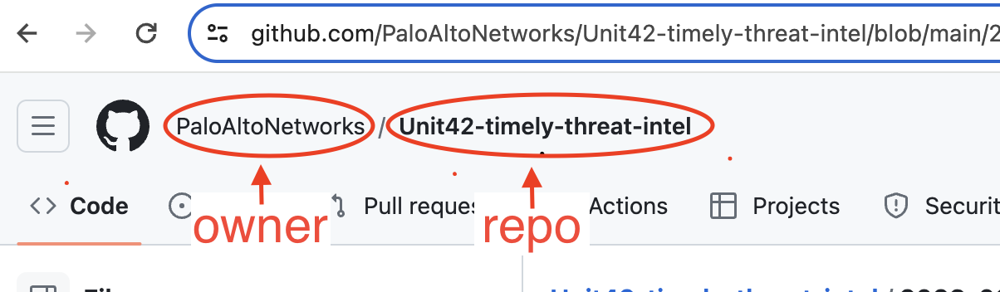

# Feed GitHub

The integration supports the following workflow:

- Publication of indicators from a specific repo.

 To access the requested repository, you need to provide
 the owner(username), repo(repository) name, and API key as parameters for the
 integration.

#### It is recommended to use Api Token in order to avoid being rate limited.

To generate your personal access token, visit:[GitHub](https://github.com/settings/tokens)

- `Owner:` The owner of the repository (see the example)
- `Repository:` The name of the repository (see the example)
- `Feed type:` The type of indicators to publish
- `Branch name:` The required head branch
- `Files extensions to fetch:` A list of file extensions from which only the indicators will be extracted

#### Owner, Repo sources example

