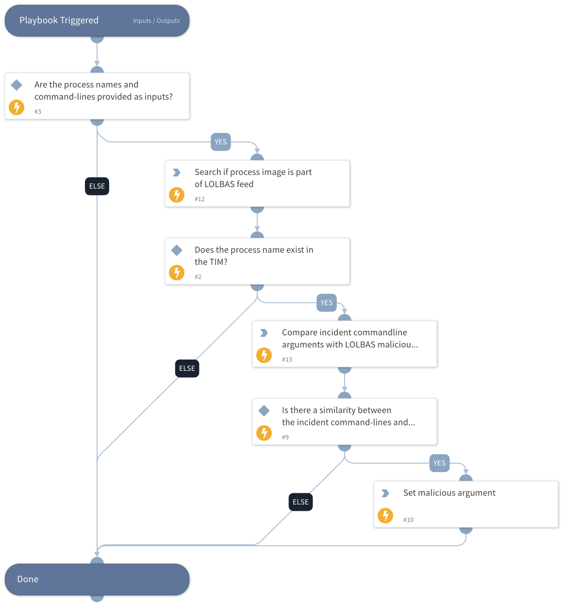

This playbook takes a process name and determines its presence in the LOLBAS repository. It then proceeds to compare the incident command line against known patterns of malicious commands listed in TIM by using LOLBAS feed integration. The playbook outputs results when the similarity between the analyzed command line and the malicious patterns is greater than or equal to the preconfigured StringSimilarity threshold. The playbook offers the flexibility to adjust this threshold through the use of the dedicated playbook input, 'StringSimilarityThreshold'.

## Dependencies

This playbook uses the following sub-playbooks, integrations, and scripts.

### Sub-playbooks

This playbook does not use any sub-playbooks.

### Integrations

This playbook does not use any integrations.

### Scripts

* Set
* SearchIndicator
* StringSimilarity

### Commands

This playbook does not use any commands.

## Playbook Inputs

---

| **Name** | **Description** | **Default Value** | **Required** |
| --- | --- | --- | --- |
| ProcessName | The process names. |  | Optional |
| Commandline | The command lines. |  | Optional |
| StringSimilarityThreashold | StringSimilarity automation threshold. The automation will output only the results with a similarity score equal to or greater than the given threshold. | 0.5 | Optional |

## Playbook Outputs

---

| **Path** | **Description** | **Type** |
| --- | --- | --- |
| SuspiciousLolbinArguments | Command-line arguments that are similar to the compared LOLBAS repository malicious command pattern. | unknown |

## Playbook Image

---

