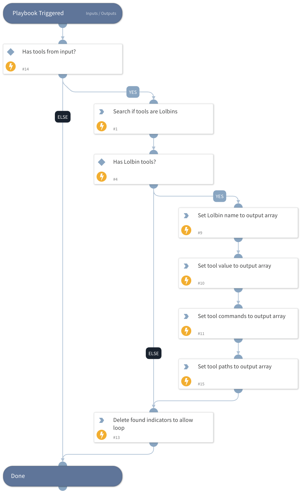

This playbook searches for LOLBAS tools that are related to a given attack pattern.

## Dependencies

This playbook uses the following sub-playbooks, integrations, and scripts.

### Sub-playbooks

This playbook does not use any sub-playbooks.

### Integrations

This playbook does not use any integrations.

### Scripts

* Set
* SearchIndicator
* DeleteContext

### Commands

This playbook does not use any commands.

## Playbook Inputs

---

| **Name** | **Description** | **Default Value** | **Required** |
| --- | --- | --- | --- |
| Tool |  | cmd.exe | Optional |

## Playbook Outputs

---

| **Path** | **Description** | **Type** |
| --- | --- | --- |
| LotlTools | Lotl tools that related to the given attack patterns. | unknown |

## Playbook Image

---

