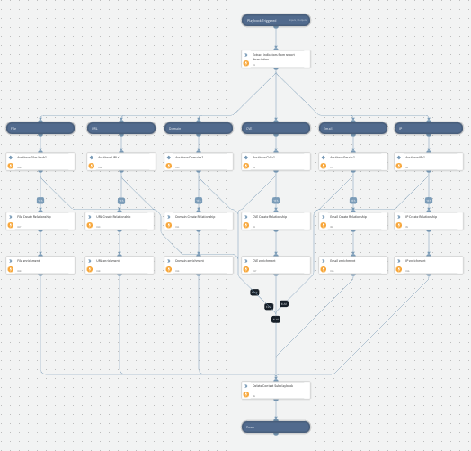

Extract and enrich indicators from report raw content

## Dependencies
This playbook uses the following sub-playbooks, integrations, and scripts.

### Sub-playbooks
This playbook does not use any sub-playbooks.

### Integrations
This playbook does not use any integrations.

### Scripts
* DeleteContext
* CreateIndicatorRelationship

### Commands
* enrichIndicators
* extractIndicators

## Playbook Inputs
---

| **Name** | **Description** | **Default Value** | **Required** |
| --- | --- | --- | --- |
| raw_content | The raw content of an article |  | Optional |
| indicator_value | Report indicator value |  | Optional |

## Playbook Outputs
---
There are no outputs for this playbook.

## Playbook Image
---
